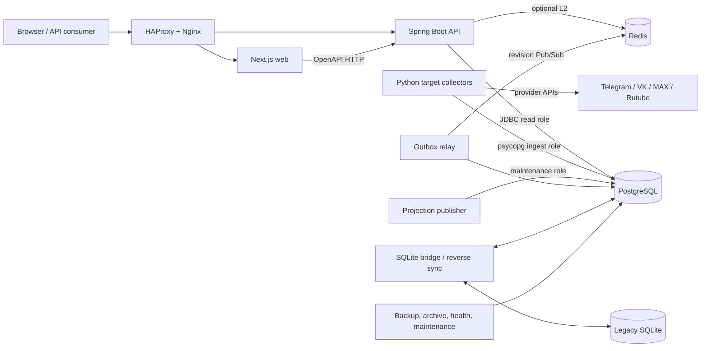
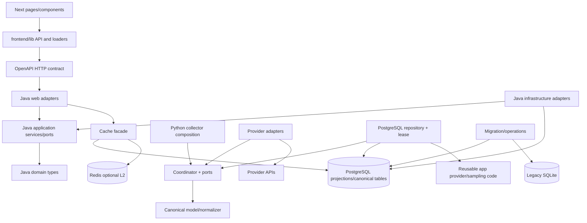

# 1. Executive Summary

M-Ranked monitors public activity counters for Russian universities' official Telegram, VK, MAX, and Rutube accounts. It discovers publications, repeatedly observes cumulative counters (views, reactions/likes, comments, shares, and subscribers where available), preserves identity and quality evidence, derives revision-pinned aggregates, and exposes public overview, detail, rating, comparison, history, media, health, and CSV interfaces. It also has a protected administration surface for managing institutions/accounts and importing the official M-Rating.

The implemented target system is a **single-release, multi-process modular monolith in a monorepo**, with a database-centric read model and a controlled strangler migration from a retained legacy runtime:

- `collector_target/` runs one isolated Python process per platform. A platform gateway returns raw provider data; pure normalization converts it to the canonical model; a PostgreSQL repository persists each account batch transactionally.
- `operations/scripts/projection-publisher.sh` consumes PostgreSQL projection requests, rebuilds all required analytics projections, and only then publishes a revision as readable.
- `backend/` is one Spring Boot application. Its Java packages are organized mostly as domain/application/infrastructure/web slices. Public queries read PostgreSQL projections through application ports; admin commands use a separately credentialed data source and audited database functions.
- `frontend/` is one Next.js App Router application. Public pages are predominantly server components that call the versioned Spring API through a generated OpenAPI client. Small client components own transient interaction state. The `/manage` compatibility facade performs same-origin form handling while Spring remains the authentication/authorization authority.
- PostgreSQL is the target source of truth. Schemas (`catalog`, `ingest`, `analytics`, `rating`, `ops_and_admin`, `migration`) are ownership and privilege boundaries. Redis is an optional L2 response cache and Pub/Sub invalidation accelerator, not the source of correctness.
- `app/` contains the still-used legacy SQLite model, provider clients, collectors, and compatibility formulas. It no longer contains a runnable FastAPI/Jinja application or a `web` CLI command. `migration/bridge/` imports immutable SQLite snapshots into PostgreSQL, while `operations/reverse_sync/` maintains a bounded PostgreSQL-to-SQLite rollback projection.

This is not a microservice architecture and is not event sourced. It does use append-oriented observations, a transactional PostgreSQL outbox, revisioned materialized read tables, and process isolation. Those amount to CQRS-like read/write separation inside one database and release train. The `docs/architecture/` package contains useful design history, but its ADRs are still marked `Proposed`, and some diagrams describe a pre-implementation target (for example Redis collector leases) that differs from current code (PostgreSQL advisory leases). Code, migrations, service units, and call sites are therefore the evidence of record for this report.

# 2. Repository / Workspace Structure

| Path | Implemented responsibility and evidence |
|---|---|
| `app/` | Legacy/runtime-shared Python code. `app/__main__.py` delegates to `app.cli.main`; `app/cli.py` exposes authentication, collection, one-shot polling, catalog synchronization, and rating commands. `app/database.py:Database` owns the SQLite schema and repository methods. `app/collector.py`, `app/public_web.py`, `app/vk_collector.py`, `app/max_collector.py`, and `app/rutube_collector.py` implement SQLite collectors. Provider clients and shared rules here are reused by `collector_target/`. There is no current FastAPI composition root in this directory. |
| `collector_target/` | PostgreSQL-only canonical ingestion runtime. `collector_target/__main__.py` is the process composition root; `PollCycleCoordinator` is the application orchestrator; `ports.py` defines collector/repository/lease contracts; `runtime_adapters.py` composes existing provider clients; `normalize.py` and `model.py` enforce canonical semantics; `repository.py:PostgresCollectorRepository` owns SQL writes; `lease.py` uses PostgreSQL advisory locks. |
| `backend/` | Maven/Java 21/Spring Boot 4 API application. `MRankedApplication` is the entry point. Feature packages are `query`, `admin`, `cache`, `operations`, `emoji`, `legacyexport`, and `exportjob`, with shared `analytics`, `catalog`, `ingestion`, and `rating` domain types. `src/main/resources/db/migration/V1..V30` is the sole target DDL history. |
| `frontend/` | pnpm workspace containing a Next.js 16/React 19 app and `packages/legacy-chart`. `frontend/app/` contains App Router pages and route handlers; `components/` holds UI; `lib/` holds API, validation, routing, cache, formatting, and data-loading seams. `proxy.ts` is request middleware. |
| `contracts/` | Shared boundary contracts. `contracts/openapi/m-ranked-v1.yaml` specifies the Spring/Next HTTP interface; `m-ranked-v1-client.ts` is generated for TypeScript; `collector-tracking-v1.md` specifies collector tracking behavior. Backend Maven packages the YAML, and frontend scripts generate/check the client. |
| `migration/bridge/` | Resumable/idempotent SQLite-to-PostgreSQL bridge. It inventories and validates a source, deterministically maps identities, batches writes, checkpoints progress, rebuilds projections, and emits reconciliation reports. |
| `migration/integration/`, `migration/schema/`, `migration/baseline/`, `migration/reports/` | Full-stack integration runner, SQL/golden checks, frozen compatibility material, and generated/summarized migration evidence. These are validation assets, not serving processes. |
| `operations/` | Production operations and rollback code: hardened systemd units, Nginx strangler route phases, projection/outbox workers, maintenance, cold archive, reverse sync, backup/restore/DR rehearsals, observability rules, deployment/cutover scripts, and runbooks. |
| `infra/` | Docker Compose and local container images/configuration. `compose.yaml` provides PostgreSQL/Redis; `compose.local.yaml` adds API, seed/import, web, gateway, and progress services. `compose.production-small.yaml` applies resource limits to the data services. |
| `tests/` | Python unit, contract, migration, PostgreSQL integration, operations, and compatibility tests. PostgreSQL-dependent tests are conditional in ordinary pytest runs and mandatory in `migration.integration.run`. |
| `.github/workflows/migration.yml` | The required `canonical-integrity` and `browser-parity` CI gates. It provisions Python 3.13, Java 21, Node 24, PostgreSQL/Redis through the integration runner, and an explicitly pinned external legacy reference checkout. |
| `docs/architecture/` | Proposed ADR/C4/ERD/security design package. It must be read as design history: `docs/architecture/README.md` explicitly says `Proposed` material is not implemented fact. |

Build/dependency declarations confirm three main toolchains:

- Python: `requirements.txt` and `pyproject.toml`; FastAPI/Jinja/Uvicorn remain dependencies for external legacy-reference validation, while Telethon, HTTPX, Playwright, PyMax, and psycopg serve collectors/migration.
- Java: `backend/pom.xml`; Spring MVC, JDBC, Validation, Security, Cache, Redis, Flyway, Actuator/Micrometer, PostgreSQL, Caffeine, JUnit, and ArchUnit.
- TypeScript: `frontend/package.json`, `pnpm-workspace.yaml`, and `pnpm-lock.yaml`; Next.js, React, Chart.js, `openapi-fetch`, an internal `@mranked/legacy-chart` package, Node test runner, and Playwright.

# 3. Architectural Model

## Implemented style

1. **Monorepo and coordinated release train.** Systemd units under `operations/systemd/` all execute from `/opt/m-ranked/current` and share the `m-ranked-target-*` naming/release. The components are separate processes for fault/resource isolation but share one PostgreSQL database and one schema migration history. There are no independently versioned internal HTTP domain services.

2. **Modular monolith with ports and adapters in the strongest areas.** Java `domain` packages contain records/enums and are guarded against Spring/JDBC dependencies by `backend/src/test/java/org/mranked/ArchitectureTest.java`. Application packages define ports such as `PublicQueryRepository`, `DatasetRevisionProvider`, `CatalogRepository`, `OfficialRatingSource`, and `ReadinessProbe`; infrastructure packages implement them; web packages adapt HTTP. The target collector mirrors this with `PlatformCollector`, `CollectorRepository`, `LeaseProvider`, and `UtcClock` protocols in `collector_target/ports.py`.

3. **Database-centric canonical model and projections.** Collectors persist facts to `catalog`/`ingest`, then request projection rebuilding. PostgreSQL functions in Flyway migrations compute and publish revision-scoped `analytics` rows. Spring's `JdbcProjectionQueryRepository` queries these read tables rather than recomputing raw observations in the request path. Business rules are therefore split between pure Java/Python value objects and substantial SQL functions/projections.

4. **CQRS-like separation, not full CQRS or event sourcing.** Admin and collector writes are isolated from public reads by database roles, write repositories/functions, dataset revisions, and read projections. Observations and audit facts are immutable/append-only in several tables (`V9__immutable_observations_quality_archive_fence.sql`, `V10__consistent_public_queries_and_formula_guards.sql`, `V13__immutable_account_identity_history.sql`), but current entity state also exists and commands are not reconstructed by replaying an event log.

5. **Transactional outbox and revision publication.** `PostgresCollectorRepository.persist_account_batch` writes canonical data, a dataset revision, and `projection.rebuild.requested` in one account transaction. `projection-publisher.sh` coalesces requests, calls `analytics.rebuild_core_projections`, verifies all nine projection states, and writes `dataset.revision.changed`/`projection.published`. `cache-outbox-worker.sh` publishes eligible events to Redis and retries with bounded backoff. Redis message loss cannot make PostgreSQL incorrect because `JdbcDatasetRevisionProvider.current()` rechecks the fully published revision on every public request.

6. **Strangler migration.** `operations/nginx/routes/phase-0..4` moves explicitly accepted routes between an externally retained legacy FastAPI release and target Spring/Next services. `migration/bridge` supplies forward migration and verification; `operations/reverse_sync` supplies a bounded rollback projection. This transition architecture is first-class and currently creates additional compatibility constraints.

## Architectural documentation versus implementation

`ADR-001-modular-monolith.md` describes the same overall direction, but its status is `Proposed`; the implementation itself is the stronger evidence. Several design elements in the C4 target diagrams are not present or changed: collector leases are PostgreSQL advisory locks, not Redis; no OIDC provider is wired (admin auth is in-memory Basic Auth); Redis does not own export-job metadata; no Java formula/anomaly runtime matching the proposed diagrams is visible. These should not be treated as current capabilities.

# 4. Component / Module Map

| Component | Responsibility / public interface | Dependencies | Dependents | Owned state | External systems |
|---|---|---|---|---|---|
| Legacy Python CLI/runtime (`app`) | CLI commands through `app.cli.main`; legacy collection through `Collector`/`PublicWebCollector`/platform collectors; shared analytics and provider parsing. | `Settings`, `Database`, provider clients, filesystem sessions. | Operators/tests; target adapters reuse its clients and rules; migration fixtures use `Database`. | SQLite tables, `app_state`, Telethon/MAX/browser session files, legacy CSV.GZ archive, rotating log. | Telegram MTProto/public web/Web K, VK API, MAX SDK, Rutube APIs, m-rating.ru. |
| Target collector process (`collector_target.__main__`) | Validates env/auth, constructs one platform adapter, PostgreSQL repository and lease, then runs a one-shot or continuous deterministic schedule. | `app.config.Settings`, target model/ports, psycopg repository, platform gateways. | systemd template `m-ranked-target-collector@.service`. | No durable in-process business state; process stop event and connection-local state. | PostgreSQL and one social provider; protected identity/raw-evidence filesystem. |
| Collector orchestration (`PollCycleCoordinator`) | Leases one platform/partition, starts/resumes a run, processes enabled accounts with bounded concurrency, normalizes/persists batches, records failures and metrics. | `PlatformCollector`, `CollectorRepository`, `LeaseProvider`, `CanonicalNormalizer`, `CollectorMetrics`. | Target CLI and tests. | Run/account status via repository; Prometheus textfile counters if configured. | Indirectly PostgreSQL/provider/filesystem. |
| Platform gateway adapters (`runtime_adapters.py`, `adapters.py`, `app/*client*`) | Discover and point-refresh provider publications, classify deletion evidence, translate provider DTOs to `RawCollectionBatch`. | Telethon, HTTPX, Playwright Telegram Web, PyMax, shared sampling/identity helpers. | `PollCycleCoordinator`. | Provider session files and bounded HTTP/client state. | Telegram, VK, MAX, Rutube. |
| Canonical normalization (`collector_target/model.py`, `normalize.py`, `tracking.py`) | Deterministic IDs, UTC/time rules, NULL-vs-zero semantics, completeness, quality, source redaction/fingerprint, bounded historical refresh. | Pure Python plus shared sampling helpers from `app`. | Coordinator/repository/tests. | None. | None directly. |
| PostgreSQL collector repository | Account/run lifecycle, enabled-account reads, tracking reads, identity merge, immutable snapshots/reactions/deletion observations, evidence/quarantine, checkpoints, revisions, outbox. Public interface is `CollectorRepository` plus tracking/high-watermark methods. | psycopg, canonical model, `ImmutableEvidenceStore`, Flyway-owned SQL objects. | Target collector runtime, collector integration tests. | `catalog`, `ingest`, `analytics.dataset_revision`, `ops_and_admin.outbox_event/checkpoint`; optional content-addressed evidence files. | PostgreSQL, local durable filesystem. |
| Projection publisher | Turns raw revisions into the only API-visible revision by invoking `analytics.rebuild_core_projections`; finalizes projection request events and creates publication events. | `psql`, PostgreSQL functions/state. | Spring revision provider, outbox relay, systemd target. | `analytics.*` projection tables and `projection_state`; outbox rows. | PostgreSQL. |
| Spring public query module (`query`) | `/api/v1` overview, details, histories, rating, comparison/candidates, revision, and sync CSV. `PublicQueryController` normalizes/validates HTTP and maps DTOs; `PublicQueryService` pins revisions, applies cursor rules and orchestration; `PublicQueryRepository` is the port. | Cache facade, domain types, `JdbcProjectionQueryRepository`, Bean Validation/JDBC. | Next.js and direct API clients. | No owned durable state; reads revisioned projections. | PostgreSQL; HTTP clients indirectly through consumers. |
| Cache module (`cache`) | Revision-derived cache keys/ETags and two-level public DTO cache. `PublicDtoCache.prepare()` always reads the PostgreSQL published revision first. | Caffeine, optional Spring Redis, Jackson, JDBC revision provider. | Public query controller only; ArchUnit forbids admin/operations/streaming exports from using it. | L1 serialized DTOs; optional Redis values/channel. | PostgreSQL and Redis. |
| Admin module (`admin`) | Authenticated job/account/catalog APIs; catalog validation/orchestration; audited/versioned commands; official M-Rating fetch/import. | Spring Security/Validation; application ports; separately constructed admin `JdbcClient`/transaction manager; PostgreSQL functions; pinned HTTPS client. | `/manage` facade and admin API clients. | Catalog/rating/audit/outbox rows, row versions, idempotency receipts; immutable identity receipt files. | PostgreSQL, m-rating.ru, filesystem. |
| Export modules (`query` sync CSV, `legacyexport`, `exportjob`) | Bounded streaming public CSV, frozen legacy CSV compatibility, and authenticated asynchronous export jobs. | Revision provider, JDBC row streams, semaphores, filesystem spool. | Next route handlers/direct API/admin clients. | Async job metadata in process memory; private `.part`/`.csv` artifacts on local spool until expiry. | PostgreSQL and local filesystem. |
| Emoji module (`emoji`) | `/api/v1/emoji/{id}` resolves Telegram custom emoji with strict host/size/deadline policy and six-hour in-process cache. | `TelegramEmojiGateway`, pinned DNS/HTTPS transport, Caffeine. | Next `/emoji/...` compatibility handler/browser. | 32 MiB process-local asset cache. | Allowlisted Telegram HTTPS hosts. |
| Operations/health module (Java) | Public liveness/readiness/legacy freshness and loopback-only Actuator health/Prometheus. | `ReadinessProbe`, sanitized PostgreSQL health function/source, Spring Actuator/Micrometer. | Nginx health route/operators. | Metrics registry only. | PostgreSQL; loopback management listener. |
| Next.js public web | SSR pages for overview, rating, comparison, institutions, canonical accounts/publications; numeric compatibility redirects; error/loading UI. | `frontend/lib/api.ts`, generated OpenAPI types, server components, reusable UI/chart components. | Browser users/Nginx. | Next server cache keyed by revision; small browser interaction/local preference state. | Spring HTTP API. |
| Next `/manage` facade | Preflights Spring auth/session, injects verified CSRF/capability headers for SSR, validates bounded same-origin form submissions, forwards one `legacy-command`, and returns controlled redirects/errors. | `proxy.ts`, `manage-facade.ts`, `catalog-api.ts`, server-rendered forms. | Browser admin users. | HttpOnly strict-path CSRF cookie; no credential persistence. | Spring admin API. |
| OpenAPI contract | Versioned endpoint/schema source, packaged into Spring resources and generated into a TypeScript client. | YAML and generation script. | Backend contract tests; frontend API/types/tests. | Source/generated files in Git. | None. |
| Forward migration bridge | Backup/inspect/map/import/reconcile/preserve workflows; deterministic source namespace and batch IDs; resumable stream checkpoints. | Read-only `LegacySource`, `BridgeService`, `PostgresTarget`, mapping/reconciliation modules. | Migration runner/operators. | `migration.*` evidence/maps/checkpoints; target canonical rows/revisions; JSON/Markdown reports. | SQLite, PostgreSQL, filesystem. |
| Reverse sync | Fail-closed `preflight/start/once/run/drain/verify/stop/status` state machine for rollback compatibility. | `PostgresReverseSource`, `LegacySqliteTarget`, `ReverseSyncJournal`. | systemd reverse-sync unit/cutover scripts. | Legacy SQLite projection plus separate SQLite journal/locks/reports. | PostgreSQL and filesystem. |
| Cold archive / maintenance / backup | Partition creation/purge, verified Parquet+Zstd export and optional guarded partition drop, pgBackRest backup/restore/PITR, legacy SQLite online backup. | psycopg/pyarrow, database archive functions/fences, shell/system tools. | Operators/timers. | Archive manifests/attestations, Parquet sidecars, backup repositories/reports. | PostgreSQL, filesystem, pgBackRest repository. |

# 5. Dependency Map

## Target runtime direction

Important observed directions and coupling:

- Next pages depend on `frontend/lib` and generated contract types; they do not connect to PostgreSQL. `frontend/lib/api.ts:createApiClient` is the public HTTP seam. `catalogReader`/`manage-facade` are the admin seams.
- Spring web depends on application services and DTO mappers. Application code depends on domain objects and interfaces. Infrastructure implements application interfaces. This rule is explicitly enforced only for the Java `domain` and admin layers by `ArchitectureTest`; other packages rely on convention.
- `PublicQueryController` directly owns HTTP cache behavior and calls `PublicDtoCache`, while `PublicQueryService` owns revision-pinned orchestration and transactions. SQL-heavy mapping remains in `JdbcProjectionQueryRepository`; this repository is a large coupling hotspot.
- The canonical database is a shared integration boundary. Java and Python do not call each other at runtime; they coordinate through schemas, database functions, projections, revisions, and outbox rows.
- Target collectors reuse legacy provider clients, parsing, identity, and sampling functions from `app`. This is an intentional reuse seam in current code, but it means `collector_target` is not an independent package and can be affected by legacy-module changes.
- PostgreSQL role grants in Flyway migrations reinforce direction: `api_read` consumes views/projections, `api_write_admin` performs admin writes, `collector_ingest` owns ingestion calls, `migration_bridge` imports/reconciles, and `maintenance` rebuilds/archives. `AdminDatabaseConfiguration` deliberately constructs a second credentialed data source rather than letting admin writes use the primary read connection.
- The projection publisher is logically between ingestion/admin writes and public reads. A dataset revision is not considered current until all nine required `projection_state` rows are ready (`JdbcDatasetRevisionProvider.CURRENT_REVISION_SQL`).
- Redis is downstream of PostgreSQL. `PublicDtoCache` tolerates Redis failures, invalidates L1 on a higher observed revision, and uses revisioned keys; the outbox relay never advances Redis backward.
- The forward and reverse migration paths depend on canonical schemas and legacy formats in both directions. They are intentionally more coupled than ordinary runtime modules because exact compatibility, identity, and rollback are their purpose.

# 6. Runtime & Data Flows

## Flow A: public overview page

`GET /?platform=...&period=...`
→ Nginx active route sends the page to Next (`operations/nginx/routes/phase-1-overview.conf` or later)
→ `frontend/app/(overview)/page.tsx:OverviewPage` normalizes search parameters with `frontend/lib/params.ts`
→ `frontend/lib/api.ts:api.overview` sends `GET /api/v1/overview` using the generated OpenAPI path type
→ `PublicQueryController.overview` applies Bean Validation/domain normalization, builds a revision-aware `PublicCacheRequest`, and invokes `cached(...)`
→ `PublicDtoCache.prepare` reads the authoritative published revision through `JdbcDatasetRevisionProvider.current`; then L1 Caffeine and optional Redis L2 are checked
→ on a miss, `PublicQueryService.readSnapshot` pins the revision in a repeatable-read transaction and calls `overviewAtRevision`
→ `JdbcProjectionQueryRepository.findOverview` queries `analytics.legacy_overview_card`/`legacy_overview_account` for that exact revision with keyset pagination
→ `PublicApiModels.overview` maps domain results to the HTTP representation
→ Spring returns JSON with revision-derived ETag and `public, max-age=30, must-revalidate`
→ Next renders `OverviewCard` components and returns HTML. The Next data cache is itself keyed/tagged through `revisionCachedResponse`; deployment may disable it with `NEXT_PUBLIC_DATA_CACHE=disabled`.

Errors travel through `Rfc9457ExceptionHandler` as `application/problem+json`; the Next page deliberately converts unavailable API calls to `ApiFailureState` rather than exposing server detail.

## Flow B: target collection and publication of a new readable revision

systemd `m-ranked-target-collector@telegram.service` (analogous for each platform)
→ `python -m collector_target --platform telegram --partition default`
→ `collector_target.__main__:_run` loads `Settings`, applies the protected platform credential file, validates tracking limits, constructs `PostgresCollectorRepository`, `PostgresAdvisoryLeaseProvider`, the selected runtime adapter, and `PollCycleCoordinator`
→ the loop resumes the oldest incomplete deterministic slot or computes the current wall-clock slot
→ `PollCycleCoordinator.run` acquires a platform/partition advisory lease, writes `ingest.collection_run`, queries enabled `catalog.platform_account` rows, and processes accounts under a semaphore
→ a runtime adapter (for example `TelegramPublicWebCollector.collect`) performs discovery plus a bounded point-refresh plan and returns `RawCollectionBatch`, including classified presence/deletion evidence
→ `CanonicalNormalizer.normalize` creates deterministic canonical identities, enforces UTC/quality/NULL semantics, sanitizes evidence, and fingerprints the source
→ `PostgresCollectorRepository.persist_account_batch` performs one account transaction: merge account identity/history, publication identities, immutable observations/reactions/deletion probes, run result/checkpoint, dataset revision, and a `projection.rebuild.requested` outbox event. Exact replay is a no-op at the observation/revision level.
→ `operations/scripts/projection-publisher.sh` sees the latest raw revision, calls `analytics.rebuild_core_projections(revision)`, verifies all nine projections, writes `dataset.revision.changed` and `projection.published`, and marks rebuild requests complete in one transaction
→ `cache-outbox-worker.sh` claims non-rebuild outbox rows using `FOR UPDATE SKIP LOCKED`, advances the Redis revision monotonically, publishes the envelope on `mranked:revision.changed`, and marks success; failures update `available_at` with bounded quadratic backoff
→ `RedisRevisionInvalidationSubscriber` clears Spring L1. Even if the message is lost, the next `PublicDtoCache.prepare` reads the newer PostgreSQL revision and clears L1.

## Flow C: protected catalog command from `/manage`

Browser `GET /manage`
→ `frontend/proxy.ts:proxy` invokes `prepareManage`
→ `frontend/lib/manage-facade.ts:prepareManage` forwards Basic credentials to `GET /api/v1/admin/catalog/session`
→ Spring Security authenticates against `AdminAuthenticationProperties`/`InMemoryUserDetailsManager`, resolves VIEWER/EDITOR/ADMIN roles, and supplies a CSRF token
→ Next injects CSRF/capability headers into SSR, stores the matching token in an HttpOnly, SameSite=Strict, `/manage` cookie, and `frontend/app/manage/page.tsx` renders bounded catalog pages and forms
→ browser submits a same-origin form to `frontend/app/manage/[...path]/route.ts`
→ `submitManage` re-authenticates, checks Origin/content type/body size/allowed path/fields/CSRF/role, creates or preserves a correlation UUID, and forwards JSON to `POST /api/v1/admin/catalog/legacy-command`
→ `ApiSecurityConfiguration` repeats Basic authentication, CSRF, and RBAC; `CatalogController.legacy` additionally restricts delete operations to ADMIN
→ `LegacyCatalogService.execute` maps the legacy form contract to `CatalogService` operations; `AccountReference` normalizes references without network calls
→ `CatalogService` validates limits/version/correlation and calls the `CatalogRepository` port
→ `JdbcCatalogRepository.command` uses the separate admin data source/transaction, writes immutable original input evidence through `IdentityCommandEvidence`, then invokes `ops_and_admin.catalog_command(...)`
→ the database function applies optimistic/idempotency rules, updates versioned catalog state, records audit/revision/outbox data, and rebuilds the appropriate visible revision according to its SQL contract
→ application outcome maps to success, 404, or optimistic/idempotency 409; admin advice returns no-store RFC 9457 problems
→ Next accepts only a controlled `/manage?...` location and returns HTTP 303.

`frontend/app/manage/admin-console.tsx` plus `frontend/lib/admin-api.ts` implement a separate client-side admin console, but no production page imports `AdminConsole`; only tests and that unused component reference it. It should be treated as an unmounted/legacy alternative, not the current `/manage` flow.

## Flow D: asynchronous authenticated export

`POST /api/v1/admin/exports`
→ Spring Security requires EDITOR or ADMIN
→ `ExportJobController.create` calls `ExportJobService.create(owner, platform)`
→ service enforces per-owner/global/rate/disk quotas, pins `DatasetRevisionProvider.current()`, creates in-memory job metadata, and submits work to a bounded executor
→ `ExportJobGenerator.generate` opens a repeatable-read, revision-filtered JDBC stream and writes a private `.part` file under the configured absolute spool
→ an atomic rename publishes `.csv`; polling `GET /{id}` exposes only owner-scoped state
→ `GET /{id}/download` obtains a bounded download permit and streams the file with content length and `X-Dataset-Revision`
→ cancellation/expiry closes readers and deletes artifacts; a single-process file lock prevents two API processes from claiming the same spool.

This flow owns ephemeral state in memory and on one host. Restart intentionally removes matching spool artifacts; it is not a durable distributed job queue.

## Flow E: immutable SQLite snapshot import

`python -m migration.bridge import SOURCE --source-namespace ... --snapshot-kind ...`
→ `migration.bridge.cli.main` constructs `LegacySource`, `BridgeOptions`, and `PostgresTarget`
→ `LegacySource.inventory` hashes the file and every ordered table row, runs SQLite quick/FK checks, and records schema/metric inventory
→ `BridgeService.run` validates the exhaustive mapping, derives stable namespace/batch/run IDs, creates/resumes `migration.import_batch`, and processes streams in dependency order (`institutions` → accounts/channels → publications → snapshots)
→ each batch transaction writes canonical target rows, deterministic legacy aliases/maps, sanitized evidence, and a checkpoint; snapshot months are prepared explicitly
→ the bridge records a dataset revision/outbox event and invokes `analytics.rebuild_core_projections`
→ independent reconciliation compares source inventory, target facts, formulas/projections, and optionally identity history/preserved prior sources
→ JSON and Markdown reports state pass/fail. `s_final` requires the stronger projection and identity checks.

## Flow F: bounded rollback projection

operator/systemd invokes `operations/bin/pg-to-legacy-sync` / `python -m operations.reverse_sync`
→ `operations.reverse_sync.cli` rejects password-bearing argv DSNs and unsafe/symlinked path combinations, then composes `PostgresReverseSource`, `LegacySqliteTarget`, and `ReverseSyncJournal`
→ `ReverseSyncService.start` validates the S-final binding, target identity, rollback deadline, and journal integrity; captures the baseline revision set
→ `once`/`run` reads eligible PostgreSQL revisions and identity aliases, builds a deterministic plan, applies it atomically to the legacy SQLite representation, fsyncs, and records the applied checkpoint
→ `drain` holds a PostgreSQL drain lock, fixes the revision set, reserves aliases, applies and verifies the final plan, and advances the journal state
→ `verify` proves the SQLite projection; only then can the operational rollback sequence reopen legacy writes/routes.

This is a rollback compatibility flow, not bidirectional steady-state replication.

# 7. Integration Surfaces

## HTTP interfaces

- Public Spring API under `/api/v1`: health, revision, overview, institutions, accounts, publications/history, rating, compare/candidates, emoji, and CSV exports. Concrete routes and schemas are in `contracts/openapi/m-ranked-v1.yaml` and controllers under `backend/.../*/web/`.
- Admin Spring API under `/api/v1/admin`: CSRF/session, collection jobs/account state, export jobs, catalog commands/status, and official-rating operations. It is Basic-authenticated, role-scoped, CSRF-protected for writes, and no-store.
- Next public routes under `frontend/app/`: `/`, `/rating`, `/compare`, `/institutions/[id]`, `/accounts/[uuid]`, `/publications/[uuid]`, legacy numeric detail routes, `/manage`, `/emoji/...`, and `/export/{posts,snapshots}.csv`.
- HAProxy/Nginx is the public ingress. `operations/nginx/m-ranked-strangler.conf` terminates the internal TLS hop and includes an atomically selected route map; unaccepted paths fall back to the separately retained legacy service during migration phases.

## Provider integrations

- Telegram: Telethon MTProto (`app/telegram_client.py`), public `t.me` HTML (`app/public_web.py` and target adapter), and optional Playwright-driven official Web K comments (`app/telegram_web.py`). Sessions are local files/directories.
- VK: HTTP POSTs to `https://api.vk.com/method/...` through `app/vk.py:VkClient`; token and version are configuration.
- MAX: PyMax user-session SDK through `app/max_user_api.py:MaxUserClient`; session is SQLite and must be pre-authorized for target systemd operation.
- Rutube: public JSON/page endpoints in `app/rutube.py:RutubeClient`; no token is required.
- Official M-Rating: legacy Python importer in `app/m_rating.py` and target `HttpOfficialRatingSource`; target transport applies allowlisted/pinned HTTPS policy through `PinnedHttpsClient`.
- Telegram emoji: only allowlisted Telegram HTTPS hosts, public IP resolution, bounded redirects/body/deadline in `TelegramEmojiHttpGateway`/`PinnedEmojiTransport`.

## Database/event interfaces

- PostgreSQL JDBC/psycopg is the primary internal protocol. Important schemas and tables are enumerated in section 8.
- `ops_and_admin.outbox_event` is the durable event queue. It currently carries projection requests, revision/cache events, catalog/account changes, and rating updates. No Kafka/RabbitMQ/Celery/SQS integration is present.
- Redis provides String cache values plus Pub/Sub on the revision channel. There is no evidence that domain messages are consumed from Redis.
- PostgreSQL advisory locks provide collector partition leases, projection/archive serialization, and rollback drains. SQLite/file locks protect legacy migration, reverse sync, and local spools.

## Filesystem interfaces

- Legacy SQLite DB/WAL, Telethon/MAX/browser profiles, CSV.GZ archives, and backups.
- Target content-addressed raw evidence (`ImmutableEvidenceStore`), immutable identity receipts, Prometheus collector textfiles, async export spool, reverse-sync journal/report, Parquet cold archives/manifests, release checksums, and pgBackRest storage/reports.
- Systemd credentials are exposed via `LoadCredential` paths rather than arguments/environment values where the units support it.

# 8. Cross-Cutting Concerns

## Persistence and state

The target schema is created only by Flyway (`backend/src/main/resources/db/migration/V1..V30`). Major ownership groups are:

- `catalog`: institutions, accounts, external/current identity history, verification, and legacy aliases.
- `ingest`: collection runs/account results, publications/identities, immutable partitioned publication snapshots, account snapshots, reaction breakdown, deletion evidence, raw payload references, and quarantine.
- `analytics`: dataset revisions, projection state, latest/hourly/period/comparison/history/content/legacy export projections, semantics/capabilities, archive restoration facts, and anomaly tables (schema presence does not prove an active anomaly application flow).
- `rating`: official rating observations/imports plus formula/run/result schema. The current serving/admin call sites clearly use official rating observations; a full general formula engine described in proposed C4 documents is not evident in Java runtime call sites.
- `ops_and_admin`: audit log, command receipts, outbox, checkpoints, retention/recovery policy, archive fences/manifests/attestations.
- `migration`: import batches/checkpoints, identity maps/history, source evidence/preservation/disappearance, and reconciliation results.

SQLite in `app/database.py` remains a legacy and rollback contract, not the target read database. It uses WAL, foreign keys, per-operation connections, a file migration lock, and transaction context adapters.

## Authentication and authorization

- Public GET `/api/v1/**` is permitted; other unmatched requests are denied in `ApiSecurityConfiguration`.
- Admin users are configured as bcrypt hashes and roles (VIEWER, EDITOR, ADMIN) in `AdminAuthenticationProperties`; `InMemoryUserDetailsManager` and stateless HTTP Basic are current. There is no implemented OIDC integration.
- Writes require CSRF plus EDITOR/ADMIN; destructive catalog operations require ADMIN. Method-level `@PreAuthorize` reinforces route-level rules.
- The Next manage facade is defense in depth/compatibility, not an authority: Spring rechecks credentials, CSRF, and roles.
- Actuator is available only by GET on a dedicated loopback management port and only for health/Prometheus (`ManagementSecurityConfiguration`).
- Database roles and separate credentials provide least-privilege boundaries. A documented exception is the temporarily broad `migration_bridge` role used by reverse sync during the bounded window (`operations/README.md`).

## Validation and identity

- Spring web uses Bean Validation plus domain normalizers/value objects (`OverviewQuery.normalized`, `ComparisonSelection`, `AccountReference`), bounded limits, opaque revision-bound cursors, and explicit legacy namespace types.
- Frontend normalizes query/form inputs before API calls, but backend validation remains authoritative. Compatibility routes preserve numeric IDs while UUIDs are canonical for accounts/publications.
- Collector normalization is explicit: UTC-aware times, deterministic run/entity keys, `NULL` distinct from observed zero, per-metric quality, monotonic forced-incomplete history, provider-authoritative deletion evidence, and sanitized provenance.
- Database constraints/triggers enforce immutability, identity history, correction sequencing, partition fences, and audit append-only behavior.

## Transactions and consistency

- Public Java reads use `REPEATABLE_READ` and are filtered to a pinned published dataset revision.
- Admin writes use a separate `TransactionTemplate`; catalog mutations are centralized in database functions with row-version and correlation/idempotency handling.
- Each target collector account batch is a separate PostgreSQL transaction and connection. This is the atomic boundary for facts, checkpoint, revision, and outbox.
- Projection publication is a distinct transaction after ingestion. Until all required projections are ready, the old revision remains authoritative.
- Migration bridge uses transactional batches and durable checkpoints. Cold archive uses repeatable-read export plus manifests/fences before optional partition deletion.

## Caching

- Spring public DTOs: bounded weighted Caffeine L1 plus optional Redis L2; keys include normalized parameters, dataset revision, and representation version. Redis errors degrade to misses.
- HTTP: public responses get ETags and a 30-second revalidation policy; admin/health/errors are no-store; emoji assets have a six-hour public cache.
- Next: `unstable_cache` provides a five-minute revision-tagged server cache unless disabled. `createApiClient` also maintains a bounded ETag response map per client instance.
- Browser: only presentation preferences such as theme/history controls use `localStorage`; chart/selector visibility uses local React state. No global client state library exists.

## Errors, retries, and failure isolation

- Spring maps expected exceptions to RFC 9457 problem responses and logs only type/path for unexpected failures. Admin has a higher-priority scoped handler.
- Target collectors persist sanitized exception class codes, not exception messages or secrets. Account failures do not abort sibling accounts; platform processes are separate.
- Provider calls have explicit timeouts/concurrency controls; VK has a rate limiter. Only the legacy MTProto collector performs a direct FloodWait sleep/retry. Target deletion logic classifies transient/rate/auth failures without counting them as missing.
- Projection and outbox workers retry with bounded backoff. Export and archive paths enforce quotas, deadlines, locks, atomic publication, and cleanup.
- Nginx applies public/API rate limits and explicit route allowlists during cutover.

## Observability

- Java: SLF4J, Spring Actuator, Micrometer Prometheus, custom JDBC query counters, public cache counters, readiness/freshness endpoints.
- Python legacy: standard logging plus a rotating file configured in `app.cli.setup_logging`.
- Target collectors: structured-ish bounded log fields and optional atomically replaced Prometheus textfiles via `CollectorMetrics`; alert rules are in `operations/observability/*.yml`.
- Operational scripts produce checksummed JSON/Markdown evidence. These artifacts prove rehearsals, not necessarily current production state.
- No distributed tracing implementation or trace exporter is present. Correlation UUIDs are persisted for commands/runs/events but are not a full tracing system.

## Configuration and feature flags

- Python uses `.env`/environment through immutable `Settings`; target collectors add strict per-platform credential files and bounds.
- Spring relies on relaxed environment/property binding. Examples are `operations/env/api.env.example`, admin configuration properties, cache TTL/enable flags, provider integration statuses, export spool, and management port. There is no checked-in `application.yml`; runtime env is the composition source.
- Next reads `API_BASE_URL`, deployment origin settings, and `NEXT_PUBLIC_DATA_CACHE`; `next.config.ts` builds standalone output.
- Operational feature/gate flags are environment variables validated by scripts (for example compatibility/cutover readiness). They are deployment safety controls, not a general feature-flag service.

## Security controls

Notable implemented controls include no-store admin responses, bcrypt-only configured hashes, CSRF and Origin checks, strict body/path/field bounds, safe redirect allowlists, SSRF-resistant pinned HTTPS clients, secret redaction, password-free argv requirements, filesystem symlink/ownership/mode checks, systemd sandboxing, separate Unix/database users, Nginx security headers, immutable release checksums, and fail-closed cutover/rollback gates. The threat model in `docs/architecture/security/` is useful context, but claims should still be checked against the relevant implementation as above.

# 9. Testing Architecture

The repository uses layered tests rather than a single suite:

- **Python unit/contract tests** in `tests/` use pytest, temporary SQLite/files, fake clocks, fake provider DTOs/clients, protocol test doubles, and pure-function assertions. Examples: `test_collector.py`, `test_platform_collectors.py`, `test_target_collectors.py`, analytics/reaction/config/port tests.
- **Python PostgreSQL integration tests** (`*_postgres.py`) execute the actual Flyway schema with role-aware DSNs. They verify ingestion idempotency, permissions, immutable observations, identity history, migration/reverse-sync, cold archive, projection consistency, and operational metrics. Ordinary pytest skips these without DSNs.
- **Bridge and compatibility tests** verify deterministic mappings, source inventories, checkpoint resume, legacy CSV lexemes, exact aliases, independent reconciliation, projection oracles, rollback ordering, and external legacy behavior. The old FastAPI application comes only from the pinned external reference through `migration/legacy_reference.py`; it is not silently imported from current `app/`.
- **Spring unit/slice tests** under `backend/src/test/java` instantiate services/controllers with fakes or use Spring Security helpers. Infrastructure tests assert SQL and error behavior.
- **Spring PostgreSQL/Redis integration tests** use the actual schema and services. Naming such as `*PostgresIntegrationTest` and `RedisPublicCacheIntegrationTest` makes the boundary visible.
- **Contract tests**: `OpenApiContractTest` validates backend behavior/resource alignment; frontend `scripts/generate-openapi.mjs --check` prevents generated-client drift; frontend types import the generated `components`/`paths` directly.
- **Architecture fitness tests**: `ArchitectureTest` forbids frameworks/persistence in domain packages, cache use from admin/operations/streaming export, and admin layer bypasses.
- **Frontend unit tests** in `frontend/tests/*.test.ts` use Node's test runner and injected fetchers. They cover URL serialization, validation, ETag/revision caching, detail pagination, chart data, manage facade/security, CSV and route compatibility.
- **Browser tests** in `frontend/tests/browser/` use Playwright with desktop/mobile projects, a deterministic API fixture, and either production Next build or dev server. They cover canonical routes, redirects, history/chart interactions, accessibility/manage roles, and parity semantics.
- **Full integration runner** `migration/integration/run.py` provisions disposable PostgreSQL/Redis, runs Flyway/Spring/Python integration stages, import/reimport/failure resume, projections, collectors, reverse sync, and semantic/browser checks. This is the authoritative way to make conditional integration tests mandatory.
- **Operational tests/rehearsals** exercise shell syntax, provenance, Linux permissions, Nginx phases/barriers, backup/restore/DR, performance/query plans, and checksummed evidence contracts.
- **CI** in `.github/workflows/migration.yml` has two stable required jobs: `canonical-integrity` (full data/runtime migration path) and `browser-parity` (frontend checks plus real semantic integration). Historical pixel parity is opt-in only.

Recurring verification pattern: pure policy tests first, adapter tests with injected dependencies second, real schema/role tests third, then full process/browser/operational rehearsal. A new behavior crossing the API/data boundary is not considered covered by only a unit test.

# 10. Architectural Conventions

## Intentional conventions supported by code/tests

1. **Flyway owns target DDL.** Additive schema changes go in the next migration; runtime code must not create target objects. Never edit a published migration to accommodate a feature.
2. **Canonical facts precede projections.** Collectors write observations and request rebuilding; they do not directly publish cache-visible revisions or write public read models.
3. **Only fully published revisions are readable.** Any new revisioned projection must participate consistently in rebuild, `projection_state`, readiness/current-revision selection, migration verification, and cache invalidation.
4. **Keep domain/application inward-facing.** Put transport adaptation in `web`, SQL/network/files in `infrastructure`, and expose application ports. For collectors, provider adapters produce raw batches, the normalizer owns canonical semantics, and repositories own SQL.
5. **Keep database privileges aligned with ownership.** Public reads, admin writes, ingestion, migration, and maintenance use separate roles/data sources. Do not bypass them for convenience.
6. **Preserve observation semantics.** UTC everywhere in storage; `observed_at`, `collected_at`, `scheduled_at`, `published_at`, and `as_of` are distinct. `NULL` is unavailable/unsupported, not zero. Synthetic baseline, quality, completeness, and correction lineage are explicit.
7. **Use deterministic identity/idempotency.** Platform external IDs, UUID mappings, schedule slots, source fingerprints, batch IDs, correlation IDs, row versions, and legacy aliases are part of compatibility and replay behavior.
8. **Bound every untrusted or large operation.** Request lengths/page sizes, provider concurrency, discovery/refresh scan budgets, SQL timeouts, caches, export rows/bytes/workers, filesystem bodies, redirects, retention batches, and retries all have limits.
9. **Failures must be sanitized and isolated.** Persist/log stable error codes rather than provider/database messages containing secrets; one account/platform/cache failure must not corrupt or falsely publish data.
10. **OpenAPI is the Spring/Next contract.** Update YAML, backend implementation/tests, regenerate the TypeScript client, and pass the drift check together.
11. **Public reads use keyset/opaque continuation and revision binding.** Do not introduce offset pagination or cursors reusable against a different revision/dimension set.
12. **Admin mutations are authenticated, CSRF-protected, role-scoped, audited, correlated, optimistic, idempotent, and no-store.** The Next facade cannot weaken or replace Spring enforcement.
13. **Compatibility paths remain explicit.** Canonical UUID routes and numeric legacy namespaces are different contracts. Preserve controlled redirects, aliases, legacy CSV lexemes, and rollback mappings while the transition gate requires them.
14. **Use atomic filesystem publication and verify before deletion.** Temporary file + fsync + rename, ownership/mode/symlink checks, manifest/hash verification, and database fences recur across evidence, export, archive, backup, and rollback.
15. **Test at the boundary actually changed.** Provider rules need adapter/canonical tests; SQL needs real PostgreSQL/role tests; HTTP needs contract/controller/frontend tests; serving changes need browser/strangler checks; operational changes need Linux rehearsal.

## Incidental duplication / legacy / deprecated-looking patterns

- Sampling, provider clients, and identity helpers live under `app/` but are imported by `collector_target`. This is current coupling, not a clean architectural boundary. Duplicate SQLite and PostgreSQL collector orchestration exists because of migration, not as a model for adding two implementations indefinitely.
- `app/database.py` is a very large SQLite repository/schema file and old platform collectors are more procedural than the target ports-and-adapters pipeline. New target behavior should not copy this structure unless it must preserve the legacy/rollback contract.
- Backend classes include compact/minified formatting and overloaded compatibility constructors/default repository methods. These appear to ease incremental migration/tests rather than express a desired style.
- `frontend/app/manage/admin-console.tsx` and `frontend/lib/admin-api.ts` implement an unmounted client-side admin path; the active `/manage` implementation is server-rendered forms through `manage-facade.ts`/`catalog-api.ts`.
- FastAPI/Jinja references in requirements/tests/operations are for the separately pinned legacy reference and transition rehearsal. There is no production FastAPI entry point in current `app/`; do not add current HTTP work there based only on old C4/baseline documents.
- Proposed formula/anomaly/OIDC/cold-storage diagrams include capabilities beyond demonstrated runtime call sites. Schema objects may reserve future capability; presence of a table alone is not proof of an active module.
- Direct synchronous public CSV, frozen legacy CSV, and authenticated async CSV are three deliberately different contracts. Their duplication should not be generalized without checking which compatibility/security/volume contract applies.

# 11. Hotspots / Constraints / Technical Debt

1. **Migration state multiplies paths.** Target, SQLite legacy, forward bridge, reverse sync, legacy aliases/routes/CSV, and four Nginx phases must remain coherent. Seemingly local identity, timestamp, metric, or admin changes can affect cutover and rollback gates.
2. **SQL is a major business-logic boundary.** `JdbcProjectionQueryRepository` and `analytics.rebuild_core_projections` (wrapped and extended across many Flyway versions) are large and tightly coupled to projection schemas. Changes require real-schema query-plan/parity tests, not only Java tests.
3. **Published revision set is hard-coded in multiple places.** The nine required projections appear in `JdbcDatasetRevisionProvider`, projection publisher, health SQL, tests, and operations. Adding/removing a projection risks a permanently unreadable revision if any list is missed.
4. **Target collectors depend on legacy `app` internals.** Shared provider DTOs, clients, parsing, sampling, and configuration reduce duplication now but weaken package autonomy and make retirement of `app` nontrivial.
5. **`PostgresCollectorRepository` is large and SQL-dense.** It owns many state transitions and privilege-sensitive writes. Its account transaction is a high-value correctness boundary; split changes or unbounded queries are risky.
6. **Admin logic is partly database procedural.** `ops_and_admin.catalog_command`, official-rating functions, Java services, and Next compatibility mapping jointly define behavior. A new command must keep row versioning, audit, original-input receipt, revision/outbox, role, and legacy-form semantics aligned.
7. **Async exports are process-local.** In-memory job ownership plus a single locked spool prevents horizontal API replicas sharing jobs. Restart discards jobs/artifacts. This is a current constraint, not a durable queue.
8. **Redis invalidation is optional and at-least-best-effort.** Correctness is safe due to PostgreSQL revision reads, but latency/load characteristics depend on the outbox relay and local invalidation subscriber being active.
9. **Operational footprint is complex for a small host.** Multiple systemd identities, credential files, projection/outbox workers, backups, archive gates, Nginx/HAProxy, and a 2 GiB production profile leave limited capacity and demand strict sequencing.
10. **Architecture documentation has drift.** `docs/architecture/c4/02-containers-current.puml` still depicts a current FastAPI web process, and target diagrams contain non-implemented choices such as Redis collector leases/OIDC. Any future design agent must verify diagrams against current code.
11. **Test matrix is expensive and conditional.** A fast pytest run can pass with over one hundred skips. Only the integration runner proves PostgreSQL/Redis/role/schema paths; evidence reports are dated and not live state.
12. **Legacy retention/target archive differ.** Legacy public Telegram purges to per-post CSV.GZ; target hot partition archival uses verified Parquet/manifests and guarded drops. Platform and restore coverage must be checked before treating retention as uniform.
13. **Reverse-sync least privilege is a known residual risk.** Operations documentation explicitly states it uses the broader `migration_bridge` role during the bounded rollback window because V1–V29 lack a dedicated role.
14. **Provider behavior is externally unstable.** HTML scraping, Web K automation, a PyMax compatibility monkey patch, and provider-specific deletion/reset rules can break independently. Adapters deliberately isolate this, but live credential validation is outside repository evidence.

# 12. Unknowns

- **Current production deployment/cutover state is unknown.** Repository reports dated 6–7 September 2026 say production acceptance/writer gate was not yet proven. The checked-in route phase does not reveal which file is currently installed as `/etc/m-ranked/nginx/routes-active.conf`.
- **Live provider credentials and account coverage are unknown.** Configuration examples contain no secrets; repository tests use fixtures. The current accessibility/rate behavior of Telegram, VK, MAX, Rutube, and m-rating.ru cannot be established from code alone.
- **Production Redis and cache worker status is unknown.** The code safely supports optional Redis, but checked-in systemd/config only shows intended deployment.
- **Actual PostgreSQL data volume, revision lag, cache hit rates, query latency, and disk headroom are unknown.** Stored rehearsal/performance reports are dated artifacts, not telemetry.
- **External legacy release contents are not in this working tree.** The pinned commit is fetched separately in CI. Its behavior is exercised through `migration.legacy_reference`, but its complete architecture was not independently re-audited here.
- **DR/backup infrastructure outside this repository is unknown.** Units/config examples define pgBackRest and standby procedures; availability, encryption keys, off-host repositories, and successful current restores require operational evidence.
- **Whether unmounted `AdminConsole` is intentionally retained or awaiting deletion is undocumented.** Call-site evidence only establishes that current pages do not mount it.
- **Future schema tables for anomaly/general rating formulas may be dormant or used by external/manual tooling not checked in.** No serving/orchestration call sites proving a current feature were found.
- **No deployment-time value for all Spring properties is committed.** Environment examples cover the important values, but systemd loads `/etc/m-ranked/*.env` and credentials that are intentionally absent.

# 13. Feature Integration Checklist

- [ ] Identify the owning runtime: Next presentation, Spring query/admin/media/export, target collector, PostgreSQL projection, migration/rollback, or operations.
- [ ] Confirm whether the feature changes canonical facts, derived projections, presentation only, or a legacy compatibility contract.
- [ ] Search actual call sites and the applicable application port before adding a new dependency.
- [ ] If persistence changes, add a new Flyway migration; update grants, roles, constraints/triggers, partitions/retention, backup/archive, bridge, reverse sync, and reconciliation as applicable.
- [ ] If a revisioned projection changes, update rebuild SQL, all required-projection/readiness lists, publisher/outbox behavior, cache keys/representation version, and consistency tests.
- [ ] Preserve UTC/time-role distinctions, NULL/zero, quality, completeness, provenance, deterministic identity, and correction semantics.
- [ ] For a collector feature, keep provider calls in an adapter, canonical rules in normalization/model policy, and writes in `CollectorRepository`; preserve account-transaction idempotency and failure isolation.
- [ ] For a public API feature, update OpenAPI, controller validation/DTO mapping, application service/port, JDBC adapter, generated TypeScript client, ETag/cache behavior, and keyset cursor rules.
- [ ] For an admin command, enforce Basic auth/RBAC/CSRF, no-store responses, row version, correlation/idempotency, audit, original-input evidence, separate admin credentials, revision/outbox, and safe error mapping.
- [ ] Decide explicitly whether numeric legacy routes/aliases/forms/CSV and reverse sync must represent the feature during the bounded migration window.
- [ ] Bound page/body/row/byte/concurrency/timeout/retry/disk usage and sanitize persisted/logged failures.
- [ ] Add pure unit tests, adapter tests, real PostgreSQL/role tests, contract/frontend tests, and browser/operational rehearsal at every boundary changed.
- [ ] Run `python -m migration.integration.run` for data/runtime changes and `pnpm check` for frontend/contract changes; do not interpret skipped local integration tests as full verification.
- [ ] Verify deployment wiring in env examples, systemd sandbox/credentials, Nginx route ownership, health/metrics/alerts, and rollback ordering.
- [ ] Treat `docs/architecture` proposals and dated evidence as context; confirm the implemented behavior again before designing against them.
