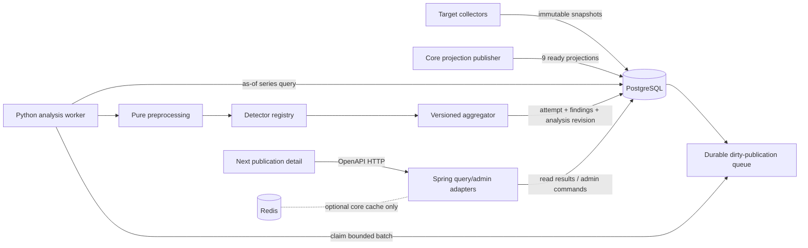
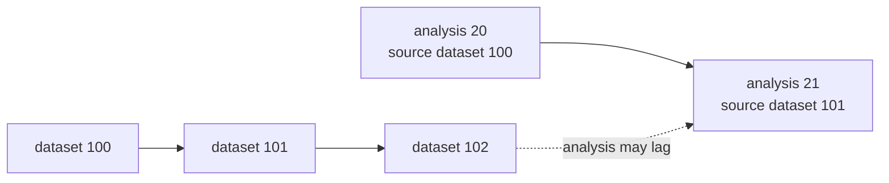
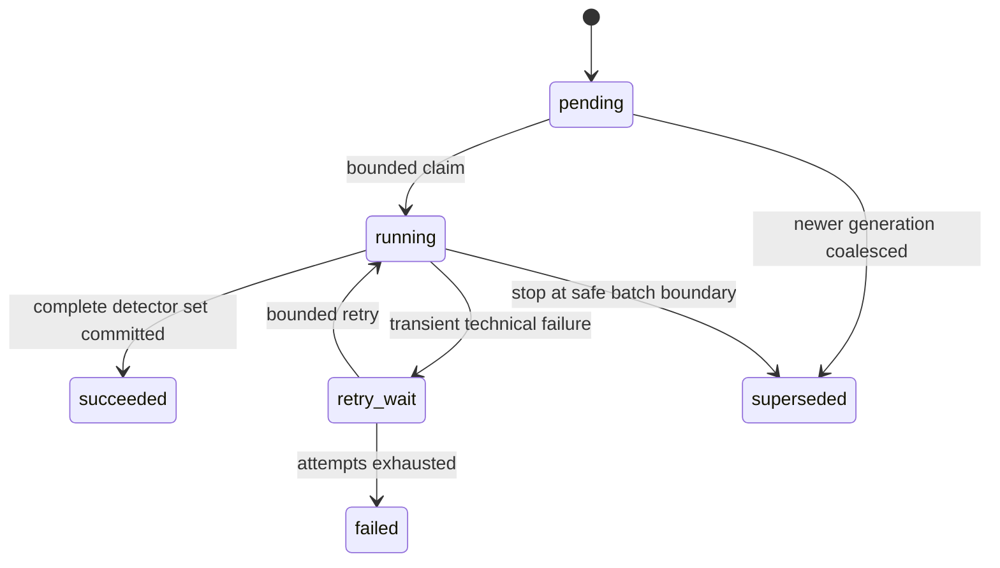

# 1. Executive Decision

Для M-Ranked рекомендуется **гибридный модуль анализа**, выполняемый отдельным Python-процессом `anomaly_analysis` внутри существующего multi-process modular monolith. PostgreSQL отвечает за отбор изменившихся публикаций, фиксацию входной `dataset_revision`, выбор актуальных correction tips и bounded-загрузку временных рядов; чистый детерминированный Python-код выполняет preprocessing, detectors и aggregation. Результаты сохраняются в схеме `analytics` как производные факты и публикуются под отдельной монотонной `analysis_revision`, которая может отставать от основной `dataset_revision` и не входит в девятикомпонентный core projection barrier.

Анализ запускается только при появлении новых пригодных snapshots, не ранее чем через конфигурируемое минимальное окно (MVP: 15 минут после публикации), а затем с возрастной периодичностью, согласованной с фактическим cadence collectors. HTTP API, collectors и `analytics.rebuild_core_projections` detectors не выполняют. Технический сбой анализа не мешает публикации обычной аналитики: публично продолжает показываться последний успешный результат с явной свежестью, а для публикации хранятся ровно последний успешный и последний неуспешный automatic attempt, если неуспешный был.

Существующие `analytics.anomaly_event` и `analytics.anomaly_review` следует не принимать как готовую реализацию, а эволюционно включить в более полную модель run/result/finding/review. Публичный продукт показывает нейтральный «сигнал аномальной динамики», включая `unreviewed`, и никогда не утверждает факт или намерение искусственного воздействия. Число называется `suspicionScore` — версионированной эвристической силой сигнала, а не вероятностью. Функция остаётся информационной и не влияет на rating, overview, exports или правила сбора.

Основание решения: канонические observations уже содержат время, накопительные значения, per-metric quality и correction lineage (`backend/src/main/resources/db/migration/V1__target_baseline.sql`, `V3__collector_observation_times_and_identity_grants.sql`, `V9__immutable_observations_quality_archive_fence.sql`); Python-процессы и psycopg уже являются частью target runtime (`collector_target/__main__.py`, `requirements.txt`); а Spring/Next уже образуют контрактно-ориентированный read path (`PublicQueryController`, `contracts/openapi/m-ranked-v1.yaml`, `frontend/lib/api.ts`).

# 2. Requirements and Terminology

## Зафиксированные продуктовые решения

| Решение | Принятая семантика |
|---|---|
| Видимость | Сигналы доступны публично сразу, включая `unreviewed`. |
| Формулировка | Только нейтральный `anomaly signal` / «сигнал аномальной динамики»; не доказательство накрутки, мошенничества или вины. |
| Влияние | Сигналы исключительно информационные и не изменяют rating/ранжирование. |
| Охват | Telegram, VK, MAX, Rutube; `views`, `reactions`, `comments`, `shares` там, где конкретная метрика доступна. `subscribers` и производный `interactions` не входят в publication-level MVP. |
| Согласованность | `analysis_revision` независима от `dataset_revision`; анализ может отставать. |
| Триггер | После новых пригодных observations, с минимальным возрастом около 15 минут и возрастающей периодичностью; без повторного запуска при неизменившемся пригодном входе. |
| История | Публично — только последний успешный automatic analysis; в БД — последний успешный и последний неуспешный attempt на публикацию. |
| Ручные действия | Только ADMIN может сделать review автоматического finding или создать manual signal. Admin UI не входит в MVP. |
| Backfill | Bounded backfill только по hot-history; cold archive не поднимается. |
| Legacy | Target-only; SQLite, bridge mapping, reverse sync, legacy CSV и rating не расширяются. |

## Термины

- **Detector** — детерминированный алгоритм с устойчивым `detectorId`, implementation version, областью применимости и versioned configuration. Он получает нормализованный временной ряд и возвращает finding, clean outcome или abstention.
- **Automatic analysis attempt** — одна технически атомарная попытка проанализировать одну публикацию на фиксированной `sourceDatasetRevision` полным активным набором detectors.
- **Finding / anomaly signal** — производный факт о форме наблюдаемого ряда: detector, метрика, эвристический score, подозрительный интервал и bounded evidence. Finding не сообщает происхождение активности и не приписывает намерение.
- **Evidence** — минимальный набор ссылок на observations/интервалы и числовых признаков, достаточный для объяснения срабатывания. Это не raw provider payload.
- **`suspicionScore`** — число `[0,1]`, выражающее силу эвристического соответствия правилам конкретной версии detector/aggregator. Оно не является статистической вероятностью.
- **`severity`** — версионированная категория `low | medium | high`, производная от score либо выбранная администратором для manual signal.
- **Abstention** — нормальный outcome `insufficient_or_unreliable_evidence`; он не равен score 0 и не является технической ошибкой.
- **`dataset_revision`** — существующая ревизия канонических данных и core projections (`analytics.dataset_revision`, `JdbcDatasetRevisionProvider.CURRENT_REVISION_SQL`).
- **`analysis_revision`** — отдельная версия опубликованного analysis state. Она изменяется при новом успешном результате, публично значимом failure/status transition, review или manual signal, но не изменяет core dataset revision.
- **Manual signal** — отдельный finding с `origin=manual`, созданный ADMIN. Он не маскируется под detector output и не получает выдуманную статистическую confidence.

Терминологическая политика основана на `docs/architecture/adr/ADR-006-anomaly-terminology.md`. ADR имеет статус `Proposed`, то есть не описывает работающий runtime, но его нейтральная терминология принята как обязательное ограничение этой функции.

# 3. Existing Data Available

## Каноническая публикация и observations

`ingest.publication` хранит `primary_account_id`, `published_at`, `discovered_at`, `first_observation_age_seconds`, `history_completeness`, `synthetic_baseline_allowed`, quality flags и `deleted_at` (`V1__target_baseline.sql`, блок `CREATE TABLE ingest.publication`). Это даёт detector-ам реальный возраст публикации и признаки полноты истории.

`ingest.publication_metric_snapshot` — partitioned append-oriented таблица накопительных наблюдений. В ней есть:

- `publication_id` и `collection_run_id`;
- `observed_at` — время наблюдаемого состояния у источника;
- `collected_at` — время получения состояния collector-ом, добавленное в `V3__collector_observation_times_and_identity_grants.sql`;
- `age_seconds` и `sampling_bucket`;
- nullable non-negative `views_count`, `reactions_count`, `comments_count`, `shares_count`;
- общая и per-metric quality;
- `interval_uncertain`, `synthetic`;
- versions семантики/capability, source fingerprint, correction lineage и bounded metric evidence.

`collector_target/model.py:RawPublication` и `CanonicalMetricSnapshot`, а также `collector_target/normalize.py:CanonicalNormalizer._publication` подтверждают семантику runtime: timestamps приводятся к UTC; `collected_at < observed_at` запрещён; отрицательные/некорректные counters становятся недоступными с quality `invalid`; provider reset становится `suspected_reset`; `NULL` не заменяется нулём.

`V9__immutable_observations_quality_archive_fence.sql` добавляет `correction_sequence`, `supersedes_snapshot_id`, `correction_reason` и per-metric quality. `prepare_immutable_publication_snapshot` сериализует logical bucket, делает exact replay no-op и создаёт новый immutable correction вместо UPDATE. `publication_metric_snapshot_active` выбирает текущий tip, а `analytics.usable_publication_snapshot` маскирует `invalid`/`suspected_reset` values в `NULL`, сохраняя качество и lineage.

Для анализа на прошлой `sourceDatasetRevision` недостаточно механически читать текущий `publication_metric_snapshot_active`: correction, пришедший позже выбранной ревизии, уже скроет прежний tip. Bounded extraction должна выбирать максимальный `correction_sequence` по bucket среди строк, чьи `created_at`/`collected_at` не позже `dataset_revision.committed_at`, и только затем применять quality rules. Это уточнение строже текущего convenience view и необходимо для воспроизводимого as-of input.

## Готовые read representations

`analytics.publication_history` из `V12__detail_history_projection.sql` содержит counts, signed deltas, per-metric quality, reaction breakdown, `synthetic`, `interval_uncertain`, correction lineage и `dataset_revision_id`. `JdbcDetailQueries.history` читает её для `/api/v1/publications/{id}/history`. Однако rebuild делает `DELETE` + `INSERT`, поэтому таблица содержит только текущую опубликованную core revision и не является историческим store для долгого асинхронного анализа.

`analytics.publication_hourly` и `comparison_publication_hourly` дают as-of carry-forward points; последняя ограничена 336 часами (`V6__comparison_valid_observation_hourly_projection.sql`). Для первых detectors нужны фактические observation intervals и их uncertainty, поэтому primary input — canonical observations, а hourly projections могут быть только вспомогательными baseline features.

## Provider capability matrix

| Provider | Views | Reactions/likes | Comments | Shares/reposts | Качество и cadence |
|---|---:|---:|---:|---:|---|
| Telegram MTProto | да | да + breakdown | да | нет (`NULL`) | Обычно exact; `collector_target/adapters.py:telegram_mtproto_batch`. |
| Telegram public web | да | да + breakdown | иногда | нет (`NULL`) | Rounded; comments могут быть unknown; возможен estimated synthetic zero baseline (`telegram_public_batch`). |
| VK | да | likes | да | reposts | Exact; positive-to-zero помечается `suspected_reset` (`vk_batch`). |
| MAX | при наличии | при наличии + breakdown | при наличии | при наличии | Недоступное остаётся `NULL/unknown` (`max_batch`). |
| Rutube | да | likes при успешном engagement request | comments при успешном request | нет (`NULL`) | Отказ engagement request даёт degraded/unknown (`rutube_batch`). |

Таблицы `analytics.metric_semantic_definition` и `analytics.platform_metric_capability` существуют в V1, но repository search не обнаруживает seed/runtime writer. Поэтому они являются dormant metadata, а не надёжным текущим registry. Рекомендуется активировать их versioned Flyway seed-данными для четырёх publication metrics; detector config hash должен учитывать capability/semantic versions.

## Sampling, deletion и retention

`app/public_web.py:snapshot_interval_minutes`, используемая target tracking через `collector_target/tracking.py`, задаёт возрастной cadence. Defaults в `app/config.py`:

- не-Rutube: 5 минут в первые сутки, затем 15/15/30/60/60 минут по возрастным диапазонам;
- Rutube: 60/180/360/720 минут;
- tracking horizon: 960 часов, то есть 40 дней;
- refresh scan/selection ограничены 400/100 публикациями за проход.

Интервалы нерегулярны даже при таком расписании: provider errors, retries и пропуски делают raw delta непригодной мерой без `deltaTime` и `interval_uncertain`.

Удаление фиксируется отдельно в `ingest.deletion_observation`; `ingest.publication.deleted_at` не удаляет историю. Detector может анализировать retained pre-deletion series, но deletion не является доказательством аномалии и прекращает ожидание новых observations.

Retention policy в `V1__target_baseline.sql` сохраняет publication snapshots hot не менее 70 дней и cold details 36 месяцев; `operations/cold_archive/` может затем удалить verified hot partition. Так как MVP не читает Parquet archive, практический analysis/backfill horizon ограничен hot-history. Существующий 40-дневный tracking horizon помещается в 70-дневный hot floor.

## Достаточность данных для первых detectors

| Detector | Достаточно | Существенная неопределённость |
|---|---|---|
| Delayed spike after plateau | `published_at`, ordered observations, cumulative values, `deltaTime`, quality, correction tips | Нельзя отличить купленную активность от viral/external referral; большой polling gap может скрыть форму jump. |
| Suspiciously linear growth | Actual timestamps и values позволяют time-based regression/rate stability | Rounded counters и provider batching могут искусственно повышать/понижать линейность. |
| Periodic large jumps | Несколько bounded jump intervals и их spacing | Истинное время события interval-censored между опросами; cadence collector-а сам может создавать видимую периодичность. |

# 4. Existing Anomaly-Related Repository Artifacts

| Artifact | Классификация | Evidence | Решение |
|---|---|---|---|
| `analytics.anomaly_event` | **DORMANT / RESERVED** | V1 создаёт таблицу и `api_read` SELECT, но нет producer/repository/controller/OpenAPI/frontend call sites; runtime roles не имеют INSERT. | Эволюционно переиспользовать как generic finding, добавив run, metric, detector/config identity, score constraints, interval и idempotency. Не использовать as-is. |
| `analytics.anomaly_review` | **DORMANT / RESERVED** | V1 хранит reviewer/decision/comment/time; `api_write_admin` имеет INSERT, но нет command path и event status автоматически не меняется. | Сохранить как append-only review facts; effective state вычислять из последнего review. |
| `analytics.metric_semantic_definition`, `platform_metric_capability` | **DORMANT / RESERVED** | DDL и grants присутствуют; seed/runtime usages не найдены. | Активировать versioned seed-данными, не считать уже заполненными. |
| `app.analytics.is_spike` | **LEGACY / PARTIALLY DORMANT** | Функция проверяет raw absolute delta + ratio; `tests/test_analytics.py` тестирует её. Но `app.database.Database.insert_snapshot` всегда присваивает `spike=False` и не вызывает helper; `app.collector` лишь читает сохранённый false. | Не переносить и не считать precedent. Его raw-delta модель противоречит irregular-interval requirement. |
| SQLite `reaction_snapshots.spike` | **LEGACY** | `app/database.py`; baseline report прямо отмечает, что новые spikes не детектируются. | Не расширять и не синхронизировать. |
| ADR-006 | **PROPOSED, принято как constraint этой функции** | Файл имеет `Status: Proposed`; запрещает language of guilt и uncalibrated probability. | Использовать терминологию/fitness principles, но не заявлять, что review/runtime уже реализованы. |
| `docs/architecture/c4/06-components-analytics.puml` | **PROPOSED ONLY** | Рисует Java anomaly engine, Spring scheduling и jOOQ, которых нет в runtime/pom call sites. | Не следовать выбору Java механически; актуализировать позднее отдельным architecture-doc task. |
| Target ERD anomaly entities | **PROPOSED / SCHEMA-MIRROR** | Поля совпадают с V1, но diagram не доказывает runtime. | Использовать как исторический замысел, не как готовый contract. |
| Spring/OpenAPI/Next anomaly surfaces | **ABSENT** | `OpenApiContractTest` перечисляет реализованные routes; anomaly routes нет. `PublicApiModels.Publication`, `HistorySnapshot` и `PublicationDetail` не имеют signals. | Спроектировать новый bounded resource и UI integration. |

Расхождение с исходным `docs/architecture-analysis.md` отсутствует по сути: отчёт также называет anomaly tables dormant и не находит Java runtime. Расхождение есть между актуальным кодом и proposed C4: диаграмма предполагает Java/Spring anomaly engine, но фактических классов, dependencies и wiring для него нет.

# 5. Architectural Alternatives

Оценка 1–5 выполнена применительно к этому repository; 5 — лучше.

| Вариант | Fit | Extensibility 10–30 detectors | Unit testing | Failure isolation | Stats/ML future | Ops cost | Итог |
|---|---:|---:|---:|---:|---:|---:|---|
| A. SQL detectors внутри core rebuild | 4 | 1 | 2 | 1 | 1 | 4 сначала, 1 далее | Отклонить |
| B1. Java jobs внутри Spring API | 2 | 4 | 5 | 1 | 3 | 4 | Отклонить |
| B2. Отдельный Java worker | 3 | 4 | 5 | 5 | 3 | 3 | Допустимый runner-up |
| C. Python worker с ad-hoc SQL каждого detector-а | 4 | 5 | 5 | 5 | 5 | 3 | Допустим, но опасен дублированием DB semantics |
| D. Bounded SQL extraction + pure Python engine | 5 | 5 | 5 | 5 | 5 | 3 | **Выбрать** |

## A. SQL-centric detection during projection rebuild

Плюсы: данные уже в PostgreSQL; window functions эффективны; не нужен новый process. Но `analytics.rebuild_core_projections` представляет цепочку Flyway wrappers V2→V5→V6→V8→V9→V10→V12→V14→V17→V18→V24, работает как SECURITY DEFINER с 15-minute timeout и заменяет projection tables транзакционно. Добавление каждого detector-а потребовало бы SQL/Flyway change, а ошибка detector-а откатывала бы всю обычную аналитику.

Девять required projections жёстко повторяются в `operations/scripts/projection-publisher.sh`, `JdbcDatasetRevisionProvider.CURRENT_REVISION_SQL`, `JdbcReadinessProbe`, `V19__safe_health_operational_snapshot.sql`, migration reconciliation, restore/cutover scripts и tests. Пользователь выбрал независимую `analysis_revision`, поэтому включение anomaly в этот barrier противоречит требуемой failure isolation.

## B. Java application runtime

Pure Java detectors хорошо тестируются JUnit и вписываются в `domain/application/infrastructure`. Однако текущий `MRankedApplication` — web composition root; production Spring соединяется как `api_read`, а admin data source отдельно и обычно выключен (`AdminDatabaseConfiguration`, `operations/env/api.env.example`). Фоновый CPU/DB workload внутри API конкурировал бы с HTTP и потребовал coordination между replicas. Отдельный Java worker устраняет это, но добавляет второй Boot composition root/JVM, тогда как `backend/pom.xml` не содержит math/stat libraries и production memory ограничена. Это жизнеспособный второй выбор, но хуже Python для будущих статистических detectors.

## C. Python-only detector process

Python уже поставляется, psycopg присутствует, pure algorithms легко тестировать. Опасность — позволить каждому detector-у самостоятельно читать SQL rows и по-разному трактовать corrections, NULL и quality. Такой вариант со временем создаст N несогласованных data-access implementations.

## D. Hybrid — выбранный вариант

Один infrastructure adapter выполняет set-based candidate selection и bounded as-of extraction. Один universal preprocessor создаёт корректные time-normalized features; detectors остаются pure Python strategies; side effects сосредоточены в coordinator/repository. PostgreSQL остаётся authority, никакой второй datastore или broker не появляется. Новый worker — не microservice: у него нет HTTP API, собственной БД и независимого release lifecycle; он запускается тем же systemd target из того же checkout/venv.

# 6. Recommended Architecture

## Placement и boundaries

Новый root package `anomaly_analysis/` должен быть соседним с `collector_target/`, а не подпакетом `app/` или collector-а:

- `domain` — immutable series, segments, detector outcomes, findings, scores;
- `preprocessing` — time normalization, quality filtering, reusable robust features;
- `detectors` — независимые algorithm implementations;
- `registry/config` — explicit packaged registry и canonical configuration hash;
- `application/coordinator` — claim, batching, attempt lifecycle, aggregation;
- `infrastructure/postgres` — только SQL extraction, leases и result publication;
- `metrics` и `__main__` — composition/observability.

Зависимости направлены внутрь: PostgreSQL adapter и CLI зависят от application ports/domain; detectors зависят только от analytical domain; domain не импортирует psycopg, collector/provider DTOs или framework code. Это повторяет strongest existing pattern в `collector_target/ports.py`, `PollCycleCoordinator` и Java `ArchitectureTest`.



## Durable candidate selection

Не следует использовать `ops_and_admin.outbox_event` как work queue: `cache-outbox-worker.sh:claim_event` конкурирующим образом забирает каждый non-`projection.rebuild.requested` event и ставит один общий `published_at`. Для анализа нужна отдельная coalescing queue, например `ops_and_admin.anomaly_analysis_candidate`.

Надёжный и производительный вариант — Flyway-owned AFTER INSERT trigger на `ingest.publication_metric_snapshot`, который через SECURITY DEFINER upsert увеличивает `dirty_generation` публикации. Exact replay не доходит до AFTER trigger, потому что V9 BEFORE trigger возвращает `NULL`; corrections создают новый candidate. Это покрывает collector, migration/backfill и будущих writers без изменения их application code. Candidate не означает, что detector запускается в ingestion transaction: trigger записывает только durable dirty marker.

Worker обрабатывает marker лишь когда соответствующий snapshot уже попадает в latest fully published core `dataset_revision`. Он фиксирует current nine-ready dataset revision, проверяет minimum age/cadence, input digest и затем claim-ит rows через `FOR UPDATE SKIP LOCKED` с lease expiry. Если во время работы `dirty_generation` увеличилась, successful completion не удаляет новый marker.

# 7. End-to-End Runtime Flow

## Automatic path

```mermaid
sequenceDiagram
    participant P as Provider
    participant C as Python collector
    participant DB as PostgreSQL
    participant CP as Core projection publisher
    participant AW as Analysis worker
    participant API as Spring API
    participant UI as Next.js

    P->>C: cumulative counters
    C->>DB: canonical snapshots + dataset revision + rebuild request
    DB->>DB: trigger coalesces dirty publication
    CP->>DB: rebuild 9 core projections
    CP->>DB: publish dataset revision
    Note over AW,DB: independent of core availability
    AW->>DB: read latest nine-ready revision; claim eligible candidates
    AW->>DB: bounded as-of series for publication batch
    AW->>AW: preprocess once; run applicable detectors; aggregate
    alt publication attempt succeeds
        AW->>DB: atomically persist result/findings, update pointer, create analysis revision
    else attempt fails technically
        AW->>DB: persist bounded latest failure; keep previous success pointer
    end
    UI->>API: GET history + GET anomaly-analysis
    API->>DB: current core history + latest successful analysis state
    API-->>UI: score/status/evidence with both revisions and freshness
```

Последовательность конкретно:

1. `PostgresCollectorRepository.persist_account_batch` сохраняет observations и `_record_revision` создаёт `projection.rebuild.requested` только при фактическом изменении.
2. Trigger лишь помечает publication dirty; collector не импортирует detector engine.
3. `projection-publisher.sh` публикует обычную аналитику как сейчас. Никаких новых required projection names не добавляется.
4. Worker выбирает только candidates с новыми effective usable observations, возрастом не менее 15 минут и наступившим analysis cadence.
5. Batch pin-ит `sourceDatasetRevision`, загружает все серии одним set-based query и строит `inputHash`.
6. Если hash не изменился после quality masking/correction resolution, candidate закрывается как no-op без нового attempt.
7. Pure engine запускает полный configured detector set. Не применимый detector или плохие данные дают abstention; unexpected exception делает весь publication attempt failed, чтобы не публиковать молча неполный detector set.
8. Success transaction создаёт/обновляет current pointer и новую public `analysis_revision`. Zero findings — полноценный success со score 0; all-abstained — success со score `NULL` и coverage status.
9. Failure transaction сохраняет только sanitized error code/metadata как latest failed attempt и не меняет latest successful pointer. Публичный status может стать `stale`/`failed`, но findings остаются от последнего success.
10. После terminal commit retention cleanup оставляет для публикации один latest success и один latest failure; более старые generated attempts/results удаляются.

## Manual correction path

ADMIN вызывает Spring command с Basic auth, CSRF и correlation ID. Database command в одной транзакции валидирует idempotency, вставляет append-only review или `origin=manual` finding, пишет `ops_and_admin.audit_log`, пересчитывает public summary и создаёт `analysis_revision`. `dismissed`/`data_error` перестают считаться active; `explained`/`unresolved` остаются видимыми. Reviewer subject и private comment наружу не возвращаются.

# 8. Detector Plugin/Strategy Model

## Контракт detector-а

Интерфейс следует определить как небольшой Python `Protocol`/ABC, не как динамический plugin loader. Концептуально detector предоставляет:

- metadata: stable `detectorId`, `implementationVersion`, human-readable type;
- `supportedMetrics` и optional platform constraints;
- `minimumObservations`, minimum duration и quality requirements;
- typed configuration schema;
- `evaluate(publicationHistory, metricSeries, sharedFeatures, config)`;
- typed outcomes: `Finding[]`, `Clean`, `Abstained(reasonCodes[])`.

Detector не читает БД, env, clock или сеть и не пишет результаты. Все времена и входная revision передаются явно. Registry представляет explicit ordered tuple/map в packaged code; duplicate IDs/versions и неизвестные config keys делают startup fail-fast. Это проще и безопаснее автоматического filesystem discovery.

## Версии и config

Идентичность результата включает:

`detectorId + implementationVersion + detectorConfigHash + preprocessingVersion + aggregatorVersion + inputHash + sourceDatasetRevision`.

Registry manifest целиком canonical-serializes в JSON и SHA-256. Смена реализации, threshold, capability matrix, preprocessing или aggregation меняет hash и инициирует bounded hot backfill. Отключение detector-а — новая config version, а не молчаливое исключение после ошибки.

## Добавление будущего detector-а

Например, detector «reaction bursts follow view bursts while comments remain flat» получает сразу несколько normalized metric series из `PublicationHistory`, использует существующие segments/rates/cross-metric alignment primitives, реализует один protocol, регистрируется и получает config/tests. Если он использует уже существующие evidence semantics, не меняются SQL schema, controllers или frontend. Изменение API потребуется только при действительно новом публичном типе evidence, а не при каждом detector ID.

# 9. Analytical Time-Series Model

## Internal normalized input

`PublicationHistory`:

- publication/account/institution/platform IDs;
- `publishedAt`, optional `deletedAt`, history completeness/quality flags;
- pinned `sourceDatasetRevision` и revision timestamp;
- map `MetricKey -> PublicationMetricSeries`;
- source capability/semantic versions.

`MetricObservation`:

- stable snapshot ID и `observedAt`;
- `ageSeconds`;
- cumulative nullable value;
- per-metric quality;
- `synthetic`, `intervalUncertain`;
- correction sequence/fingerprint reference.

`MetricSegment` между двумя usable observations:

- start/end IDs and timestamps;
- `deltaTimeSeconds`, signed `deltaValue`, `ratePerSecond`;
- gap/correction/quality flags.

## Universal preprocessing

Один проход на metric:

1. Упорядочить по `(observedAt, snapshotId)` после as-of correction resolution.
2. Не превращать `NULL` в 0. `invalid` и `suspected_reset` исключить из числового ряда, сохранив gap reason.
3. Synthetic baseline не использовать как подтверждение spike/rate; он может задавать только publication origin/coverage context.
4. Для одинакового timestamp не вычислять бесконечную скорость: deterministic deduplication либо abstention для нулевого интервала.
5. Вычислить signed delta и `deltaTime`; отрицательная delta разрывает monotonic segment и не становится отрицательным «анти-spike».
6. Вычислить rates, robust median/MAD, local dispersion, plateau candidates, bounded rolling sums и time-weighted regression statistics.
7. Отметить gaps, превышающие ожидаемый provider-age cadence, и interval uncertainty.

Persisted остаются только source observations, input hash и bounded finding evidence. Deltas/rates/MAD/regression windows в MVP ephemeral: их можно воспроизвести, они зависят от preprocessing version и не должны превращаться в преждевременный feature mart. SQL выполняет correction/as-of filtering и ordering, но detector policies остаются в Python.

# 10. Finding & Evidence Model

## Detector outcomes

Каждая пара `(publication, detector, metric)` заканчивается ровно одним типизированным outcome:

- `finding` — обнаружен сигнал с score и evidence;
- `clean` — detector применим и не нашёл сигнал;
- `abstained` — detector неприменим либо evidence недостаточно надёжна;
- unexpected exception не является outcome и проваливает automatic attempt целиком.

Хранить отдельные clean rows для каждого detector/metric необязательно. Достаточно агрегированных counters и abstention reason codes в publication result, а finding rows — только для срабатываний. Полный detector manifest в attempt позволяет доказать, какие detectors должны были выполниться.

## Durable automatic finding

Минимальная долговечная модель:

| Field | Назначение |
|---|---|
| `findingId` / deterministic `findingKey` | Идемпотентность retry и стабильная ссылка. Hash включает publication, metric, detector, version и suspicious interval. |
| `analysisAttemptId` | Связь с единственным успешным automatic attempt. |
| `origin` | `automatic` или `manual`; manual не маскируется под algorithm. |
| `publicationId`, `metric` | Public subject и затронутая cumulative metric. |
| `detectorId`, `detectorVersion`, `configHash` | Интерпретация и эволюция алгоритма. Для manual: `detectorId=manual-assessment`, score nullable. |
| `suspicionScore`, `severity` | Эвристическая сила automatic signal; constraint `[0,1]`. |
| `explanationCode` | Stable bounded code для API/UI localization. |
| `suspiciousInterval` | Start/end snapshot IDs и timestamps; допускается один point interval. |
| `baselineInterval` | Optional start/end, относительно которых рассчитано отклонение. |
| `evidence` | Bounded numeric facts, observation refs, sample/coverage/quality и alternative explanation codes. |
| `createdAnalysisRevisionId` | Ревизия, в которой finding стал публичным. |

`evidence` должен иметь закрытую общую форму, а detector-specific числовые facts — пары `{code, value, unit}`. Public mapper ограничивает, например, число observation refs и facts; arbitrary keys из provider payload не проходят. Полные histories не дублируются: API `/history` уже возвращает `snapshotId`, timestamp, counters и deltas (`HistorySnapshot.java`, OpenAPI `HistorySnapshot`).

## Review и manual signal

`analytics.anomaly_review` остаётся append-only. Effective status finding-а — решение последнего review, а не in-place изменение finding row. Initial state — `unreviewed`; допустимы `explained`, `unresolved`, `data_error`, `dismissed`. `dismissed` и `data_error` не входят в active summary; `explained` и `unresolved` видимы с нейтральным статусом. Reviewer и private comment остаются admin-only.

Manual signal использует тот же public evidence vocabulary, но:

- `origin=manual`;
- обязательны ADMIN actor, correlation ID, reason/explanation code, metric, interval и severity;
- numeric detector score отсутствует;
- audit/withdrawal выполняются review events;
- manual signal не удаляется при pruning automatic attempts.

## Retention, immutability и принятый компромисс

Для каждой публикации durable automatic storage оставляет:

1. последний `succeeded` attempt со всеми его findings/result;
2. последний `failed` attempt с bounded error metadata, если failure когда-либо был.

При новом success предыдущий success удаляется после атомарного переключения public pointer. При новом failure предыдущий failure заменяется; success сохраняется. Это более строгая политика, чем предложенные ADR-006 и V1 retention row `anomaly_and_review = 36 months`. Поэтому «immutable» здесь означает: retained attempt/finding никогда не UPDATE-ится; superseded generated payload может быть удалён retention transaction.

Чтобы pruning не уничтожал административную подотчётность, `ops_and_admin.audit_log`, manual signals и review audit facts отделяются от prunable automatic run payload. Для удалённого старого attempt audit сохраняет только безопасный tombstone: attempt ID, versions/hashes, source revision, terminal status и deletion reason — не полный finding/evidence. Полная историческая реконструкция всех когда-либо показанных результатов намеренно не обещается; это прямое следствие выбранного двухслотового retention.

# 11. Score / Confidence Semantics

Начальные эвристики не обучены и не откалиброваны на independently labeled dataset. Поэтому Bayes/posterior probability, false-positive calibration и probability of manipulation из них получить нельзя. Поле `probability` запрещено.

Для automatic finding:

- `suspicionScore ∈ [0,1]` — version-local normalized strength;
- score 0.8 у разных detector versions не обязан иметь одинаковую empirical precision;
- `severity` формируется versioned thresholds `low/medium/high`;
- evidence раскрывает компоненты расчёта, но UI не показывает ложные десятые доли процента.

MVP aggregator использует **maximum active automatic finding score**, а не сумму или формулу независимых вероятностей. Причина: три detectors коррелированы — spike detector и periodic jumps могут срабатывать на одних segments; сумма дважды посчитала бы один феномен. Aggregate хранит `aggregatorId=max-active-signal`, version и contributing finding IDs. В дальнейшем aggregator заменяется независимо, не меняя detectors.

Семантика пустых результатов:

- хотя бы один detector оценил данные, findings нет → `suspicionScore=0`;
- все применимые detectors abstained → `suspicionScore=null`;
- analysis ещё не запускался → summary/status `pending`, score отсутствует;
- technical failure не превращается в score 0.

Manual signals не получают искусственное numeric значение. Public summary содержит automatic `suspicionScore` отдельно и `overallSeverity`, где ordinal severity manual assessment может повысить категорию. Также возвращается `manualAssessmentPresent=true`. Это не смешивает человеческую оценку и detector confidence в псевдоматематическое число.

Перед использованием слова probability потребуется labeled dataset с независимым ground truth, заранее определённая calibration method, holdout validation, Brier/calibration curves, документированные base rates и внешний методологический review.

# 12. Revision & Reproducibility Model

## Две независимые оси



- Core `dataset_revision` продолжает означать fully published canonical/projection snapshot.
- Global `analysis_revision` означает атомарно опубликованное изменение analysis state. Она может охватывать bounded batch публикаций и содержит cause: `automatic`, `manual_review`, `manual_signal`, `configuration_backfill`.
- Publication state отдельно указывает `latestSuccessAttemptId`, `latestFailureAttemptId`, `currentAnalysisRevisionId`, `latestInputGeneration` и pending/lease state.

Публичный finding допустим только если его successful attempt использовал `sourceDatasetRevision <= currentDatasetRevision`. API возвращает обе версии и `analyzedAt`. `stale` определяется не просто разностью глобальных IDs (чужие аккаунты тоже двигают dataset), а наличием более нового dirty input или failure именно для этой публикации.

## State transitions



Publication-level attempt публикуется без partial findings: либо весь configured detector set технически завершён, либо attempt failed. `abstained` — успешное доменное решение. Batch может содержать successes и failures разных публикаций; каждая publication state меняется атомарно, а один broken series не блокирует соседние.

Public status:

- `pending` — success ещё нет, minimum input не достигнут;
- `ready` — latest success актуален, все применимые detectors отработали;
- `partial` — success актуален, но часть detectors abstained/not-applicable;
- `stale` — старый success показан, но есть более новый dirty input или более поздний failure;
- `failed` — success ещё нет, последний bounded attempt failed.

Failure может создать новую `analysis_revision`, если меняет публичный status, но никогда не переключает findings pointer. В ответе не публикуются error code/message.

## Что делает результат воспроизводимым

Retained success хранит source dataset revision/time, effective snapshot IDs, canonical `inputHash`, detector/preprocessor/aggregator versions и canonical config JSON/hash. Пока source rows доступны hot или в cold archive, результат может быть проверен повторно. MVP не обещает автоматическую реконструкцию из cold archive и не хранит все superseded successes; этот предел должен быть явно указан в API/methodology.

Correction создаёт новую dataset revision и dirty generation. До нового success старый результат остаётся видимым как stale. Config/algorithm change при тех же observations создаёт backfill candidates через новый manifest hash; старый success остаётся до атомарной замены.

# 13. Persistence Design

Названия ниже концептуальны; SQL в этой фазе не создаётся.

## Новые/эволюционирующие объекты

| Object | Schema | Responsibility |
|---|---|---|
| `anomaly_analysis_candidate` | `ops_and_admin` | Coalesced dirty generation, eligibility time, claim lease, retry counters. Не public fact. |
| `anomaly_analysis_revision` | `analytics` | Monotonic published analysis-state version, cause, committed time, correlation, source dataset range, manifest/config hashes. |
| `publication_analysis_attempt` | `analytics` | Один automatic attempt: publication, source dataset, input hash/high watermark, versions, timestamps, status, counters, sanitized failure code. |
| `publication_analysis_state` | `analytics` | Current pointers на retained success/failure, current analysis revision, pending generation и compact public summary. |
| `anomaly_event` (evolved) | `analytics` | Immutable generic automatic/manual findings. |
| `anomaly_review` (evolved) | `analytics` | Append-only ADMIN decisions; effective status derived. |

`publication_analysis_state` — derived read model, но не core projection. Worker/manual command обновляет её в короткой publication transaction после полной проверки result set. Public API никогда не вычисляет aggregation по raw events на лету.

## Keys и indexes

- Candidate PK `publication_id`; claim index `(available_at, lease_until, publication_id)`.
- Attempt uniqueness `(publication_id, source_dataset_revision_id, input_hash, detector_manifest_hash)` для idempotent retry.
- Attempt terminal indexes `(publication_id, status, completed_at DESC, id DESC)`.
- State PK `publication_id`; index по `current_analysis_revision_id` для observability/cache headers.
- Finding unique `(analysis_attempt_id, finding_key)`; public page index `(publication_id, analysis_attempt_id, metric_key, suspicion_score DESC, id)`.
- Review index `(anomaly_event_id, reviewed_at DESC, id DESC)`.
- Для as-of extraction может понадобиться partition-compatible index `(publication_id, sampling_bucket, created_at DESC, correction_sequence DESC)`; текущий `(publication_id, observed_at DESC, id DESC)` оптимизирует chronology, но не все correction-as-of predicates.

## Transactions и pruning

Success publish transaction:

1. lock publication state/advisory key;
2. verify claimed `dirty_generation`, source revision и idempotency;
3. insert terminal success/result/findings;
4. recompute summary/effective review state;
5. create analysis revision and switch success pointer;
6. delete previous generated success and its findings;
7. keep newest failed slot; release candidate only if generation unchanged;
8. commit.

Failure transaction вставляет/заменяет failed slot, оставляет success pointer, обновляет public status/revision при необходимости и планирует bounded retry/backoff. Raw exception text не хранится.

## Roles и ownership

Flyway/migration owner остаётся единственным DDL owner. Рекомендуется новая login role `analytics_worker` с:

- SELECT/EXECUTE только bounded extraction interface и необходимой catalog/revision metadata;
- claim/update только candidate/run state через narrowly scoped SECURITY DEFINER functions;
- publish results только через проверяющую DB function;
- без прав на canonical INSERT/UPDATE, core projection rebuild, archive drop или public API tables в целом.

Role нужно provision до Flyway migration: `infra/postgres/init/001-create-roles.sh` создаёт runtime roles, а `migration_owner` имеет `NOCREATEROLE`. Для существующего deployment потребуется явный operator step и новая credential. Переиспользование `maintenance` возможно как временный fallback, но не рекомендуется: его grants позволяют менять core projections и archive state (`V1__target_baseline.sql`, maintenance grants).

`api_read` получает SELECT только на safe public analysis view. `api_write_admin` не получает broad table DML; ADMIN commands вызывают SECURITY DEFINER functions. Это сохраняет разделение authentication role в Spring и DB privilege boundary.

# 14. Projection Publication Integration

Новая функция **не добавляется** в девять core `projection_state`. Не меняются:

- `analytics.rebuild_core_projections`;
- `operations/scripts/projection-publisher.sh` и его count `9`;
- `JdbcDatasetRevisionProvider.CURRENT_REVISION_SQL`;
- core `JdbcReadinessProbe`/V19 health semantics;
- cache invalidation key текущей dataset revision.

Это сознательно реализует выбранную пользователем независимость: ordinary projection rebuild может успешно опубликовать новую dataset revision, пока analysis worker отстаёт или сломан.

У analysis есть собственный короткий publication barrier:

- staging/running attempts не видны;
- findings видны только через current state, указывающий на terminal `succeeded` attempt;
- failed attempt не становится findings source;
- manual review/finding меняет summary и analysis revision в одной транзакции;
- partial batch не создаёт недоказанного «complete detector set» для отдельной публикации.

Ответ на failure scenario: если core rebuild succeeded, а anomaly analysis failed, core API продолжает обслуживать новую dataset revision. Для публикации с прежним success возвращаются прежние findings и `status=stale`; без прежнего success — `status=failed`, score/findings отсутствуют. Readiness API остаётся healthy; analysis lag/backlog получает отдельные health details/metrics и alerts.

Текущий `ops_and_admin.outbox_event` не используется как input queue. Для MVP analysis endpoint не включается в Redis/Spring DTO cache, поэтому correctness не зависит от отдельного Redis revision. Если позже будет добавлен application cache, cache key обязан включать `(datasetRevision, publicationAnalysisRevision, representationVersion)`; доставка invalidation event остаётся лишь ускорением.

# 15. API Design

## Public MVP

Рекомендуется один отдельный resource:

`GET /api/v1/publications/{id}/anomaly-analysis?legacyType=...&limit=50&cursor=...`

Он принимает тот же canonical UUID/legacy ID resolution, что существующие publication endpoints, но не создаёт новый legacy page contract. `limit` bounded `1..100`; cursor связывает publication ID, `analysisRevision`, normalized filters и last finding key. Изменившаяся analysis revision делает cursor недействительным, как текущие revision-bound cursors в `PublicQueryService`.

Response содержит:

- `publicationId`, `datasetRevision`;
- `analysisRevision`, `sourceDatasetRevision`, `analyzedAt`;
- `status`, freshness/lag metadata;
- nullable automatic `suspicionScore`, `overallSeverity`;
- `manualAssessmentPresent`, `affectedMetrics`, `activeFindingCount`;
- bounded active findings;
- `nextCursor`;
- обязательный neutral disclaimer/methodology version.

Finding содержит stable ID, origin, metric, detector metadata, score/severity, explanation code, suspicious/baseline intervals, bounded numeric facts/observation refs, effective review status и quality/alternative explanation codes. Reviewer identity/private comment/error details отсутствуют.

Публичная publication detail **страница** показывает summary из этого resource. Существующие `Publication`/`PublicationHistory` DTO в MVP не следует расширять independently-changing summary: сейчас они кешируются по `datasetRevision`, тогда как analysis меняется отдельно. Такое разделение избегает stale cache и сохраняет контракт core history. Это осознанное уточнение идеи «aggregate on detail»: aggregate находится на detail page, но поступает из отдельного analysis resource.

Endpoint выполняет только indexed projection/state reads, не raw history и не detection. Он получает собственный ETag digest из `datasetRevision + publicationAnalysisRevision + representationVersion`, `Cache-Control: public, max-age=30, must-revalidate`, но первоначально не использует `PublicDtoCache`/Redis и Next `unstable_cache`. Existing `frontend/lib/api.ts:revalidate` уже поддерживает HTTP ETag для uncached-by-Next routes.

## Admin-only commands

- `POST /api/v1/admin/anomaly-signals` — создать manual signal.
- `POST /api/v1/admin/anomaly-signals/{findingId}/reviews` — append review автоматического или manual finding.

Оба route требуют исключительно `ROLE_ADMIN`, а не EDITOR. Они используют Basic auth, CSRF, `X-Correlation-Id`, bounded validated body, idempotency receipt/request digest, `Cache-Control: no-store`, audit log и RFC 9457 errors. Это продолжает patterns `AdminController`, `CatalogController`, `ApiSecurityConfiguration` и `V16__audited_catalog_commands.sql`. Admin UI не создаётся.

OpenAPI остаётся source of truth: изменяются YAML, `OpenApiContractTest` exact route list, Spring DTO/controller mappings; затем генерируется `contracts/openapi/m-ranked-v1-client.ts` через `frontend/scripts/generate-openapi.mjs`. В этой design-фазе контракт не редактируется.

# 16. Frontend Integration

`frontend/app/publications/[id]/page.tsx`/legacy publication page loader параллельно загружает current history и analysis resource. Если `sourceDatasetRevision > history.datasetRevision` из-за cross-request race, history перечитывается один ограниченный раз; `sourceDatasetRevision <= history.datasetRevision` допустимо и означает lag.

В `PublicationDetail` добавляется компактный блок:

- «Сигнал аномальной динамики», а не «накрутка»;
- heuristic score с короткой шкалой и severity;
- `unreviewed/explained/unresolved` status;
- affected metric chips;
- freshness и предупреждение при stale/failed/pending;
- обязательная фраза, что сигнал не доказывает искусственное происхождение активности;
- раскрываемый список detector explanations/evidence.

`PublicationMeasurements` переиспользует существующие cumulative/growth charts. Suspicious intervals отображаются marker/band поверх соответствующей metric, а evidence points связываются по snapshot ID и timestamp. Полная история не дублируется в response анализа.

Текущий chart показывает максимум 144 sampled points (`PublicationMeasurements.tsx`, `sampleHistory`). Sampling нужно расширить так, чтобы он обязательно сохранял все bounded annotation boundaries/markers внутри выбранного диапазона; иначе detector evidence исчезнет визуально. Annotation должна быть доступна не только цветом: table rows получают текстовую метку/`aria-describedby`, а под canvas остаётся читаемый список evidence. Existing keyboard navigation/tooltip behavior сохраняется.

Если stale finding ссылается на snapshot, superseded в более новой history revision, UI использует timestamp interval и показывает stale note; он не подставляет ближайшую точку как будто это та же observation.

Не меняются overview, rating, exports, notifications и `/manage`. Новый admin UI отсутствует.

# 17. Initial Detector Algorithms

Все параметры ниже являются typed/versioned config, а не предложенными окончательными thresholds.

## 17.1 Delayed spike after plateau

**Purpose.** Найти резкий time-normalized jump после заметного периода существенно более медленного роста.

**Input requirements.** Одна cumulative metric; несколько real usable observations до jump; положительный `deltaTime`; минимальная длительность/число plateau segments; metric supported. Для утверждения именно `delayed` нужна наблюдаемая pre-plateau growth либо достаточный post-publication age.

**Preprocessing.** Разбить series на monotonic segments; исключить synthetic point из jump baseline; посчитать per-segment rates, robust prior median/MAD, plateau duration, gap/coverage. Candidate jump — интервал `(previousObservedAt, observedAt]`, а не точный момент.

**Detection logic.** Для каждого допустимого segment проверить одновременно:

1. preceding time window соответствует plateau: low rate относительно robust earlier/local baseline и длится достаточно долго;
2. candidate rate заметно выше plateau/prior robust rate;
3. absolute delta и доля от pre-jump cumulative value не тривиальны;
4. elapsed interval достаточно короток относительно cadence и не `interval_uncertain`;
5. по возможности последующие observations образуют новый plateau — это усиливает score, но их отсутствие не запрещает early finding.

Raw delta без elapsed time никогда не является достаточным условием.

**Parameters.** Minimum observations, natural-growth/baseline window, plateau duration/rate ratio, jump absolute floor, jump-to-baseline ratio, jump share, maximum trusted gap, optional post-plateau length, score component weights.

**Evidence.** Metric; baseline/plateau/candidate intervals; endpoint IDs/timestamps/values; delta, duration, rate, baseline median/MAD, ratios, sample coverage и quality flags.

**Score.** Версионированная monotone combination jump prominence, plateau strength, duration/coverage и optional new plateau. Это similarity-to-rule, не probability.

**Abstain.** Нет минимальных samples/duration; candidate touches invalid/reset/zero-time/uncertain interval; history слишком поздно началась для required baseline; metric unavailable; gap превышает maximum.

**False positives.** Viral mention/news, paid legitimate promotion, external link, provider batch refresh, delayed polling/API counter reconciliation.

**Complexity.** Один scan с rolling robust summaries: `O(N)` либо `O(N log W)` при bounded rolling median.

## 17.2 Suspiciously linear growth

**Purpose.** Найти достаточно длинный non-zero cumulative growth segment с нетипично стабильной скоростью во времени, включая позднее начало.

**Input requirements.** Minimum real observations и duration, достаточная total growth, несколько независимых intervals, acceptable timestamp coverage.

**Preprocessing.** Time в секундах от начала candidate window; cumulative value; rates; scale-aware residuals. Rounded data помечается отдельно. Candidate start points берутся из bounded change-point set/age windows, а не из всех `O(N²)` подокон.

**Detection logic.** Для каждого bounded candidate window выполнить time-based linear regression либо robust linear approximation; оценить normalized residual error, `R²`, dispersion of time-normalized rates, monotonicity и persistence. Сигнал требует одновременно высокой linear fit, слишком низкой variation, достаточного ненулевого slope и существенных duration/sample/total delta. Поздний onset допускается после change point, если предшествующая часть существенно менее линейна или имеет другой slope.

**Parameters.** Minimum points/duration/total delta, candidate window set, normalized residual ceiling, rate coefficient/MAD dispersion ceiling, minimum slope, rounded-quality penalty, onset improvement threshold.

**Evidence.** Window endpoints; fitted slope/intercept; normalized residual, `R²`, rate dispersion, sample count/duration, observed vs fitted bounded points, onset timestamp.

**Score.** Усиливается при большей duration/sample coverage и меньшей normalized residual/rate dispersion после прохождения activity floors.

**Abstain.** Flat/near-zero series; слишком мало intervals; большинство данных rounded/degraded; resets/gaps делят window; duration недостаточна; values below meaningful resolution.

**False positives.** Органическая стабильная рекламная кампания, platform rate limiting/batching, округлённый публичный counter, регулярная аудитория/расписание.

**Complexity.** `O(N × K)`, где K — небольшой versioned набор окон/change points; K bounded и не растёт как N.

## 17.3 Periodic large jumps

**Purpose.** Найти несколько prominent jumps с подозрительно регулярным временным spacing.

**Input requirements.** Не менее configured repetition count (минимально осмысленно три events), reliable intervals, non-zero baseline history.

**Preprocessing.** Сначала выделить jump events общей primitive `jump prominence`: absolute/relative delta, rate против robust local baseline. Каждый event interval-censored между двумя observations; reference time — midpoint с uncertainty width, а не якобы точный event timestamp.

**Detection logic.** Упорядочить jump events, вычислить spacing intervals, robust central period и отклонения. Совпадение считается допустимым, только если tolerance учитывает polling uncertainty, но не настолько велико, чтобы регулярность стала неизбежной. Проверить repetition count, prominence каждого jump и optional magnitude consistency. Collector cadence сравнивается с найденным period: pattern, полностью объяснимый polling schedule/batching, получает penalty или abstention.

**Parameters.** Jump prominence floors, minimum repetitions, min/max period, absolute/relative spacing tolerance, magnitude variation tolerance, maximum interval uncertainty, cadence-confounding penalty.

**Evidence.** Jump intervals/points, deltas/rates/prominence, inter-jump spacing, estimated period, dispersion/tolerance, repetition count, cadence comparison.

**Score.** Комбинация repeat count, spacing regularity, jump prominence и evidence certainty; не умножение независимых probabilities.

**Abstain.** Меньше требуемых events; gaps шире periodicity tolerance; resets/corrections затрагивают events; series duration слишком мала; metric unavailable.

**False positives.** Регулярные рассылки/эфиры, scheduled promotion, provider counter batching, совпадение polling cadence с update cadence.

**Complexity.** Jump extraction `O(N)`, sorting не требуется после chronological preprocessing; spacing evaluation `O(J × Kp)` с bounded period candidates.

## Shared mathematical primitives

Допустимо переиспользовать: time-safe adjacent segments, robust median/MAD, bounded rolling statistics, linear fit summaries, coverage/gap calculation, jump prominence, interval-overlap/uncertainty arithmetic. Detector policy thresholds и final scoring не выносятся в общий слой: иначе изменение одного algorithm начнёт неявно менять другие.

# 18. Configuration Strategy

Для MVP detector parameters должны быть **typed, packaged и versioned вместе с worker code**. Каждый detector получает immutable configuration object; registry manifest canonical-serializes detector IDs, implementation versions, parameters, preprocessing/aggregator versions и capability versions. SHA-256 manifest становится `configHash` attempt-а.

Это предпочтительнее четырёх альтернатив:

| Подход | Оценка |
|---|---|
| Hard-coded literals внутри algorithms | Прост, но скрывает provenance и затрудняет тестирование; не использовать. |
| Versioned typed constants/config files в package | **Выбрать для MVP**: reviewable в Git, воспроизводимо, не требует нового control plane. |
| Environment variables | Подходят для operational bounds/concurrency, но не для statistical thresholds: deployment state трудно воспроизвести без snapshot. |
| Database-managed/admin-editable rules | Полезно позже для экспериментов, но сейчас потребует validation, RBAC, history, UI и rollback semantics. |

Разделение конфигурации:

- **Algorithm configuration:** thresholds, minimum samples/duration, window sizes, tolerances, score mapping; находится в versioned manifest и полностью фиксируется в attempt.
- **Operational configuration:** batch size, leases, polling interval, concurrency, statement timeout, memory/time budgets; поступает из environment, валидируется на startup и не меняет математический результат при одинаковом входе.
- **Capability/metric semantics:** versioned seed facts в `analytics.metric_semantic_definition` и `analytics.platform_metric_capability`; их versions входят в input/config identity.

Provider/metric overrides допустимы только как явные typed profiles, например `(telegram_public_web, views)`, а не как произвольный dict с silent fallback. Неизвестный platform/metric/profile приводит к abstention или startup error, не к применению Telegram thresholds к Rutube.

Config deployment сравнивает новый manifest hash с последним покрытым hash и создаёт bounded hot backfill candidates. До успешного reanalysis остаётся предыдущий result со `stale` status. Admin-editable detector configuration и rule-management UI не входят в MVP.

# 19. Data Quality / Abstention Rules

Detector обязан уметь отказаться от вывода. Universal preprocessor создаёт quality mask и coverage summary; detector добавляет собственные требования.

| Условие | Базовое поведение | Обоснование/evidence |
|---|---|---|
| `NULL` / unsupported metric | `not_applicable`, не 0 | V1 nullable counters; adapters Telegram/Rutube сохраняют shares как `NULL`. |
| `quality=exact` | Использовать нормально | Наиболее сильное доступное observation. |
| `rounded` | Использовать с quality penalty и более широкими tolerances; linear detector может abstain при доминировании rounded points | Telegram public adapter явно маркирует rounded counters. |
| `estimated` / `synthetic` | Не использовать для derivative/jump evidence; разрешить как origin context | Telegram public synthetic baseline — предположение zero в момент публикации. |
| `degraded` | Не использовать в critical candidate interval; вне него снижать coverage | Rutube engagement request может быть недоступен. |
| `invalid` | Исключить value, сохранить reason; при ключевом интервале abstain | `CanonicalNormalizer` и usable view маскируют invalid. |
| `suspected_reset` | Разорвать monotonic segment; не интерпретировать reset как jump | VK positive-to-zero handling и V9 quality semantics. |
| Negative delta без explicit reset flag | Разорвать segment и пометить counter correction; detector не перескакивает через неё | `publication_history` сохраняет signed deltas; DB запрещает negative stored counters, но не гарантирует monotonicity. |
| `interval_uncertain` | Не подтверждать точный rate/period на этом interval; обычно abstain для candidate, иногда снизить score для baseline | Поле присутствует в canonical/history model. |
| Большой polling gap | Treat event time as wide interval; abstain, если gap шире detector tolerance | Raw delta не локализует событие внутри gap. |
| `history_completeness=incomplete` | Local detectors допустимы при достаточном внутреннем окне; claims об initial natural growth запрещены | `ingest.publication.history_completeness`. |
| `forced_incomplete` | Более строгий coverage gate; обычно abstain для delayed-after-natural-growth | V30 сохраняет legacy forced baseline semantics. |
| Correction | Выбрать as-of tip, rerun на новой revision; не смешивать superseded row | V9 immutable correction chain. |
| Deleted publication | Анализировать retained history, прекратить ожидание новых points; показать deletion context | `deleted_at` и deletion observations отделены от metric history. |
| Too many points / horizon exceeded | Typed abstention `input_bound_exceeded`; не silently truncate anomaly window | Repository invariant: large/untrusted work bounded. |

Confounders, которых нет в canonical data и потому нельзя «исправить» алгоритмом: viral news, external links, legitimate paid promotion, изменение platform recommendation algorithm и internal provider batching. Каждый публичный signal содержит alternative explanation codes и disclaimer. Отсутствие referral/user/device data — системное ограничение, не detector bug.

# 20. Performance & Scaling

Пусть:

- `P` — число публикаций в текущем eligible batch;
- `N` — максимум observations одной публикации;
- `M` — число доступных publication metrics (не более 4 в MVP);
- `D` — число registered detectors.

Set-based extraction и universal preprocessing дают `O(P × M × N)`. Worst-case detector work — `O(P × D × M × N)`, но общие segments/rolling statistics вычисляются один раз, а detectors используют prepared features. Initial algorithms не должны иметь unbounded `O(N²)` scan.

## Bounded execution

- Candidate queue coalesces много snapshots одной публикации в один dirty generation.
- Первый запуск происходит не раньше `published_at + 15 minutes`.
- Analysis cadence имеет нижнюю границу 15 минут и возрастные bands, согласованные с collector cadence; Rutube обычно анализируется после каждого нового редкого snapshot.
- Без нового effective usable input hash reanalysis не создаётся.
- Worker claim ограничен publication batch size, lease и wall-clock deadline.
- Истории загружаются одним set-based query на batch, не N+1 queries.
- MVP horizon не превышает hot tracked history; cold archive не читается.
- Начальный `maxObservationsPerPublication` рекомендуется установить около 2,000: текущий public history contract уже bounded 2,000, а default 40-day age-based schedule даёт порядок менее этого числа. Точное значение подтверждается benchmark, а превышение приводит к abstention, не silent sampling.
- Evidence имеет отдельные caps на findings, point refs и numeric facts.
- SQL применяет `statement_timeout`; process имеет memory/task limits в systemd.
- Retry имеет bounded exponential/quadratic backoff и maximum attempts.

## Adaptive scheduling

Analysis schedule не копирует wall-clock timer каждой публикации. Snapshot INSERT поднимает dirty marker; worker вычисляет `eligibleAt = max(publication+minimumAge, lastAttempt+ageProfileInterval)`. Несколько 5-minute Telegram observations в первые 15 минут coalesce; поздние 30/60-minute observations естественно уменьшают частоту. Runtime collector intervals могут отличаться от defaults, поэтому worker также учитывает фактический median recent observation interval, bounded config profile и quality.

## Backlog и parallelism

Fresh incremental work имеет приоритет над configuration backfill. Очередь сортируется по priority/eligibleAt/publication ID; backfill использует keyset batches и отдельный rate budget. Несколько worker processes могут безопасно claim-ить разные publications через `FOR UPDATE SKIP LOCKED`; один worker на публикацию защищён lease/advisory lock. Pure detector evaluation после batch load также допускает bounded process-level parallelism, но MVP должен начинать с минимального числа workers и измерений, а не с unbounded fan-out.

Архитектурный SLO при отсутствии production telemetry: steady-state worker должен обрабатывать входящие dirty publications быстрее collectors, а oldest eligible backlog age не должен устойчиво превышать следующий analysis interval. Числовой throughput утверждается performance rehearsal на production-like corpus. `operations/performance/rehearse.py` уже показывает pattern фиксированного dataset inspection, p95 и constant-query-count checks; для worker нужен аналогичный отдельный report.

## Index/query-plan gates

EXPLAIN на representative corpus должен доказывать:

- indexed candidate claim без full queue scan;
- bounded publication batch extraction;
- correction-as-of selection без full 70-day table scan;
- indexed current-state/finding API query;
- отсутствие N+1 по числу findings/observations.

Unchanged publications никогда не пересчитываются при каждом public HTTP request или каждом global dataset revision.

# 21. Testing Strategy

## Pure detector unit tests — обязательны

Новый Python suite проверяет каждый detector на synthetic series:

- organic growth с шумом;
- delayed spike after plateau;
- stable linear growth с immediate и delayed onset;
- periodic jumps с tolerance;
- large organic viral jump;
- irregular sampling с эквивалентными time-normalized rates;
- missing/unsupported metric;
- insufficient samples/duration;
- rounded/degraded/interval-uncertain observations;
- synthetic baseline;
- correction/reset/negative delta;
- very large bounded series.

Каждый test фиксирует detector/config version, outcome, score bounds и exact evidence codes, но не overfit-ит необоснованные production thresholds.

## Property/invariant tests — обязательны

Без обязательного нового dependency можно использовать deterministic generated cases; при принятии Hypothesis он должен быть pinned в dependency manifest. Инварианты:

- одинаковое масштабирование timestamps и окон не меняет time-normalized conclusion;
- добавление exact duplicate observation не создаёт spike;
- изменение sampling density вдоль той же линейной кривой не должно само менять conclusion;
- permutation input rows не влияет после canonical ordering;
- `NULL` никогда не становится 0;
- score finite и внутри `[0,1]`;
- correction as-of не видит future row;
- detector не мутирует input и даёт одинаковый output повторно.

## Worker/application tests — обязательны

- registry rejects duplicate IDs/versions;
- manifest/config hash stable;
- applicability верна для всех provider/metric combinations;
- minimum age и adaptive cadence;
- unchanged usable input skipped;
- batching/lease recovery/SKIP LOCKED;
- one publication failure does not corrupt siblings;
- detector exception fails publication attempt;
- abstention не является failure;
- zero-finding success сохраняется как score 0;
- config change запускает bounded backfill;
- priority не позволяет backfill вытеснить fresh work.

## Real PostgreSQL integration — обязательны

По образцу `tests/test_target_collectors_postgres.py`, `tests/test_observation_integrity_postgres.py` и `DetailPostgresIntegrationTest`:

- Flyway schema, constraints, indexes и role grants;
- trigger candidate coalescing и exact replay no-op;
- correction-tip as-of source revision;
- invalid/reset/synthetic semantics;
- idempotent retry/publish;
- partial staging невидим;
- новый failure сохраняет old public success;
- retention оставляет ровно latest success + latest failure;
- новый success переключает pointer и удаляет предыдущий generated success;
- concurrent claims и expired lease recovery;
- admin-only manual/review commands, idempotency receipt, audit и role denial для VIEWER/EDITOR/api_read;
- review changes effective public state/analysis revision;
- ordinary core revision remains publishable при broken analyzer.

## Spring/OpenAPI tests — обязательны

- domain/application mapping без framework dependency;
- repository читает только safe analysis views;
- controller validation, limits, canonical/legacy ID resolution;
- cursor binds analysis revision;
- public ETag меняется при success/failure status/review/manual signal;
- 304 behavior, no-store admin responses и RFC 9457 errors;
- `OpenApiContractTest` route/schema exactness;
- ArchitectureTest запрещает web→JDBC bypass и framework/persistence в новом domain.

## Frontend tests — обязательны

- API serialization/type generation and drift gate;
- `null` score vs zero score;
- cautious terminology и disclaimer;
- pending/partial/stale/failed/ready states;
- active/dismissed/manual findings;
- annotation boundaries сохраняются при 144-point sampling;
- stale evidence без matching snapshot отображается безопасно;
- keyboard, screen-reader text, non-color indication и axe;
- Playwright page behavior на Telegram/VK/MAX/Rutube fixtures.

## Full integration/operations — обязательны

`python -m migration.integration.run` должен устанавливать новую Flyway migration, проверять роль/worker path и доказывать, что reimport/rebuild не повреждает analysis storage. Legacy parity oracle не сравнивает anomaly outputs, поскольку legacy feature отсутствует. Добавляются process-level rehearsal, schema restore/backup smoke, query-plan/performance report и systemd hardening checks. Skipped local PostgreSQL tests не считаются достаточной проверкой.

# 22. Observability

Минимальный набор metrics с bounded detector labels:

- `analysis_publications_total{outcome=succeeded|failed|abstained|noop}`;
- `analysis_detector_evaluations_total{detector_id,outcome}`;
- `analysis_findings_total{detector_id,metric,severity}`;
- `analysis_duration_seconds` и batch size;
- `analysis_candidate_backlog`;
- `analysis_oldest_candidate_age_seconds`;
- `analysis_latest_revision`;
- `analysis_latest_source_dataset_revision`;
- `analysis_source_revision_lag` и lag seconds;
- `analysis_lease_recoveries_total`, retry/failure counters;
- last successful completion timestamp.

`operations/observability/exporter.py` сейчас публикует только bounded aggregate PostgreSQL/Redis/filesystem values и отбрасывает sensitive error details. Analysis metrics продолжают это правило: не включают publication/account IDs, comments, evidence или exception messages. Detector IDs берутся только из packaged registry, что предотвращает cardinality explosion.

Alerts:

- worker/process metrics stale;
- oldest eligible backlog больше нескольких analysis intervals;
- no successful completion при наличии candidates;
- repeated failures/retries;
- expired/stuck leases;
- analysis lag устойчиво растёт;
- anomalous finding volume change как warning, а не автоматическое обвинение.

Analysis lag не входит в core `/health/ready`: worker failure не должен выводить API из readiness. Public response показывает sanitized per-publication freshness, operational endpoint/Prometheus — aggregate failure state. Logs используют correlation/run/attempt IDs и stable error codes; raw provider payloads, DSNs и private admin comments запрещены.

# 23. Legacy / Migration / Rollback Impact

Функция является target-only derived analytics:

- `app/` и SQLite schema не меняются;
- legacy `spike` column/helper не оживляются;
- forward bridge не импортирует anomaly results;
- reverse sync не экспортирует analysis tables;
- legacy CSV/numeric page representation не расширяется;
- rating formulas не используют signals;
- rollback на legacy временно теряет функцию, но не source observations.

Это безопасно, потому что canonical observations остаются в PostgreSQL и analysis можно recompute после возврата target runtime. `operations/reverse_sync/postgres.py` уже проектирует publication/snapshot/correction facts, но не anomaly tables; добавлять derived judgment в rollback contract означало бы поддерживать несуществующую legacy семантику.

Forward migration/integration всё же затрагиваются как validation boundaries: новая Flyway migration должна устанавливаться на fresh/imported DB; bridge reimport не должен удалять или дублировать candidate/analysis state; final integration runner проверяет grants и core barrier independence. Это test/deployment impact, не новый mapping.

Cold archive: MVP не извлекает archived snapshots. Existing analysis findings/manual reviews подлежат backup/restore; generated attempt retention заменяет прежнее общее ожидание «anomaly 36 months» для automatic payload. Если позже потребуется historical 3-year reanalysis, это отдельная feature phase с verified Parquet read path и resource budget.

# 24. Security & Abuse Considerations

1. **Reputational safety.** Public wording следует ADR-006: signal, evidence, quality и alternatives; никаких утверждений о вине или fraud probability.
2. **Authorization.** Manual create/review разрешены только `ROLE_ADMIN` в Spring и narrow SECURITY DEFINER DB commands. EDITOR/VIEWER отклоняются и на route, и method level.
3. **CSRF/auth.** Stateless Basic, CSRF token, Origin policy и no-store повторяют `ApiSecurityConfiguration`/admin controllers.
4. **Idempotency/audit.** `(actor, correlationId, requestDigest)` даёт safe retry и conflict на иной payload; действия пишутся в immutable audit log.
5. **Evidence minimization.** Public contract закрыт и bounded; raw payload/evidence JSON, actor, internal error и provider secrets не выдаются.
6. **Database least privilege.** Worker не получает collector writes, core rebuild или archive-drop grants; API read role не пишет analysis facts.
7. **Resource abuse.** Нет on-demand public analysis. Limits на response, cursor, evidence, batch, N/D/M, SQL timeouts, retries и worker memory предотвращают amplification.
8. **Algorithm/config integrity.** Только packaged registry/config; DB или public request не загружает executable detector code. Manifest hash и release identity сохраняются.
9. **Tampering.** Findings retained immutable, reviews append-only; current pointers меняются transactional DB functions. Manual signal явно помечен.
10. **Information leakage.** Error mapping возвращает generic status; logs/metrics используют stable codes и bounded labels.
11. **Gaming.** Публичное раскрытие thresholds позволяет адаптацию, а скрытие ухудшает проверяемость. MVP публикует методологию и общие признаки, но не обязан раскрывать все точные operational anti-abuse thresholds; версия/hash остаются аудируемыми.
12. **Human error.** Manual commands требуют reason, interval, metric, correlation и optimistic/current-state validation; destructive hard delete отсутствует, отзыв — append-only review.

# 25. Repository Impact Map

| Area / path | Change? | Expected responsibility | Why |
|---|---|---|---|
| `anomaly_analysis/` (new) | **MUST CHANGE** | Domain series, preprocessing, detector registry, three detectors, aggregator, coordinator, PostgreSQL adapter, metrics, composition root | Выбранный execution owner. |
| `requirements.txt` | **POSSIBLY CHANGE** | Только pinned math/stat dependency, если stdlib недостаточно | Первые algorithms реализуемы без NumPy/SciPy; не добавлять заранее. |
| `collector_target/` | **SHOULD NOT CHANGE** | Продолжает писать только canonical observations | Dirty enqueue выполняет DB trigger; collector не становится analytics engine. |
| `app/` | **SHOULD NOT CHANGE** | Legacy collectors/SQLite/shared provider clients | Legacy `is_spike` не precedent; target-only scope. |
| `backend/src/main/resources/db/migration/` | **MUST CHANGE** | Следующая additive Flyway migration: runs/state/candidates/findings/reviews/functions/indexes/grants/seed semantics | Flyway — единственный DDL owner; V1 не редактируется. |
| `analytics.rebuild_core_projections` wrappers | **SHOULD NOT CHANGE** | Девять core projections | Independent analysis revision и failure isolation. |
| `analytics.anomaly_event` / `anomaly_review` | **MUST CHANGE** | Generic immutable findings и append-only reviews | Existing tables dormant и недостаточны. |
| `analytics.metric_semantic_definition`, `platform_metric_capability` | **LIKELY CHANGE** | Versioned seed capabilities для publication metrics | Сейчас DDL есть, active data/call sites нет. |
| `operations/scripts/projection-publisher.sh` | **SHOULD NOT CHANGE** | Core dataset publication only | Не добавлять analysis в count 9/barrier. |
| `JdbcDatasetRevisionProvider` | **SHOULD NOT CHANGE** | Authoritative core dataset revision | Analysis endpoint имеет отдельный provider/state. |
| `backend/src/main/java/org/mranked/analysis/` (new) | **MUST CHANGE** | Framework-free domain DTOs, application ports/service, JDBC read/admin adapters, public/admin controllers | Spring только читает persisted results и выполняет admin commands. |
| `backend/.../admin/infrastructure/ApiSecurityConfiguration.java` | **MUST CHANGE** | Explicit ADMIN-only route rules | Никто кроме ADMIN не может исправлять/создавать signal. |
| `backend/.../admin/infrastructure/AdminDatabaseConfiguration.java` | **LIKELY CHANGE** | Wiring command repository через existing admin data source | Commands используют `api_write_admin`. |
| `backend/src/test/java/org/mranked/ArchitectureTest.java` | **LIKELY CHANGE** | Enforce new domain/application boundaries | Сохранить existing ports/adapters convention. |
| `backend/.../cache/*`, Redis public DTO cache | **SHOULD NOT CHANGE** для MVP | Core dataset cache остаётся dataset-only | Новый analysis endpoint сначала indexed + ETag, вне Redis/L1 cache. |
| `operations/scripts/cache-outbox-worker.sh` | **SHOULD NOT CHANGE** для MVP | Revision Pub/Sub для текущего cache | Не использовать outbox как analysis queue; нет analysis cache dependency. |
| `contracts/openapi/m-ranked-v1.yaml` | **MUST CHANGE** | Public analysis resource и два ADMIN commands | OpenAPI-first boundary. |
| `contracts/openapi/m-ranked-v1-client.ts` | **MUST CHANGE** | Generated TypeScript contract | Regenerate, не редактировать вручную. |
| `frontend/lib/api.ts`, types/loaders | **MUST CHANGE** | Analysis client call, race/freshness handling | Detail page получает отдельный resource. |
| `frontend/app/publications/[id]/`, legacy detail route loaders | **MUST CHANGE** | Параллельная загрузка history/analysis | Публичная detail integration. |
| `frontend/components/publication-detail.tsx` | **MUST CHANGE** | Neutral summary/status/disclaimer/evidence | Требуемая public presentation. |
| `frontend/components/publication-measurements.tsx`, `history-data.ts`, styles | **MUST CHANGE** | Accessible markers/intervals, annotation-preserving sampling | Evidence связывается с существующими charts. |
| `frontend/app/manage/`, `frontend/lib/admin-api.ts` | **SHOULD NOT CHANGE** | Admin UI отсутствует | Backend commands есть, UI явно вне MVP. |
| `infra/postgres/init/001-create-roles.sh` | **MUST CHANGE** | Provision `analytics_worker` role/credential input | Migration owner не может создать login role. |
| `operations/systemd/` | **MUST CHANGE** | Hardened analysis worker service; target wiring as `Wants` | Independent non-critical process. |
| `operations/env/` | **MUST CHANGE** | Worker DSN/operational bounds example без secrets | Reproducible deployment configuration. |
| `operations/scripts/deploy-shadow.sh`, preflight/release manifest checks | **LIKELY CHANGE** | Include package, migration, role, unit and checksum gates | Deployment inventories exact files/migrations. |
| `operations/observability/` | **MUST CHANGE** | Metrics/alerts/runbook for backlog, lag, failures | Analysis не влияет на core readiness, но должен наблюдаться. |
| backup/restore/DR scripts and checks | **LIKELY CHANGE** | Verify new durable tables/pointers/audit | PostgreSQL остаётся source of truth. |
| `migration/bridge/` | **SHOULD NOT CHANGE** production mapping | Не импортирует derived signals | Backfill выполняет worker; integration лишь проверяет coexistence. |
| `migration/integration/run.py` | **MUST CHANGE** | Make new PG/role/process tests mandatory | DB/API boundary требует real integration. |
| `operations/reverse_sync/` | **SHOULD NOT CHANGE** | Legacy rollback projection без signals | Target-only decision. |
| legacy CSV/numeric routes | **SHOULD NOT CHANGE** | Existing compatibility outputs | Analysis endpoint может resolve numeric ID, но old page/CSV contract не расширяется. |
| overview/rating/export code | **SHOULD NOT CHANGE** | Signals не влияют на ranking/lists/exports | Зафиксированная MVP boundary. |
| Python/Spring/frontend tests | **MUST CHANGE** | Layered verification и fixtures | Feature пересекает data/API/UI/ops boundaries. |
| `docs/architecture/*` | **POSSIBLY CHANGE** отдельной задачей | После принятия решения обновить ADR/C4/ERD | Текущая задача создаёт только этот design report. |

# 26. Architectural Invariants

Implementation agent обязан сохранить:

1. PostgreSQL — canonical authority; Redis не источник correctness.
2. Raw observations неизменяемы; analysis judgments — отдельные derived facts.
3. Collector не выполняет detectors и не пишет public analysis result.
4. Core dataset publication и девять required projections не ждут analysis.
5. Analysis работает только по фиксированной fully published `sourceDatasetRevision`.
6. Public findings происходят только из complete successful attempt; failure не публикует partial detector set.
7. Публично показывается последний success; хранится последний success и последний failure на publication.
8. `NULL` не равен нулю; timestamps/quality/synthetic/uncertainty/corrections сохраняют исходную семантику.
9. Irregular intervals нормализуются по времени; raw delta не является достаточным detector rule.
10. Detector pure/deterministic; SQL/network/clock/state изолированы в orchestration/adapters.
11. Detector addition не требует DB/API/frontend change при прежнем evidence vocabulary.
12. Detector/config/preprocessor/aggregator/input versions/hashes записываются.
13. Uncalibrated score не называется probability/confidence of guilt.
14. Abstention отличается от clean/zero и technical failure.
15. Manual signal/review доступны только ADMIN, append-only/audited/idempotent и явно manual.
16. Public API не выполняет analysis on demand и не читает raw history.
17. Все batch/page/history/evidence/concurrency/time/retry/memory операции bounded.
18. Flyway владеет target DDL; runtime roles получают explicit least privileges.
19. OpenAPI — Spring/Next contract; generated TS не редактируется вручную.
20. Изменение DB/API boundary проверяется real PostgreSQL integration и full runner.
21. Legacy/bridge/reverse-sync/rating остаются вне feature scope.
22. Logs/metrics/public evidence не содержат raw provider payload, secret или private review comment.

# 27. Risks and Open Questions

Ниже только фактически не определимые из repository вопросы; они не блокируют architecture choice.

1. **Production scale/SLO неизвестны.** В repository нет live числа active publications, observation velocity, disk headroom или допустимого analysis lag. Нужен benchmark перед rollout и tuning batch/concurrency.
2. **Detector thresholds не откалиброваны.** Initial constants должны пройти offline golden corpus и наблюдение false positives; design фиксирует структуру, не выдаёт числовые thresholds за доказанные.
3. **Ground truth отсутствует.** Публичные counters не позволяют подтвердить происхождение активности; probability calibration пока невозможна.
4. **Runtime collector cadence configurable.** Defaults известны из `app/config.py`, но production env не checked in. Worker должен учитывать фактические intervals, а operations — сверить deploy values.
5. **Metric semantics/capability tables не заполнены доказанно.** Их seed/version ownership нужно завершить до включения detectors.
6. **Correction-as-of требует отдельной проверки.** Текущий active view выбирает глобальный latest tip; новый extraction query/function должен доказать отсутствие future correction leakage.
7. **Двухслотовый retention ограничивает аудит.** Полные superseded automatic findings не сохраняются, несмотря на proposed ADR/V1 36-month language. Остаются только hashes/tombstone/admin audit; это осознанный продуктовый компромисс.
8. **Public `unreviewed` signals несут reputational risk.** Disclaimer/evidence/content tests обязательны; возможная будущая moderation policy не должна требовать redesign persistence.
9. **Cold historical reanalysis не поддерживается.** При запросе анализа старше hot floor понадобится отдельный verified archive reader и resource model.
10. **Manual severity не является detector score.** UI/aggregate обязаны сохранять раздельные semantics, иначе снова возникает false precision.
11. **Exact process capacity неизвестна.** Один worker может оказаться достаточным или нет; SKIP LOCKED/lease seam позволяет scale-out без нового broker.

# 28. Implementation Boundaries

Это последовательность крупных implementation stages, а не line-by-line plan.

## Stage 1 — Semantics and analytical domain

Формально принять terminology constraints; зафиксировать detector/outcome/score/evidence/config vocabulary; активировать metric semantics/capability versions; определить as-of correction query contract и public glossary.

## Stage 2 — Pure engine and initial detectors

Создать normalized series/preprocessing primitives, explicit registry, versioned aggregator и три detectors. Закрыть unit/property/golden tests до подключения persistence.

## Stage 3 — Persistence and worker orchestration

Добавить additive Flyway model, candidate trigger/queue, dedicated role/functions/indexes; реализовать bounded claim/extraction, per-publication attempts, success/failure retention, adaptive scheduling, config backfill и process metrics.

## Stage 4 — Independent analysis publication

Реализовать `analysis_revision`, current pointers/status/freshness и atomic publication. Доказать, что core nine-projection publication не зависит от worker, а failure сохраняет last success.

## Stage 5 — Spring public and ADMIN surfaces

Добавить analysis query slice, bounded public resource/ETag/cursor и два ADMIN-only command paths с CSRF/idempotency/audit. Обновить OpenAPI и generated client.

## Stage 6 — Frontend presentation

Подключить detail page summary/evidence, cautious content, status/freshness, accessible chart/table annotations и sampling preservation. Admin UI не реализовывать.

## Stage 7 — Integration and operational verification

Provision role/credential, systemd/env/target wiring, observability/alerts/runbooks, PG/API/browser/full integration, query-plan/performance rehearsal, bounded hot backfill и staged rollout. Только после измерений утвердить production batch/concurrency/lag thresholds.

Stage boundaries нельзя объединять так, чтобы detector correctness впервые проверялась только через HTTP/UI или чтобы migration сразу включала публичную функцию без worker failure tests.

# 29. Final Architecture Decision

1. **Process/runtime owner:** отдельный Python package/process `anomaly_analysis` в том же M-Ranked release train; это worker modular monolith, не network microservice.
2. **Trigger:** durable dirty-publication marker от нового immutable snapshot/correction; worker запускает analysis после fully published core revision, minimum age 15 minutes и adaptive cadence, только при новом usable input/config hash.
3. **Persistence:** PostgreSQL `analytics` хранит attempts/state/revisions/findings/reviews; `ops_and_admin` хранит candidate/lease и audit. Existing anomaly tables эволюционируют, а не используются as-is.
4. **Revisions:** analysis имеет независимую `analysis_revision`, привязанную к `sourceDatasetRevision`; core publication никогда её не ждёт. Failure оставляет обычную аналитику и последний успешный finding set доступными.
5. **Retention/current result:** публично показывается только последний successful automatic analysis; на публикацию сохраняются ровно latest success и latest failure, если он был. Manual signals/audit отделены от pruning.
6. **Extensibility:** новый detector реализует pure protocol, добавляется в explicit registry/config и получает tests; при неизменной evidence semantics unrelated schema/API/UI не меняются.
7. **Scores:** automatic `suspicionScore [0,1]` и severity — versioned heuristics, не probability. Abstention даёт `null`, clean evaluated result — 0; manual severity хранится отдельно от numeric detector score.
8. **Frontend path:** Spring отдаёт отдельный bounded OpenAPI analysis resource; Next publication detail показывает neutral summary, explanations и annotations существующих history charts. Admin-only manual/review commands существуют без admin UI.
9. **Неизменные границы:** collectors продолжают писать canonical facts; девять core projections, `DatasetRevisionProvider`, projection publisher, Redis correctness, rating/overview/export, SQLite, bridge и reverse sync не включают detection.

Итог: **bounded SQL extraction + pure Python detector engine + PostgreSQL independent analysis publication** является единственной основной архитектурой для реализации. Она соответствует текущему multi-process modular monolith, изолирует отказ и стоимость развивающихся 10–30 detectors от публичной core analytics, сохраняет объяснимость и допускает дальнейшую статистическую эволюцию без нового datastore, broker или microservice.
