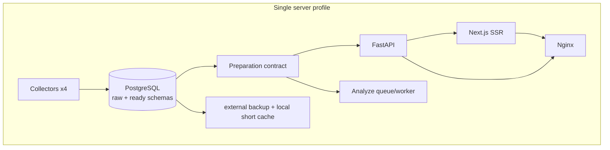
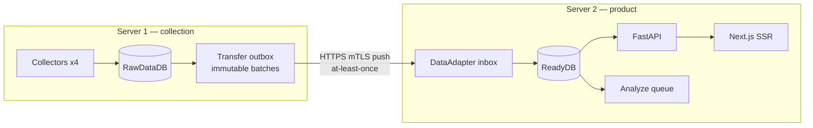

# Deployment topologies

Дата: 2026-09-16 · commit `b242378` · статус `draft; production current state read-only validated`

## Один сервер

До появления физически отдельных БД logical boundary задаётся schema/role/contract:
collector пишет raw envelope/outbox, DataAdapter применяет его к ready tables, API имеет
только ready read role, Analyze получает свою очередь и cgroup. Тот же envelope и inbox
используются локально, чтобы two-server не стал второй реализацией.

Рекомендуемый production floor после текущего baseline: 4 vCPU, 8 GiB RAM, 100 GiB
NVMe для 1×. Это не утверждение о минимуме приложения: это operational target с
headroom для backup, maintenance и краткого backlog. На текущем 1 vCPU/2 GiB headroom нет.

Resource policy:

| Компонент | CPU weight/quota | MemoryMax | Примечание |
|---|---:|---:|---|
| PostgreSQL | reserve 1.5 CPU, cap 2.5 | 3 GiB | 30–50 connections; temp per query bounded |
| API + SSR | reserve 1 CPU total | 512 MiB + 768 MiB | online priority, no swap |
| Collectors x4 | cap 1.5 CPU total | 512 MiB each, 1.5 GiB slice | offsets + per-platform interval |
| DataAdapter | cap 0.75 CPU | 768 MiB | durable inbox, bounded batch |
| Analyze | cap 1 CPU initially | 1 GiB | lowest CPU/IO weight, stoppable independently |

Reservations overlap only where limits permit; validate actual cgroup pressure under soak.

## Два сервера

Baseline choice: HTTP batch push from server 1 to a durable inbox on server 2. It adds no
broker and preserves server 1 autonomy. Transport details are in
[raw-data-transfer.md](raw-data-transfer.md).

Alternatives:

| Transport | Reliability fit | Operations | Verdict |
|---|---|---|---|
| HTTP/gRPC direct per event | retry possible, but chatty and couples availability | low initially, poor under outage | reject as primary |
| HTTP batch push | durable outbox/inbox gives at-least-once | low; one endpoint and spool | baseline |
| pull from server 2 | hides server 1 behind firewall; same cursor semantics | server 2 needs authenticated DB/API access | acceptable if inbound to S2 forbidden |
| files/object storage | strong immutable artifact/replay | object store and lifecycle required | next step for multi-day autonomy |
| broker/queue | native backpressure/retry | largest new failure domain | revisit above sustained 100 events/s or multiple consumers |

## Capacity model

Measured current throughput is 455,368 snapshots/day (5.27/s average), database 11.58 GB,
and recent partition growth implies roughly 0.3–0.5 GB/day. Peak/event size and Analyze
production cost are unknown, so numbers below are planning envelopes, not acceptance facts.

| Scenario | Snapshot avg | Single server target | Server 1 target | Server 2 target | Limiting resource |
|---|---:|---|---|---|---|
| 1× | 5.3/s | 4 CPU, 8 GiB, 100 GB | 4 CPU, 8 GiB, 100 GB | 4 CPU, 12 GiB, 150 GB | current CPU/disk |
| 2× | 10.6/s | 6 CPU, 12 GiB, 180 GB | 4 CPU, 8 GiB, 150 GB | 8 CPU, 16 GiB, 300 GB | DB I/O + analysis |
| 5× | 26.4/s | 12 CPU, 24 GiB, 400 GB | 8 CPU, 16 GiB, 300 GB | 16 CPU, 32 GiB, 750 GB | ReadyDB IOPS/disk |

Disk gate uses `daily ingest × retention/autonomy × overhead + WAL + indexes + temp +
backup cache + 30% safety`. Before purchase, replace 0.3–0.5 GB/day with seven-day measured
raw/ready byte rates and p99 batch bytes. Analyze CPU is separately budgeted and may scale
by workers after queue/DB limits are measured.

## Shared profiles

Images, envelope schema, inbox/outbox, roles, health checks and E2E tests are identical.
Profile variables choose `TRANSFER_MODE=local|push`, endpoint, credentials, and resource
limits. Collectors never write ReadyDB over WAN.

