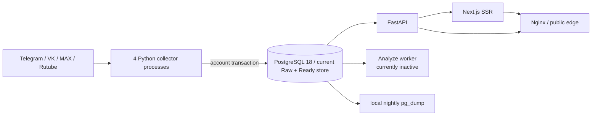

# Текущее состояние M-Ranked

Дата: 2026-09-16  
Commit: `b2423783feadc5f27794971f83de62bb0f327617` (`alpha`)  
Статус: `validated in production read-only` для inventory; изменения не выкатывались

## Карта компонентов

Это фактический single-server модульный монолит, а не схема `RawDataDB →
DataAdapter → ReadyDB`. Коллектор получает provider DTO, нормализует его и в одной
транзакции пишет канонические таблицы, cursor, dataset revision и outbox
(`collector_target/coordinator.py:93`, `collector_target/coordinator.py:104`,
`collector_target/coordinator.py:110`, `collector_target/repository.py:65`).

## Соответствие требуемым логическим именам

| Логическое имя | Фактическая реализация | Процесс/контейнер | Хранилище и состояние |
|---|---|---|---|
| Collectors x4 | `collector_target` + `collector_runtime` | четыре systemd instance: telegram, vk, max, rutube | lease, run/account results, checkpoints и snapshots в PostgreSQL; provider sessions на host |
| RawDataDB | отдельной БД нет | тот же PostgreSQL | `ingest.raw_payload` содержит ограниченное raw evidence; production: 624 строки |
| DataAdapter | `CanonicalNormalizer` + `PostgresCollectorRepository` внутри collector-процесса | не изолирован | нормализация и запись выполняются до commit account batch |
| ReadyDB | схемы `catalog`, `ingest`, `analytics`, `rating`, `ops_and_admin` | PostgreSQL container | source of truth для API и анализа |
| API | `api`, FastAPI/uvicorn, один worker | `m-ranked-target-api-python.service` | read/admin pools, LRU, outbox marker |
| Web SSR | Next.js standalone | Docker, запущенный systemd unit | read-only image + cache volume |
| Analyze | `anomaly_analysis` и три detector plug-in | unit существует, production inactive | durable candidate queue и analysis tables |
| Edge | nginx | systemd | TLS/reverse proxy |
| Backup | nightly `pg_dump`; pgBackRest units описаны, но не подтверждены запуском | timers/oneshots | три локальных dump-файла; внешний failure domain не подтверждён |

## Контракты и инварианты из кода

- Run/correlation UUID детерминированы platform, partition, version и scheduled time
  (`collector_target/model.py:101-138`).
- Каждый account batch атомарен; соединение не делится между concurrent account tasks
  (`collector_target/repository.py:65-70`).
- Cursor продвигается в той же транзакции, что данные
  (`collector_target/repository.py:665`, `collector_target/repository.py:1531`).
- Exact replay защищён стабильным semantic/source fingerprint и уникальными ключами;
  delivery события outbox имеет уникальность по revision/type/aggregate
  (`db/migrations/0009_constraints.sql:264-270`,
  `db/migrations/0009_constraints.sql:316-322`).
- Timestamps обязаны быть timezone-aware и нормализуются в UTC
  (`collector_target/model.py:67-71`). `null` не подменяется нулём в DTO и snapshots
  (`collector_target/model.py:163-187`, `db/migrations/0004_tables_ingest.sql:35-82`).
- Analyze имеет bounded batch/lease/point limits и durable retry queue
  (`anomaly_analysis/coordinator.py:32-52`, `anomaly_analysis/coordinator.py:65-135`).

## Runtime inventory

| Компонент | Вход | Выход | Параллелизм/лимит | Способ запуска |
|---|---|---|---|---|
| Telegram collector | provider API/web/MTProto | account batch | configured semaphore; production cycle 300 s | `python -m collector_target --platform telegram` |
| VK collector | provider HTTP API | account batch | configured semaphore; production cycle 300 s | аналогично |
| MAX collector | provider API | account batch | default account concurrency 1 | аналогично |
| Rutube collector | provider HTTP API | account batch | request concurrency 2; production cycle 300 s | аналогично |
| PostgreSQL | transactional SQL | canonical rows/revisions/outbox | 30 connections; 512 MiB/0.65 CPU compose limits | Docker |
| API | HTTP JSON | OpenAPI responses/exports | pool min 2, max 6; statement timeout 15 s | systemd, Python 3.11 |
| Web | HTTP from edge | SSR | container 384 MiB; Node 16.3.3 | systemd-managed Docker |
| Analyze | candidate queue | attempts/findings/state | batch 20, max 4096 points | currently inactive |

## Расхождения документации и deployment

1. Репозиторный unit называется `m-ranked-target-api.service` и задаёт
   `MemoryHigh=320M/MemoryMax=384M`, production запущен как
   `m-ranked-target-api-python.service` с 192/256 MiB.
2. Репозиторный web unit запускает Node напрямую с heap 128 MiB и max 192 MiB;
   production unit запускает Docker с heap 256 MiB и limit 384 MiB.
3. `docs/architecture/README.md` считает anomaly worker частью runtime, но unit inactive,
   попыток анализа нет и backlog растёт.
4. Bootstrap-функция метрик использует `latest_dataset_revision`, а production-каталог
   сохранил старую ссылку на удалённую `latest_fully_published_dataset_revision`.
5. Runbook заявляет pgBackRest/restore verification, но production подтверждает только
   локальный nightly dump; restore/PITR units не имеют времени последнего запуска.

## Границы доказательств

Не выполнялись production profiling, нагрузочный тест, `EXPLAIN ANALYZE`, изменение
расширений, конфигурации или процессов. API p95/p99 и точный query ranking недоступны:
`pg_stat_statements` не установлен, исторический monitoring output отсутствует.

