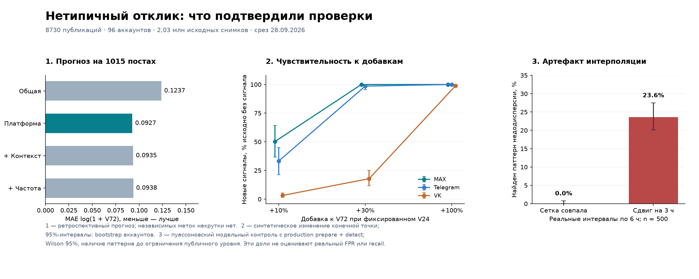

# Выявление нетипичного отклика: проверка гипотез 28.09.2026

**Результат:** проверены 12 гипотез на реальных счётчиках, контролируемых моделях и коде работающего анализатора. Подтверждена польза платформенной возрастной нормы; преимущество усложнённой контекстной модели не подтверждено. Найдены воспроизводимые контрпримеры к интерпретации недодисперсии, синхронности и превышения реакций над просмотрами. Плавное увеличение, сохраняющее обычный ER, частично обнаруживается по предсказательному остатку, но полностью совпадающее распределение наблюдений не позволяет установить происхождение активности.

Это завершённый исследовательский цикл, **не допуск нового детектора в публичный продукт**. Точность распознавания реальной накрутки не измерена: независимых меток происхождения активности нет. Все выводы ниже относятся к указанным выборкам и моделям.

Исходные статьи и границы их применимости: [SOURCES.md](SOURCES.md). Числа: [полный результат](evidence/observable_validation_2026-09-28.json), [происхождение данных](evidence/provenance_2026-09-28.json). Код: [observable_validation.py](scripts/observable_validation.py).



## 1. База ветки и границы работы

Создана изолированная ветка `codex/smart-engagement-research-20260928` от `ea8326e`. После обновления Git refs по SHA-256 проверены 442 файла исходников API, frontend, аналитики, сборщиков и схемы: 442/442 совпали как в релизе API/web, так и в **фактическом WorkingDirectory** работающих сборщиков. На узле сборщиков симлинк `current` был устаревшим; проверять только его было бы ошибкой. Доступы и сырые SSH-выводы не сохранены в репозитории.

Основная рабочая папка имела незавершённое слияние; её индекс и конфликты не менялись. Изменения этой ветки ограничены `research`. Прод читался для сверки версии и ограниченного обновления данных; схемы, службы, сборщики и публичные статусы не менялись.

## 2. Что именно наблюдается

Наблюдение — платформенный накопительный счётчик `C(t_j)`. Разность `Y_j=C(t_j)−C(t_{j−1})` является нетто-изменением за интервал. Это не время отдельного действия и не число уникальных людей. Отрицательные изменения нельзя скармливать обычному счётному likelihood как отрицательные события.

Архив сохраняет изменения и контрольные снимки, а также может сохранить строку из-за изменения другой метрики. Поэтому нулевые приросты в нём встречаются, но частота этих нулей не равна частоте нулей среди всех успешных чтений. Успешный цикл аккаунта также не равен подтверждённому чтению каждого поста.

Если отображаемый счётчик известен только в диапазоне `[L_j,U_j]`, то

`ΔC_j ∈ [L_j−U_(j−1), U_j−L_(j−1)]`.

При неизвестном шаге округления нельзя выдавать точный нулевой прирост. Исследовательский `rounded_growth.py` уже поддерживает такие границы, но обычный `PostSeries` рабочего v2 не несёт шаг округления и флаги качества каждой точки.

## 3. Реальная выборка и временная проверка

Отобраны 24 аккаунта на платформу по сортировке `md5(account_id)`, без обращения к anomaly-статусам: в исходном календарном окне 24.08–19.09 должно быть 10–250 неудалённых постов без репостов. Затем для тех же аккаунтов взяты посты до 24.09 включительно. Это удобная детерминированная когорта активных аккаунтов, **не вероятностная выборка всех вузов**.

| Платформа | Посты | Архивные снимки | Пригодные V/R около 72 ч | Нулевые R среди них |
|---|---:|---:|---:|---:|
| MAX | 2908 | 752 541 | 1619 | 20 |
| RuTube | 900 | 28 725 | 197 | 161 |
| Telegram | 2312 | 512 476 | 1324 | 1 |
| VK | 2610 | 733 149 | 1386 | 4 |
| Всего | **8730** | **2 026 891** | | |

В локальной копии максимум `publication_latest.observed_at` — 27.09 16:30 UTC, но полнота обновления неравномерна. Полных per-post receipts там 44 за приблизительно 16 минут. Старое утверждение «M0 = 0» в прежних отчётах относится к их срезам, а не к этой копии. Текущая производственная конфигурация M0 этим измерением не установлена.

Первоначальный план обучения на августе не дал ни одной пригодной пары 24/72 ч: у ранней истории много `unknown`. До получения оценок моделей окна сдвинуты. После первого прогона обнаружена неполнота поздних данных: контрольных постов только 129. **Без изменения моделей и порогов** read-only запросом обновлены 24/72/168-часовые точки всех 1175 заранее выбранных постов 20–24.09; получено 2298 точек. Таймаут SQL — 60 секунд; полная история прода не выгружалась. Итоговый контроль содержит 1015 постов. Это прозрачное уточнение ретроспективного исследования, не заранее закрытый будущий holdout.

Правила:

- Последняя реальная точка **до** возраста 6/24/72/168 ч; допустимое отставание 0,5/3/6/12 ч соответственно. Между точками ничего не интерполируется.
- Последняя коррекция `sampling_bucket`; synthetic, неопределённые интервалы, NULL и неподходящее качество исключаются. Для модели берутся пары `V72≥V24`; исключение уменьшений ограничивает переносимость результата.
- Основной расчёт допускает `exact` и `rounded`; дополнительно полностью повторён на `exact`. Для Telegram в этой выборке **нет exact-просмотров**: его выводы о мелких различиях предварительны.
- Обучение: публикации **06–09.09**, 833 поста. Калибровка: **13–16.09**, 778. Контроль: **20–24.09**, 1015, причём `published_at+72h≤27.09 16:30 UTC`.
- Между частями есть паузы: даже 72-часовой исход последнего обучающего поста известен до начала калибровки; аналогично между калибровкой и контролем. Это проверяется `assert` в коде. Один пост не входит в разные части; аккаунты повторяются, что соответствует прогнозу для уже наблюдаемых аккаунтов.
- Все `archived_text` в выборке пусты. Смысл, эмоциональность, тема и реальные рекламные кампании **не проверены**. Формат публикации есть. Условный прогноз не превращается из-за этого в причинную модель маркетинга.

## 4. Реестр проверенных гипотез

| ID | Проверяемое утверждение | Итог и граница вывода |
|---|---|---|
| H01 | Одна норма отклика достаточна для всех платформ | **Опровергнуто как рабочее упрощение:** различаются нули, ER и поздняя доля; платформенный прогноз лучше общей модели на этом контроле. |
| H02 | Добавление аккаунта, формата, времени и частоты публикаций уже улучшает прогноз | **Не подтверждено:** выигрыш относительно платформенной модели не установлен; интервалы разницы ошибок включают ноль. Это не опровержение полезности контекста вообще. |
| H03 | Нормальный ER исключает заметное искусственное добавление | **Опровергнуто математически:** совместное масштабирование R и V сохраняет ER. Остаток возрастной модели часть таких изменений замечает. |
| H04 | Малый разброс относительно Пуассона надёжно указывает на искусственный отклик | **Опровергнуто:** интерполяция и конечная аудитория дают контрпримеры. Производственный паттерн воспроизведён. |
| H05 | Учёт процесса наблюдения может исправить ложную недодисперсию | **Подтверждено для заданной симуляции:** калибровка всего сканирования после интерполяции восстановила низкую частоту тревог, сохранив чувствительность к специально малошумному добавлению. |
| H06 | Пуассоновский z остаётся корректным при неоднородности аудитории | **Опровергнуто модельным контролем:** смесь интенсивностей резко расширяет нормальный разброс. NB подходит заданной смеси, но его пригодность для всех реальных рядов не доказана. |
| H07 | Сохранённых строк / успешных обходов достаточно, чтобы восстановить нули и время всплеска | **Опровергнуто в общем случае:** выборочное сохранение смещает распределение; функция восстановления может сузить неопределённый 24-часовой прирост до 30 минут. |
| H08 | Синхронный рост старых постов без роста подписчиков исключает общий естественный стимул | **Опровергнуто контрпримером:** общий внешний интерес даёт тот же сигнал; отсутствие измерения подписчиков не исключает его. |
| H09 | Скорость в конце интервала × длина заменяет интеграл | **Опровергнуто на известной возрастной интенсивности:** ошибки ожидания до 45,5% в выбранных интервалах. |
| H10 | Порог 5% на каждом повторном просмотре сохраняет 5% на пост | **Опровергнуто:** для 100 независимых просмотров вероятность хотя бы одной тревоги ≈99,4%. |
| H11 | По агрегатам всегда можно отличить полностью замаскированный оплаченный отклик | **Опровергнуто теоретически:** при совпадении распределений наблюдений мощность любого теста равна его частоте ложной тревоги. |
| H12 | `R>V` физически невозможно для текущей суммы Telegram-реакций | **Опровергнуто семантикой и кодом:** платные Stars входят в сумму реакций, но не являются уникальными зрителями. |

## 5. Условная возрастная норма: H01–H03

### Математическая постановка

Простой воспроизводимый baseline прогнозирует `y=log(1+V72)` по `log(1+V24)`. Минимизируется

`Σ_train (y_i−x_iᵀβ)² + 10·Σ_(j≠intercept) β_j²`.

Штраф 10 фиксирован до оценки, непрерывные признаки нормируются только по обучающей части. Это ridge-прогноз логарифма счётчика; **не** NB-модель, не оценка среднего исходного счётчика после обратного преобразования и не causal inference.

Четыре кандидата:

1. Общая зависимость от раннего V24.
2. Отдельные intercept и наклон для платформ.
3. Плюс эффекты аккаунта с регуляризацией, формат, календарные синусы/косинусы часа и дня недели, реальные возрасты конечных точек. Длина текста и её missing-флаг константны/нулевые и не несут содержания.
4. Плюс число более ранних постов того же аккаунта за сутки **до** публикации. Это проверка частоты публикаций, не повтор старого M2 с измеренной экспозицией нового поста.

| Кандидат | MAE `log(1+V72)` на 1015 постах | На exact-only, 715 постов |
|---|---:|---:|
| Общая модель | 0,12373 | 0,14198 |
| Платформенная | **0,09271** | **0,10641** |
| Расширенный контекст | 0,09352 | 0,11258 |
| Контекст + частота | 0,09377 | 0,11278 |

Общее снижение MAE платформенной модели — около **25,1%**. Это относительное уменьшение ошибки на лог-шкале, не «точность 75%». Парный bootstrap с пересэмплированием аккаунтов (2000 повторов) даёт для разницы MAE «платформенная − общая»: Telegram −0,01734, 95%-интервал [−0,02612; −0,00832]; VK −0,06974 [−0,09659; −0,04028]. Для MAX интервал включает ноль. Повторение в exact-only поддерживает общий вывод, но не проверяет точность округления Telegram.

Дополнительный контекст не показал убедительного улучшения. Его разница с платформенной моделью: MAX +0,00237 [−0,00663; +0,01042], Telegram −0,00026 [−0,00907; +0,00890], VK −0,00042 [−0,00704; +0,00620]. Короткий календарный срез и 24 аккаунта не позволяют утверждать, что контент или маркетинговая стратегия бесполезны. **Решение:** оставить простую платформенную модель обязательной точкой сравнения; контекст допускать по измеренному выигрышу.

Описательно доля просмотров после первых суток среди накопленных к 7 суткам имеет медиану 25,8% MAX, 24,9% Telegram, 46,4% VK; для RuTube 39,6%, но всего 37 пригодных пар. Значительная поздняя доля сама по себе обычна для этой выборки. Это неполный архив и не норматив для отдельного поста.

### Плавное добавление при обычном ER

Для остатка `s=y−ŷ` рассчитывается верхний эмпирический ранг относительно калибровочных постов той же платформы:

`rank(s) = (1 + #{s_cal≥s}) / (n_cal+1)`.

Из-за зависимости, дрейфа, отбора архива и отсутствия чистой контрольной группы это **диагностический ранг**, а не сертифицированный p-value и не вероятность накрутки. Использован заранее выбранный порог 0,05; пороги по контрольной выборке не настраивались.

В контексте «умного» отклика проверено увеличение конечного V72 на 10%, 30% и 100% с округлением добавки до целого; V24 остаётся прежним. Такой итог достижим и гладкой добавкой после 24 часов: `A(t)=ρ·V72·(3x²−2x³)`, `x=clip((t−24)/48,0,1)`. Прогноз проверяет конечную точку, поэтому не зависит от резкости пути. Равное пропорциональное изменение конечной R сохраняет R/V до погрешности округления. **Код проверяет чувствительность конечного остатка, а не распознавание формы этой кривой.**

| Платформа | Исходно без сигнала контекстной модели | Новые сигналы при +10% | При +30% | При +100% |
|---|---:|---:|---:|---:|
| MAX | 345 | 173 / 345 = **50,1%** | 345 / 345 = 100% | 100% |
| Telegram | 286 | 95 / 286 = **33,2%** | 282 / 286 = 98,6% | 100% |
| VK | 314 | 10 / 314 = **3,2%** | 56 / 314 = 17,8% | 311 / 314 = 99,0% |

10% здесь — от **всего V72**, а не от малого позднего прироста; относительно хвоста такая добавка может быть большой. Базовые посты не размечены как органические. Таблица показывает чувствительность к заданным изменениям, не recall реальной накрутки. Контекстная модель для stress-test была выбрана до сравнения и оставлена, хотя лучшей оказалась платформенная; это не результат подбора наиболее выгодной модели.

При +10% account-bootstrap интервалы новых срабатываний широки: MAX 36,9–64,2%, Telegram 21,3–45,0%, VK 1,4–5,3%. Вырожденные интервалы [100%;100%] при одинаковых исходах не являются доказательством будущих 100%: bootstrap не может изобрести отсутствующие неуспехи.

Самих малых рангов **до** добавления было 37/382 MAX, 14/300 Telegram, 14/328 VK. Без независимой разметки это не FPR; превышение 5% в MAX показывает, почему нельзя приписать рангу номинальную гарантию. Для RuTube только 5 калибровочных и 5 контрольных пар: минимальный достижимый ранг 1/6, порог 0,05 недостижим. Его «0 сигналов» означает недостаточное разрешение калибровки, а не нормальность или нулевую чувствительность.

В 1015 парах совместное вещественное масштабирование R,V на 1,3 оставило R/V неизменным с максимальным численным отклонением `1,11×10⁻¹⁶`. Это математическая инвариантность. **Решение:** ER пригоден как одна условная характеристика, но не как защита от пропорциональной маскировки.

## 6. Недодисперсия и процесс измерения: H04–H07

### Почему интерполяция создаёт «слишком ровные» реакции

Рабочий [паттерн 5](../../anomaly_analysis/v2/detectors/reactions_catch_up.py) считает на шестичасовой сетке

`q=ΣΔR/ΣΔV`, `D=Σ(ΔR−qΔV)²/(qΔV)/(n−1)`

и применяет нижний хвост χ² с порогом `10⁻⁴`, просматривая несколько суффиксов. Но сетка получена линейной интерполяцией накопительных счётчиков в [series._grid](../../anomaly_analysis/v2/series.py). Если реальные независимые приращения `Y_i~Pois(μ)` смещены на половину клетки, на сетке появляются `Z_i=(Y_i+Y_(i+1))/2`. Тогда

`E[Z_i]=μ`, `Var(Z_i)=μ/2`, `Cov(Z_i,Z_(i+1))=μ/4`.

Половинный разброс и зависимость созданы измерением. Предпосылки исходного χ²-теста нарушены даже при точной пуассоновской органической модели.

| Контроль, 10 000 рядов по 40 окон | Медиана D | Срабатывания существующего сканирования суффиксов |
|---|---:|---:|
| Независимый Poisson(40), ΔV=500 | 0,981 | 9 / 10 000 = 0,09% |
| Те же распределения после половинной интерполяции | 0,476 | **2781 / 10 000 = 27,81%** |
| Независимый Binomial(100;0,6), ΔV=100 | 0,392 | 4557 / 10 000 = 45,57% |
| Специально малошумные ΔR=40+UniformInteger(−2,2) | 0,050 | 100% |

Порог `10⁻⁴` относится к одному суффиксу, а не всему сканированию: уже поэтому 0,09% для исходного Пуассона не противоречит заявленному порогу одного теста.

Второй тест вызвал **полный production `prepare` → `reactions_catch_up.detect`** с регулярными шестичасовыми чтениями RuTube между 3 и 13 сутками. На 500 реализациях паттерн найден 0 раз при совпадении сетки и замеров и **118 раз (23,6%; Wilson 95%: 20,1–27,5%)** при сдвиге на 3 часа. Речь о наличии паттерна, не о конечном публичном уровне: `verdict` дополнительно ограничивает силу при молодой норме. Это не измерение реальной доли ложных тревог RuTube.

Binomial-контрпример показывает ещё одну границу: при фиксированных V независимые реакции с вероятностью q имеют `Var(R|V)=Vq(1−q)`, поэтому отношение к пуассоновскому ожиданию равно `1−q`. Большое q=0,6 использовано как математический stress-test, а не как типичный ER наших площадок. Низкая дисперсия не устанавливает мотив активности даже при идеальном измерении.

### Можно ли сохранить полезность признака

В эксперименте H05 весь суффиксный поиск калибруется по 10 000 новым рядам нулевой модели **после того же оператора интерполяции**. Статистика — максимальная `−log10(p_suffix)`, номинальный уровень 1%. На независимых 10 000 нулевых рядах получено **77 тревог (0,77%; Wilson 95%: 0,617–0,961%)**, а на специально малошумном контроле — 100%.

Это подтверждает принцип калибровки полного вычислительного процесса. Здесь известны истинные Poisson(40), стационарность и сдвиг; параметры не оценивались на реальном ряде. При переносе нужно моделировать неоднородность, оценивание параметров, реальные интервалы, округление, пропуски и выборочное сохранение; результат симуляции не является готовым production-порогом.

### Неоднородность и выборочное сохранение

Если `Y|Λ~Pois(Λ)`, то `Var(Y)=E[Λ]+Var(Λ)`. Смешивание разной аудитории/тем создаёт сверхдисперсию без накрутки. Контроль gamma–Poisson со средним 100 и дисперсией 5100 дал 32,07% превышений пуассоновского 95%-квантиля против 4,91% для правильного NB-квантиля; `z_Poisson≥6` возник в 17,55% случаев. **Не любой высокий z означает редкое событие вне явно заданной модели.**

Для чисто положительно отобранного `Y~Pois(0,2)`:

`E[Y | Y>0] = 0,2/(1−exp(−0,2)) ≈ 1,1033`.

В симуляции среднее 0,20088 стало 1,10386, а 81,8% нулей исчезли. Реальный архив сложнее: есть checkpoints и изменения других метрик, поэтому это демонстрация механизма, не оценка его величины в базе.

В [confirm_unchanged](../../anomaly_analysis/v2/series.py) пара снимков с промежутком 24 часа и успешными циклами каждые 30 минут получает перенесённую старую точку за 30 минут до нового снимка. При отсутствии подтверждения чтения поста неопределённый прирост оказывается на интервале в 48 раз короче. Кодовое поведение воспроизведено; **наличие такого сбоя у конкретных реальных постов не установлено**.

**Решение:** предпочтительны непересекающиеся реальные интервалы; если нужна сетка, её статистика калибруется после наблюдательного преобразования. Полнота per-post receipts важнее искусственного заполнения нулями. Отрицательные изменения, которых в выбранных exact-парах было 979 MAX и 29 RuTube, обрабатываются отдельно; их причины по этим числам не установлены.

## 7. Синхронность, интеграл и повторные проверки: H08–H10

Общий внешний интерес может одновременно поднять реакции к нескольким старым публикациям без обязательного притока подписчиков. В контролируемом примере три MAX-поста получили общий стимул в один час; производственный `synchronous_rise` вернул один признак силы 0,7 при отсутствии данных подписчиков. Это контрпример к исключительности причины, а не измерение ошибки на реальных постах.

Полезная следующая статистика координации — совместные **остатки** после возрастной, календарной и общей для аккаунта экспозиции. Нужно сохранять временную автокорреляцию при block-permutation, учитывать поиск множества пар и требовать повторения в других периодах. Этот метод пока не обучен и не валидирован на нашей когорте. Результаты прежнего M2 не заменяют такую проверку; его архивный отрицательный результат сохранён в [EVIDENCE.md](EVIDENCE.md).

При интенсивности `λ(t)=1000·(t+1)^(-3/2)` ожидаемый прирост на `(a,b]` точно равен

`μ(a,b)=2000·[(a+1)^(-1/2)−(b+1)^(-1/2)]`.

На заранее заданных интервалах от 15 минут до нескольких суток `λ(b)·(b−a)` занижает ожидание на 15,3–45,5%; midpoint-аппроксимация — на 0,8–10,1%. Интеграл не имеет этой ошибки, но правильность выбранной интенсивности ещё нужно проверить. Это основание для interval-count likelihood, а не доказательство, что всем постам подходит данная степень.

Если каждый из K независимых тестов имеет ошибку α, ошибка хотя бы одной тревоги равна `1−(1−α)^K`. При α=0,05 и K=100 это 99,41%; симуляция дала 99,43%. Bonferroni α/K дал 5,10% на 10 000 реализаций. Для реальных коррелированных проверок число будет другим, но разовый порог нельзя выдавать за постовую гарантию. Контролировать нужно всё сканирование окон/метрик/повторных пересчётов; альтернативы — заранее заданные горизонты либо корректный последовательный e-process с проверенными предпосылками.

## 8. Пределы обнаружения и семантика: H11–H12

Пусть O — всё, что сохраняет система. Если распределения `P(O|обычный отклик)` и `P(O|организованный отклик)` совпадают, для любого правила δ(O):

`P(δ=1 | организованный) = P(δ=1 | обычный)`.

Более общо разница этих вероятностей ограничена total variation между распределениями. Поэтому для одинаково наблюдаемых механизмов невозможно одновременно получить низкую частоту ложных тревог и высокую чувствительность. В симуляции 100 рядов имеют два разных скрытых разложения, включая около 30% условно оплаченных действий, но **побитно одинаковые** наблюдаемые суммы. Пример демонстрирует неидентифицируемость; он не доказывает, что реальные исполнители способны идеально воспроизвести любой процесс.

Практический вывод: сложная модель ищет отклонение от правдоподобной нормы, а не гарантированно раскрывает происхождение каждого просмотра. Для неоднозначных случаев нужны независимые сведения — источники трафика, метки кампаний, разрешённые данные каскадов/пользовательских взаимодействий. Без них допустим вывод «нет обнаруженного отклонения», но не «точно органика».

Отдельно проверена семантика `R>V`. [Telegram](https://core.telegram.org/api/reactions) допускает несколько реакций, а Star-реакция увеличивает счётчик на количество переданных Stars. В текущем [парсере](../../collector_runtime/public_web.py) `paid:star` входит в общую сумму. На локальном HTML-примере 100 просмотров и 200 Stars парсер вернул R=200, затем production `reactions_exceed_views` выдал признак силы 1,0 по двум точкам. Это корректно разрешённая платформой поддержка автора, не «физическая невозможность». Реальный инцидент с такими значениями не утверждается.

**Решение:** разделять денежные Stars, обычные реакции и уникальных реагировавших; никогда не предполагать `R≤V` без контракта конкретных счётчиков. Для binomial/beta-binomial с числом просмотров как количеством попыток этот контракт также обязателен.

## 9. Что использовать в следующем детекторе

1. **Измерительный слой.** Per-post receipts, точность/шаг округления, причины отсутствия, коррекции, реальный интервал и независимое поле paid reactions. При недостаточной наблюдаемости — воздержание с причиной.
2. **Обязательный простой baseline.** Платформа + возраст + ранний масштаб; раздельные нормы для просмотров, реакций и иных метрик. Измеренная здесь польза относится к прогнозу 72 часов. Не переносить коэффициенты на другие горизонты без проверки.
3. **Кандидат на полноценную модель.** Для неотрицательных приращений `μ_ij=∫ λ_i(t)dt`; например, `log λ_i(t)=α_platform+u_account+f_platform(age)+g(clock)+β·format+γ·content+z_account,time`. Сравнить NB, Poisson-lognormal и двухчастную модель для нулей. Это проект дальнейшего сравнения: текущий эксперимент не выбрал победителя среди этих семейств.
4. **Остатки нескольких типов.** Избыток объёма, недостаточный условный разброс, необычная связь метрик, повторяющаяся координация. Пропорциональное увеличение может пройти проверку ER, но выйти за возрастной прогноз. Общая экспозиция может объяснить синхронность. Два семейства правил не становятся статистически независимыми только из-за разных названий.
5. **Калибровка целого постового правила.** Симулировать/пересэмплировать модель вместе с наблюдением и всеми сканированиями; проверить временной перенос. Ранги не называть вероятностью накрутки. Для RuTube заранее проверять разрешение калибровки: n=5 недостаточно даже для одного 5%-ранга.
6. **Проверка на действительности.** Будущая полная когорта, заранее заданный бюджет ошибок и независимая разметка статистической необычности/ошибки измерения/внешнего объяснения. Отдельно от случайных контролей — challenge-набор плавных, пропорциональных, случайных и повторяющихся добавлений. Синтетика измеряет конкретную чувствительность, не реальную распространённость или precision.

Приоритет исправлений в существующей методике: убрать универсальность `R≤V`, откалибровать недодисперсию с учётом интерполяции, не сужать интервалы без подтверждённого чтения поста, сохранить различие между эвристической силой признака и вероятностной гарантией. В этом исследовании продуктовый код не изменялся.

Уточнение продолжения: этот документ описывает исторический код `ea8326e`. Последующие исправления и контроли «до/после» находятся в [MAX_TAIL.md](MAX_TAIL.md). Ветка переименована в `feat/smart-analizes`; утверждение о неизменности продуктового кода относится только к первому циклу.

## 10. Воспроизведение и сохранённые материалы

Замороженный набор находится локально в `local_data/observable_panel_2026-09-28.jsonl.gz` и исключён из Git; он содержит исходные ряды и обновлённые конечные точки отдельно. Детальные идентификаторы не добавлены в новый публичный отчёт. Агрегаты, SQL и скрипты сохранены в ветке.

Из корня исследовательской рабочей копии, с Python окружением проекта. Исторические кодовые контрпримеры требуют исходников `ea8326e`: сначала экспортировать `git archive --format=tar ea8326e --output=/tmp/observable-baseline.tar` и распаковать в отдельный `/tmp/observable-baseline` (все shell-команды через `rtk proxy`). Исследовательский скрипт остаётся из текущей ветки; `--repo` указывает на baseline. С `--repo .` получится результат после исправлений, он намеренно отличается по трём кодовым контролям:

```sh
rtk proxy /Users/funpin/Documents/ChatGPT/TG-monitoring/.venv/bin/python \
  research/smart-engagement-2026-09/scripts/observable_validation.py \
  --repo /tmp/observable-baseline \
  --panel research/smart-engagement-2026-09/local_data/observable_panel_2026-09-28.jsonl.gz \
  --output /tmp/observable-reproduced.json
```

`export_local_panel.py` выполняет локальный read-only SQL через psycopg; принимает `--output` и подключение `MRANKED_RESEARCH_DATABASE_URL` только к loopback-БД. Пример: `python research/smart-engagement-2026-09/scripts/export_local_panel.py --output research/smart-engagement-2026-09/local_data/panel.jsonl.gz`. Параметры доступа хранятся только в локальном окружении. При подготовке выпуска прежний Docker/shell-транспорт заменён прямым подключением; SQL не менялся, прежний hash скрипта в provenance относится к использованной исторической версии. `holdout_endpoints.sql` принимает JSON-массив заранее отобранных UUID в psql-переменной `ids`; транспорт и доступы намеренно вынесены из репозитория. `merge_endpoint_refresh.py` добавляет точки, не заменяя исходную историю. Не запускать полную архивную выгрузку на проде.

График строится функцией `render_figure` того же скрипта из агрегатов; необязательный аргумент `--figure <png>` требует matplotlib. Он не влияет на расчёт статистики.

Фиксированный seed — 20260928. Контроль целостности — SHA-256 несжатого финального JSONL:

`9f0ff271628584b78ba3350587623826a1c96f1e696976a965307e356fa0df22`.

Полезные ограничения для следующего исследователя: разбиение ретроспективное; полнота исходной базы неоднородна; refresh выполнен после предварительного малого прогона; аккаунты не независимы от учреждений/общих инфоповодов; account-bootstrap не учитывает зависимость между вузами и календарными днями; истинных меток манипуляции нет; Telegram округлён; RuTube слишком мал в контроле; текст и рекламные воздействия отсутствуют. Ни один из этих пробелов не заполнен вымышленными метками.
