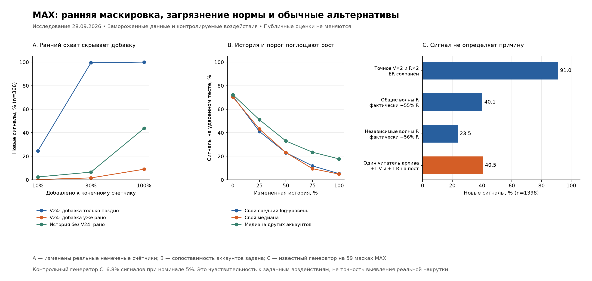
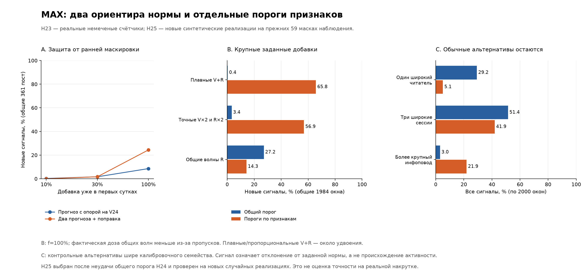

# Маскирующаяся активность: проверенные ограничения и прототип

Дата: 28.09.2026. Продолжение [хвостов MAX](MAX_TAIL.md) и [первых экспериментов](EXPERIMENTS.md). Ветка `feat/smart-analizes`; исходная база соответствует ранее проверенному развёрнутому `ea8326e`. Этот цикл меняет только исследование и его тесты. Сборщики, БД, сроки хранения и публичные оценки не менялись.

Продолжение H23–H25 (§10–13): объединение двух ориентиров уменьшает раннюю слепую зону, а отдельные пороги признаков возвращают чувствительность к крупному росту после учёта обычных читательских сценариев. Малые добавки и несколько широких сессий остаются трудными; публичное применение не подтверждено. Все прежние результаты сохранены ниже.

## 1. Результат первого цикла H13–H17

Проверены пять направлений H13–H17 в ограниченных постановках. Раннее начало добавки и загрязнение исторической нормы действительно скрывают воздействие. Сочетание объёма, условных реакций и согласованности динамики замечает часть сценариев с нормальным итоговым ER, но небольшие добавки в основном пропускает. Синхронность и ширина отклика дают сильный сигнал также на обычных сессиях чтения архива. Поэтому прототип пока не годится для усиления публичных статусов.

Это три разных вида свидетельств: **воздействия на реальные немеченые конечные счётчики**, **контролируемая синтетическая история** и **синтетические траектории на реальных масках наблюдений**. Чувствительность к заданным добавкам не является точностью выявления реальной накрутки. Ни один вуз не использован как заведомо органическая или заведомо искусственная группа.



## 2. Ограничение диска и существующий журнал

Владелец исключил рост хранения. Расширенный пилот из прежнего плана отложен. Не увеличивать возраст опроса, частоту, TTL и квоты; не создавать дополнительные таблицы. Локальные эксперименты используют два уже сохранённых сжатых архива. Полная новая копия БД не создавалась.

В `ingest.publication_poll_receipt` уже сохраняются успешные чтения конкретных постов, включая значения и качество счётчиков, время и `snapshot_written`. Это позволяет отличать **наблюдавшееся неизменившееся значение** от отсутствия чтения. Один `snapshot_written=false` ещё не равен доказанному нулевому приросту: в аудите равенство проверено по последовательным V и R одного поста.

[Ограниченный read-only SQL](sql/receipt_capacity_audit.sql) просмотрел последние 7 дней с пределом 100001 строк. Предел не достигнут: 2088 записей по четырём платформам, 581632 байта таблицы с индексами и служебными данными на момент запроса. Это моментальный размер, не прогноз будущего объёма.

Для MAX: 640 чтений / 64 поста / 4 аккаунта; все 640 имели точные V/R без флага неопределённости. 528 чтений не создали новый metric snapshot; 380 последовательных пар имели одинаковые V и R. 75 чтений относятся к возрасту ≥4 суток, ни одного к ≥7 суткам. Диапазон MAX: 27.09 22:10 — 28.09 00:16 UTC. Поэтому таблица уже решает часть проблемы нулей, но этот двухчасовой срез ещё не проверяет повторяемость хвоста в течение двух недель. Он заменяет более ранний короткий аудит из MAX_TAIL, а не дополняет его независимой выборкой.

Текущая политика M0 по умолчанию: opt-in, до 16 аккаунтов и 16 самых новых постов на батч, возраст ≤7 суток, bucket 15 минут, TTL 7 дней. Эти настройки не расширялись. Отсутствие полного наблюдения 8–14 суток означает ограничение доступного вывода, а не обязательство нарастить диск.

## 3. H13: ранняя активность становится частью объяснения

На точных MAX V24/V72 сохранено прежнее календарное разбиение: 295 постов обучения, 223 калибровки, 382 контроля. Исключены отрицательные изменения и embargo; исходные контрольные посты не имеют истинной метки. Сравниваются ridge=10 модели `log(1+V72)`: условная на `log(1+V24)` и историческая с индикатором аккаунта, без V24. Обучение и калибровка при воздействии не меняются; верхний эмпирический ранг ≤0.05 — исследовательское правило.

До добавок обе модели отмечали 16/382 постов (4.2%). Ниже — **новые сигналы среди 366 первоначально не отмеченных**, а не доля обнаруженной реальной накрутки. В первом сценарии увеличен только V72; во втором на ту же долю увеличены V24 и V72.

| Добавка | Условная на V24: только поздно | Условная на V24: уже в первых сутках | История аккаунта без V24: ранняя добавка |
|---|---:|---:|---:|
| +10% | 24.6% | 0.3% | 2.5% |
| +30% | 99.5% | 1.6% | 6.6% |
| +100% | 100.0% | 9.0% | 43.7% |

При удвоении: 366/366 против 33/366 у условной модели, 160/366 у account-only. Пересэмплирование целых аккаунтов даёт интервалы 5.4–13.7% для условной ранней проверки и 29.3–59.5% для account-only; оно не обеспечивает перенос на всю совокупность вузов. Ошибка прогноза `log1p(V72)` у account-only хуже: MAE 0.271 против 0.052. Нельзя повысить чувствительность ценой плохого прогноза и назвать это готовым улучшением.

Математическая причина: коэффициент раннего охвата β≈0.909. При умножении обоих крупных счётчиков на c остаток сдвигается примерно на `(1−β)·log(c)`, а при позднем изменении только V72 — на `log(c)`. **H13 подтверждена для конечных счётчиков.** Точное начало в первые минуты и внутрисуточные формы этим тестом не установлены. Требуются два отдельно проверяемых ориентира: прогноз без раннего охвата и условный прогноз развития; V24 не считать чистым эталоном.

## 4. H14: загрязняются и норма, и порог

1500 независимых синтетических миров: 10 сопоставимых аккаунтов, `log(count) ~ N(log(1000), 0.3²)`, по 40 обучающих и 40 отдельных калибровочных постов на аккаунт. У трёх аккаунтов, включая тестируемый, удваивается заданная доля истории. Тестовый чистый счётчик независим; затем отдельно проверяется его удвоение. Сопоставимость аккаунтов здесь **задана**, а не доказана для реальных вузов.

Методы: собственное среднее в log-шкале (геометрический средний уровень), собственная медиана, медиана остальных девяти аккаунтов. Порог для каждого мира — верхний 5%-квантиль 400 калибровочных остатков. Таблица показывает долю сигналов на удвоенном тесте, когда изменены **и обучение, и калибровка**.

| Изменённая доля истории трёх аккаунтов | Свой средний log-уровень | Своя медиана | Медиана других аккаунтов |
|---|---:|---:|---:|
| 0.0% | 71.1% | 70.4% | 72.3% |
| 25.0% | 41.1% | 43.1% | 51.1% |
| 50.0% | 23.1% | 23.1% | 33.0% |
| 75.0% | 11.9% | 9.5% | 23.5% |
| 100.0% | 5.3% | 4.9% | 17.8% |

С чистой калибровкой и полностью изменённым обучением чувствительность собственной нормы падает до 8.1%/7.3%; медиана соседей даёт 77.9%, но отмечает уже 7.4% чистых тестов вместо исходных 5.3%. При изменении также калибровки её чувствительность падает до 17.8%. Чистые тесты при полном загрязнении отмечаются редко: расширившийся порог скрывает проблему, а не доказывает качество метода.

**H14 подтверждена в контролируемой постановке; гипотеза «достаточно заменить среднее медианой» опровергнута.** Устойчивая оценка должна защищать не только средний прогноз, но и калибровочный хвост. Неоднородные реальные аккаунты, иной закон счётчиков и обычный рост аудитории ещё не проверены этим экспериментом.

## 5. H15–H17: траектории с известным ориентиром

Из прежней панели выбраны 59 аккаунтов и 2425 пригодных поздних интервалов. По аккаунту — до 12 постов, выбранных по хешу ID; минимум 6 постов, 24 интервала и 2 интервала на пост. Использованы те же правила MAX_TAIL: реальные точные V/R, концы не старше 3 часов, интервал 18–30 часов, фактический начальный возраст ≥4 суток и конечный ≤14 суток; репосты в основной расчёт не входят.

Из реальных данных взяты **только маска и фиксированный дизайн экспозиции**: `μV=max(0.1, сохранённое ΔV)`, `q=clip(q24,0.005,0.2)·exp(−0.12·(age−1))`. Просмотры генерируются Poisson с индивидуальным lognormal-множителем σ=0.3 и общим дневным σ=0.35. Реакции — NB со средним `q·V`, индивидуальным множителем σ=0.25, дневным σ=0.2 и дисперсией `m+0.4m²`. Lognormal-множители имеют среднее 1.

Такой ориентир известен экспериментатору. Это благоприятный контролируемый тест, **не оценённая органическая норма MAX**. Маска фиксирована даже после добавок: зависимость change-only-сохранения от изменённых значений не пересимулирована. Модель не восстанавливает людей, переходы, точное время реакций или все ограничения платформы.

Шесть компонент: объём V относительно μV; R относительно qV; число активных пост-интервалов относительно NB-ожидания; недодисперсия относительно подогнанного масштаба; максимальная общая дневная волна центрированных остатков; связь остатка R с предыдущим относительно текущего остатком V. При NB ожидание индикатора активности равно `1−(1+0.4m)^(−1/0.4)`. Дневная координация считается только при ≥4 наблюдавшихся постах. Pearson-подобная статистика не выдаётся за χ² p-value.

Единица решения — целое окно аккаунта. 1500 независимых миров задают шкалы компонент, другие 1500 — порог максимума, ещё 1500 — контроль. Выбор компонент и правило максимума зафиксированы до исходов; порог не подгонялся по таблице чувствительности.

В таблице **новые сигналы среди 1398 исходно не отмеченных миров**. Добавки f=10/30/100% относятся к заданному воздействию; последняя колонка показывает фактическую добавку относительно всей контрольной выборки при f=100%. Для общих/независимых волн одинаковы ожидаемая доза каждого поста и его пригодность; из-за фиксированных дат часть постов не затронута, поэтому f не равно доле всей выборки.

| Сценарий | f=10% | f=30% | f=100% | Фактически добавлено V / R при f=100% |
|---|---:|---:|---:|---:|
| Плавные случайные V+R | 1.9% | 8.1% | 99.6% | 99.8% / 98.5% |
| Масштабирование траектории V+R | 2.7% | 13.7% | 91.0% | 100.0% / 100.0% |
| Рассеянные добавки R | 2.9% | 11.2% | 56.6% | 0.0% / 96.4% |
| Общие по датам волны R | 2.2% | 9.8% | 40.1% | 0.0% / 55.4% |
| Независимые по постам волны R | 1.9% | 5.6% | 23.5% | 0.0% / 55.7% |
| Общий приток просмотров и реакций | 1.1% | 5.1% | 50.7% | 58.6% / 56.2% |

**H15:** прототип замечает крупные плавные случайные добавки, однако +10% почти всегда пропускает; +30% тоже выявляет слабо. Отдельная недодисперсия отмечает всего 0.7% миров с плавной добавкой f=100% и 0.5% с рассеянной добавкой R. Признаки «слишком ровно» не заменяют модель объёма и совместной динамики. Здесь суточный рисунок задан дневным дизайном; минутные интервалы, произвольная длительность и старт ещё не испытаны.

**H16:** согласованные даты дают 40.1% новых сигналов против 23.5% независимых волн при близкой фактической дозе R, 55.4% против 55.7%. Это свидетельство чувствительности к структуре, не происхождению. Общий приток экспозиции, допустимый и при обычной рекламе/инфоповоде, тоже даёт 50.7% новых сигналов в крупном сценарии. Перестановочная проверка на реальных независимых периодах пока не выполнена.

**H17:** при точном удвоении каждого интервала V и R весь ER сохранён; совместное правило всё равно даёт 91.0% новых сигналов благодаря отдельной норме объёма. При переносе половины переносимых реакций на следующий календарный день общий итог не меняется, фактически сдвинуто 36.2% всех R; новые сигналы возникают в 9.9% исходно не отмеченных миров. Перенос запрещён через ненаблюдавшийся день. Результат ограничен V/R; комментарии и репосты MAX здесь не измеряются.

## 6. Обычные альтернативы и ошибки калибровки

Один заинтересованный читатель в фиксированный день добавляет по просмотру и реакции к каждому доступному старому посту. Всего +0.38% V и +26.73% R, но **43.6% всех миров получают сигнал, 40.5% — новый**. Причина: при редких поздних реакциях одна человеческая сессия уже создаёт широкую согласованную волну. Генератор исходной нормы такой механизм не содержит. Это контрпример к специфичности признаков; он не измеряет частоту таких сессий в MAX.

Одинаковые доступные счётчики под двумя названиями — «кампания» и «организованная активность» — дают одинаковые оценки. Программная проверка лишь фиксирует эту неидентифицируемость, а не проверяет существование конкретной кампании. Сам по себе постоянный хвост не становится атрибуцией.

На исходном контрольном генераторе совместное правило отмечает **102/1500=6.8%** при номинале 5%; Wilson 95%: 5.63–8.19%. Применение шести отдельных 5%-правил через «хотя бы одно» даёт **406/1500=27.1%**. Поэтому складывать флаги без общей калибровки нельзя. Первые 6.8% не скрыты и не исправлены подбором порога.

После этого результата выполнена **отдельная диагностическая**, не первичная проверка: 20 новых независимых пар калибровка/тест по 1500 миров, с неизменной шкалой компонент. Средняя доля сигналов обычного квантиля — 4.52%, диапазон 3.13–5.87%. Это согласуется с тем, что маргинальная гарантия усредняет случайность калибровки; она не гарантирует ≤5% после каждой конкретной калибровки. Wilson-интервал первого теста учитывает случайность теста при фиксированном пороге, а не всю случайность его выбора.

Для контроля риска после калибровки проверен порог `S_(k)`, где `k=1440` из 1500 и `P[Bin(1500,0.95)≥k]≤0.05`. При независимых одинаково распределённых score и заранее фиксированном правиле это даёт вероятность не менее 95%, что истинная доля превышений ≤5%; совпадения делают границу консервативной. Средняя тестовая доля в 20 парах — 3.64%. Это аналитический выбор порядковой статистики, не оптимизация по результатам. Чувствительность таблицы выше рассчитана с **исходным** порогом: её нельзя приписывать более строгому правилу. Гарантия iid не переносится автоматически на зависимые посты и дрейф реального MAX.

## 7. Источники и решения для продолжения

- [Clarkson et al., 2024, Split Conformal Prediction under Data Contamination](https://proceedings.mlr.press/v230/clarkson24a.html), §3: загрязнение калибровочных score влияет на покрытие и размер области принятия; большие загрязнённые score могут сделать её избыточно широкой. Для нас это основание отдельно стресс-тестировать обучение и калибровку. Классификационная поправка авторов не перенесена на агрегаты MAX.
- [Hulsman, 2022, Distribution-Free Finite-Sample Guarantees and Split Conformal Prediction](https://arxiv.org/abs/2210.14735), §3.3–4.4: различие маргинального покрытия и tolerance-регионов, выбор порога через порядковые статистики. Это магистерская диссертация/препринт, не новая проверка MAX. Биномиальная граница выше независимо проверена тестом.
- [Scholten & Günnemann, ICLR 2025](https://proceedings.iclr.cc/paper_files/paper/2025/hash/8c4d21a4b33361c40c2142db9511c126-Abstract-Conference.html): отдельная защита обучения и калибровки разбиением и агрегацией. Просмотрены официальный abstract и описание подхода; алгоритм на MAX не реализован. Их гарантии для классификации не заявляются для нашего детектора.
- Для возрастного отклика, информативных наблюдений, общего продвижения и зависимости остаются [ранее разобранные первоисточники](SOURCES.md). Никакие коэффициенты другой платформы не объявлены нормой MAX.

Следующий практический шаг в текущем бюджете — сделать локальное сравнение двух прогнозов (до раннего охвата / условного на него), защищать калибровку вместе с нормой и проверять общие человеческие сессии как часть альтернативной модели. Использовать доступные receipts только в реально покрытом окне; за его пределами сохранять воздержание. Дальнейший план без расширения хранения обновлён в [VALIDATION.md](VALIDATION.md).

Не допущены к публичному применению: вероятности накрутки, сильный статус только по хвосту/синхронности, гарантия 5% ошибок на реальных вузах. Доказанные ограничения метода полезны уже сейчас: они исключают ложные основания уверенности и определяют, какие компоненты нужно сравнивать дальше.

## 8. Воспроизведение и контроль реализации

[Скрипт](scripts/masked_engagement_validation.py), [агрегаты](evidence/masked_validation_2026-09-28.json), [происхождение и SHA256](evidence/masked_validation_provenance_2026-09-28.json). Seed 20262228; Python 3.13.5, NumPy 2.4.6, SciPy 1.17.1. Панели прежние, сырьё в git не добавляется. Параметры трёх экспериментов зафиксированы в MASKING до расчёта; настоящий документ объединяет этот протокол с исходами. Полный перебор генераторов не проводился.

При проверке реализации найдено и исправлено округление малой дозы: округление каждого прироста, затем каждого суммарного пути к ближайшему целому, систематически уничтожало малые добавки на редких реакциях. Финальный алгоритм использует одну случайную фазу U~Uniform(0,1) на путь: добавленный накопительный счётчик `floor(f·C(t)+U)`, приращения — его разности. Ожидание равно f·C(t), накопительная ошибка <1; нулевые интервалы остаются нулевыми. При f=1 удвоение точное. Исправление дозы сделано без изменения признаков/порогов; результаты пробных неверных доз не используются как экспериментальные выводы. Диагностика 20 калибровок обозначена как последующая проверка.

Повторный численный прогон побайтово совпал с сохранённым JSON; ссылки, контрольные суммы и проверка секретов прошли.

24 целевых теста прошли: доза на редких счётчиках, сохранение пропусков, отсутствие изменения исходных массивов, точное удвоение, сохранение суммы при задержке, равенство ожидаемой дозы общих/независимых волн, воспроизводимость, конечность score, биномиальная граница, правила реальных интервалов и baseline. Это не повторный прогон всех продуктовых тестов и не проверка production-данных с истинными метками.

Из корня выделенной ветки, в окружении с указанными NumPy/SciPy:

```sh
rtk proxy python research/smart-engagement-2026-09/scripts/masked_engagement_validation.py \
  --endpoint-panel research/smart-engagement-2026-09/local_data/observable_panel_2026-09-28.jsonl.gz \
  --tail-panel research/smart-engagement-2026-09/local_data/max_tail_panel_2026-09-28.jsonl.gz \
  --output /tmp/masked_validation.json
rtk proxy python -m pytest -q tests/test_masked_engagement_research.py tests/test_max_tail_research.py tests/test_research_baseline.py
rtk proxy python research/smart-engagement-2026-09/scripts/plot_masked_validation.py \
  --input /tmp/masked_validation.json \
  --output /tmp/masked_validation.png
```

## 9. Следующий локальный цикл: протокол до исходов

Дата 28.09.2026, seed 20263228. Без новых выгрузок БД, расширения опроса или хранения. Две уже сохранённые панели; прежний временной контроль повторно используется для ретроспективного сравнения, поэтому не называется новым независимым holdout. Новые симуляции имеют отдельные потоки случайности. Порогов и параметров по контрольным исходам не подбирать.

**H23 — два ориентира и перенос на другой аккаунт.** На той же точной MAX-панели сравнить: условный прогноз log(V72+1) по log(V24+1); историю аккаунта без V24; историю + тип поста и циклические время суток/день недели, известные при публикации. Ridge=10, без подбора. Повторить после исключения целого целевого аккаунта из обучения и калибровки. Размер аудитории на момент публикации и текст отсутствуют; их не заменять актуальными или вымышленными значениями. Объединение условного и контекстного предикторов через Bonferroni min(1,2*min(rank)); это диагностические ранги немеченого архива, не доказанная доля ошибок. Измерить MAE и парные разницы по аккаунтам, исходную долю сигналов и +10/30/100% при раннем/позднем воздействии. Для сравнения прироста чувствительности использовать один общий набор исходно не отмеченных постов.

**H24 — норма с обычными альтернативами.** Сохранить прежние 59 масок и заданный генератор счётчиков. Три референсных семейства: исходный фон; Poisson(2) читательских сессий за окно (случайный наблюдаемый день, глубина Geometric(0.35), вероятность реакции 0.7); общий приток экспозиции в два случайных наблюдаемых дня с интенсивностью Uniform(0.15,0.6) и реакциями q*ΔV. Прочитанные за сессию посты выбираются без возвращения среди доступных, каждый даёт +1V и не более +1R. Модели семейства заданы для стресс-теста, их распространённость в MAX неизвестна.

Сохранить шесть прежних компонент, но заменить ограниченные сверху эмпирические CDF на неизменную после обучения шкалу (score−median)/IQR, чтобы большое отклонение не терялось за пределом максимума обучающей выборки. 2000 независимых миров для шкалы. Сравнить пороги: по исходному фону; по равной iid-смеси трёх семейств; максимум отдельных семейных порогов. Каждый порог выбирается по биномиальной tolerance-границе для риска 5% и уверенности 95%; для максимума трёх семейств — δ/3 на семейство. Калибровка: 2000 миров на семейство и отдельные 6000 для iid-смеси. Контроль: 2000 на семейство. Проверять ожидаемый риск при любых весах смеси только внутри заданных семейств, а не при произвольном дрейфе реального MAX.

Отдельный неиспользованный при калибровке контроль: один широкий читатель, три широкие сессии, +30% обычного совместного роста аудитории и более крупный инфоповод. Воздействия +10/30/100% из MASKING проверить на исходном и смешанном фоне; фиксировать фактическую дозу и новые сигналы на общем для правил наборе исходно не отмеченных окон. При одинаковых доступных траекториях названия «обычный рост» и «организованная добавка» не могут менять ответ. Снижение чувствительности после учёта обычных альтернатив — содержательный результат, его не скрывать.

Технические проверки: отсутствие обучения на исключённом аккаунте/будущих исходах; изменение V24/V72 не влияет на признаки до публикации; пропуски не превращаются в чтения; сессия не даёт повторных реакций одного посетителя на один пост; максимальный порог не ниже семейных; фиксированный состав референса не меняется после просмотра результатов. Результаты будут дописаны в этот документ, без отдельного отчёта для каждого теста.

### H25 — дополнительная проверка после исходов H24

Первичный H24 показал: общий максимум порогов семейства почти уничтожает чувствительность к плавному росту V/R; возможная причина — разные хвосты компонент. Это основание для следующей, явно последующей гипотезы, а не изменения первичного результата. Проверить отдельную tolerance-границу для каждой из шести компонент, максимум по трём семействам внутри компоненты и объединение шести превышений. Заранее: α_j=0.05/6, δ_jk=0.05/18. При выполнении iid-предпосылок внутри каждого заданного семейства Bonferroni ограничивает совокупный риск и вероятность неудачной калибровки.

Шкала общего score остаётся из H24, но обе сравниваемые версии порогов заново калибруются на независимых потоках seed+2000…2102, по 2000 миров на семейство. Контроль и воздействия используют новые потоки seed+2200…3002; ни один контрольный исход H24 не используется при вычислении новых порогов. Сравнить семейный общий порог и пороги компонент на тех же исходных/смешанных фонах, тех же дозах и широких читательских сессиях. Фиксировать отрицательные результаты, случайность калибровки и фактическую дозу. Это независимые случайные реализации прежней заданной модели, не внешний контроль на новых реальных данных.

## 10. Результаты H23: два ориентира, перенос и цена объединения

Вновь использованы 295/223/382 поста прежних периодов; это ретроспективное сравнение на уже изученном архиве, не новая слепая оценка. Вариант с известным аккаунтом использует его старые посты в составе общей обучающей выборки. Во втором варианте все посты целевого аккаунта исключены из обучения и калибровки (24 отдельные подгонки). Никакой собственной истории для него там не остаётся; это проверка переноса на незнакомый аккаунт, а не реализация поиска идеально сопоставимого вуза.

Признаки контекста: аккаунт, тип, синусы/косинусы часа МСК и дня недели. Текст, текущие подписчики и фактический возраст позднего измерения не используются. Параметры преобразований вычисляются на обучении. Тип поста взят из архива без полной истории изменений метаданных: его доступность в точной исторической версии не подтверждена, поэтому данный вариант не считается проверенным прогнозом в реальном времени.

| Ориентир | MAE log1p, известный аккаунт | Исходные сигналы | Новые при раннем удвоении* | MAE, аккаунт исключён | Сигналы после исключения |
|---|---:|---:|---:|---:|---:|
| Условный V24 | 0.052 | 16/382 | 8.6% | 0.054 | 16/382 |
| История аккаунта | 0.271 | 16/382 | 42.9% | 0.428 | 43/382 |
| История + тип/время | 0.273 | 17/382 | 48.8% | 0.438 | 39/382 |
| Два прогноза + поправка | — | 14/382 | 24.4% | — | 32/382 |

\* Общие для четырёх правил 361 первоначально не отмеченный пост. Знаменатель отличается от 366 в H13: дополнительно исключены исходные сигналы новых ориентиров. Сырые 382 поста те же. Доля исходных сигналов немеченой выборки **не** является частотой ложных тревог.

Тип/время не показали улучшения прогноза: парная разница MAE против истории +0.0022, кластерный bootstrap 95% [−0.0125; +0.0183]. При исключении аккаунта +0.0099 [−0.0068; +0.0293]. В обоих случаях интервал содержит ноль. Без размера аудитории и надёжного содержательного контекста история другого аккаунта не становится точной нормой целевого.

Объединение двух рангов даёт 88/361=24.4% новых сигналов раннего удвоения против 31/361=8.6% условного прогноза. Bootstrap по аккаунтам: соответственно 12.7–40.5% и 4.7–13.8%; это интервалы каждой оценки при фиксированных подогнанных моделях, не проверка независимости двух показателей. Подгонка в bootstrap заново не выполняется; неопределённость обучения этой оценкой не охвачена. При поздней добавке +30% чувствительность снижается с 99.4% до 95.6%; при ранней +30% оба дают лишь 1.7%. После исключения аккаунта объединение отмечает 32/382 исходных постов вместо 14/382, причём неизвестно, какая часть этих сигналов ошибочна.

**Вердикт H23:** два ориентира уменьшают слепую зону раннего крупного воздействия на этом архиве. Гипотеза об улучшении прогноза от имеющихся типа/времени не подтверждена. Объединение имеет цену по чувствительности и не получило гарантии реальной точности. Контролировать нужно оба ориентира и общий бюджет, а не подменять условный прогноз более шумным.

## 11. Результаты H24: защита среднего риска не защищает каждый сценарий

Генератор и 59 масок из §5 сохранены. Добавлены сессии отдельных посетителей и общая экспозиция согласно §9. Читательские дни выбираются среди наблюдавшихся дней, посты внутри сессии — без возвращения; разные сессии моделируют разных посетителей. Случайные дни разных сессий могут совпасть. Частота/глубина заданы для эксперимента, а не оценены по пользователям MAX.

Чтобы score не насыщался выше обучающего максимума, первичный прототип H24 использовал `(feature−median)/IQR`, затем максимум шести компонент. Пороги и результат этого неудачного варианта сохранены. Они не сопоставляются напрямую с чувствительностью старого CDF-прототипа §5, у которого иная шкала, порог и генератор обычных альтернатив.

По 2000 контрольных окон на семейство:

| Референсный сценарий | Порог только по исходному фону | Порог по равной смеси | Максимум семейных порогов |
|---|---:|---:|---:|
| Исходный фон | 4.2% | 1.6% | 0.4% |
| Читательские сессии | 18.1% | 11.1% | 4.5% |
| Общий приток экспозиции | 6.6% | 2.1% | 0.4% |

У смешанного правила средняя по трём семействам доля 4.93%, но на читательских сессиях 11.1%. При увеличении доли таких сессий в аудитории риск вырастет. Семейный максимум уменьшает этот результат до 4.5%, однако практически перестаёт видеть плавное удвоение V+R: 0 новых сигналов на 1921 общем исходно не отмеченном окне. Широкий отдельный читатель, не входивший в калибровочное семейство в таком фиксированном виде, всё ещё вызывает сигнал в 26.25% всех окон.

**Вердикт H24:** единый более высокий порог — неудачный способ совместить чувствительность к охвату и устойчивость к человеческим сессиям. Порог, подходящий только средней смеси, не гарантирует качество при изменении её состава. Результат не скрыт последующей модификацией.

## 12. H25: отдельные пороги компонент дали полезный, ограниченный выигрыш

H25 сформулирована после H24. Параметры α/δ зафиксированы до её расчёта (§9); использованы новые калибровочные и контрольные потоки. Первичные H23/H24 воспроизвелись без изменения. Обе версии H25 повторно калибруются на одних новых семейных выборках, поэтому численные результаты общего порога отличаются от H24. Это новые случайные реализации той же заданной модели, не новые реальные данные.

Для признака j и семейства k порог `C_jk` выбран порядковой статистикой с `α_j=0.05/6` и `δ_jk=0.05/18`. Итоговый `C_j=max_k C_jk`; сигнал возникает при превышении хотя бы одного `C_j`. При независимых одинаково распределённых калибровочных score внутри каждого семейства и независимо фиксированных признаках с вероятностью ≥95% все 18 границ одновременно верны. Тогда для любого из трёх семейств:

`P_k(хотя бы один сигнал) ≤ Σ_j P_k(score_j > C_j) ≤ Σ_j α_j = 0.05`.

Независимость компонент или семейств между собой для этих двух union-bound не требуется. При произвольных весах **тех же** трёх семейств граница также сохраняется. Для нового типа сессий или внутреннего дрейфа семейства гарантии нет. В реальных данных семейства и их распределения неизвестны: эти пороги пока нельзя переносить в публичный анализатор.

В новых контрольных семействах покомпонентное правило отметило 0.55% исходного фона, 1.75% читательских сессий, 0.95% общей экспозиции; общий семейный порог — 0.30%, 5.40%, 0.75%. Это эмпирические частоты конечных тестов, а не точные значения риска. Номинальные бюджеты совпадают, фактически достигнутые частоты различаются; строгого сравнения при одинаковом **измеренном** FPR здесь нет.

Ниже — новые сигналы среди **1984 общих первоначально не отмеченных окон** исходного фона. Доза f относится к заданному механизму: V/R при плавном f=100% увеличились фактически на 99.95%/100.05%; точное масштабирование удваивает оба ряда. Общие волны R при f=100% дали +55.86% R по всей выборке из-за наблюдаемости выбранных дат, поэтому их нельзя сравнивать с рассеянными +100% как одинаковую дозу.

| Сценарий | Общий порог, f=100% | По компонентам, f=10% | По компонентам, f=30% | По компонентам, f=100% |
|---|---:|---:|---:|---:|
| Плавные V+R | 0.4% | 0.1% | 0.5% | 65.8% |
| Масштабирование V и R | 3.4% | 0.2% | 1.4% | 56.9% |
| Рассеянные R | 3.5% | 0.0% | 0.1% | 6.0% |
| Общие волны R | 27.2% | 0.0% | 0.7% | 14.3% |
| Независимые волны R | 3.4% | 0.0% | 0.1% | 0.7% |

Для плавного удвоения 1305/1984=65.8%, Wilson 95% 63.7–67.8%; у общего порога 7/1984=0.35%. На смешанном фоне новые сигналы плавного воздействия f=100% — 74.2% против 0.6% (общие 1946 окон); фактическая добавка там +92.2% V и +86.0% R относительно уже смешанного фона. При точном V×2/R×2 — 68.1% против 7.2%. Усиление чувствительности к просмотрам не универсально: на общих волнах R она падает относительно общего порога, а на небольших добавках остаётся слабой.

Контрольные обычные альтернативы, **все 2000 окон** каждой проверки:

| Альтернатива | Общий семейный порог | Пороги по компонентам |
|---|---:|---:|
| Одна широкая сессия | 29.2% | 5.1% |
| Три широкие сессии | 51.4% | 41.9% |
| Более крупный инфоповод | 3.0% | 21.9% |
| Обычный совместный рост +30% | 0.2% | 0.9% |

У одной широкой сессии 102/2000=5.1%, Wilson 95% 4.22–6.15%: нельзя заявлять доказанное соблюдение 5% по одной этой оценке. Три широкие сессии и более крупный инфоповод остаются контрпримерами. В последнем случае восстановленная чувствительность к охвату увеличивает число сигналов на обычной альтернативе. Распознаётся отклонение от выбранного диапазона нормы, а не источник просмотров.

**Вердикт H25:** покомпонентная защита заслуживает дальнейшей проверки. Она восстанавливает чувствительность к крупному совместному росту и уменьшает реакцию на одну широкую сессию, но не решает малые добавки, несколько широких сессий и атрибуцию больших обычных кампаний. Утверждение «сложная накрутка теперь надёжно определяется» результатами не поддерживается.



## 13. Что использовать дальше и что проверено технически

Рабочая архитектура для следующего исследовательского сравнения: **два ориентира ожидаемого охвата**, отдельно объясняемые компоненты V и R, несколько правдоподобных референсных механизмов и общий бюджет ошибок. Признаки ширины/координации не должны автоматически повышать уверенность в манипуляции. Состояние «необычно относительно выбранной нормы, причина неизвестна» сохраняется даже при большом score.

Следующая проверка — устойчивость этого варианта к неоднородным аккаунтам и загрязнению обеих стадий (обучения и калибровки), перенос на следующий реально доступный период без настройки по нему, а также карта частоты/глубины читательских сессий. До такой проверки не расширять область применения до всех вузов и старых возрастов с плохим покрытием. Существующие receipts и архивы остаются единственным источником; ни частота опроса, ни TTL, ни серверное хранение не менялись.

Дополнительно изучена [Bastani et al., Practical Adversarial Multivalid Conformal Prediction, NeurIPS 2022](https://proceedings.neurips.cc/paper_files/paper/2022/file/bcdaaa1aec3ae2aa39542acefdec4e4b-Paper-Conference.pdf), постановка §1–2: последовательное эмпирическое покрытие по группам при дрейфе. Алгоритм здесь не реализован. Наш вывод из сочетания этой постановки с H14: адаптация к наблюдаемым счётчикам может восстановить предсказательное покрытие, одновременно приняв постоянное воздействие за норму. Гарантия покрытия не равна гарантии выявления манипуляции; это разные цели.

[Один скрипт](scripts/robust_reference_validation.py) содержит H23–H25 и отдельный режим построения графика по сохранённым данным. [JSON](evidence/robust_reference_2026-09-28.json) содержит все дозы, знаменатели и интервалы, в том числе отрицательные результаты. [Происхождение и контрольные суммы](evidence/robust_reference_provenance_2026-09-28.json) фиксируют протокол до расчёта и последующее добавление H25. Сырьё не дублируется.

34 целевых теста прошли: временное разбиение; исключение аккаунта из обеих стадий; независимость признаков публикации от изменяемых счётчиков; отсутствие подгонки преобразования на контроле; отсутствие повторной реакции одного посетителя на тот же пост; сохранение пропусков; воспроизводимость; конечность score; верхние границы порядковых статистик и совокупный бюджет 18 калибровочных событий. Проверки прежнего MASKING/MAX_TAIL/baseline включены. Это исследовательские тесты, не проверка точности на реальных метках.

Повторный численный прогон побайтово совпал с сохранённым JSON; первичные результаты H23/H24 не изменились после добавления H25.

Численный запуск использует Python 3.13.5 / NumPy 2.4.6 / SciPy 1.17.1. Режим графика только читает JSON; его зависимости не используются для повторного расчёта.

```sh
rtk proxy python research/smart-engagement-2026-09/scripts/robust_reference_validation.py \
  --endpoint-panel research/smart-engagement-2026-09/local_data/observable_panel_2026-09-28.jsonl.gz \
  --tail-panel research/smart-engagement-2026-09/local_data/max_tail_panel_2026-09-28.jsonl.gz \
  --output /tmp/robust_reference.json
rtk proxy python -m pytest -q tests/test_robust_reference_research.py tests/test_masked_engagement_research.py tests/test_max_tail_research.py tests/test_research_baseline.py
rtk proxy python research/smart-engagement-2026-09/scripts/robust_reference_validation.py \
  --plot-input /tmp/robust_reference.json --figure /tmp/robust_reference.png
```
