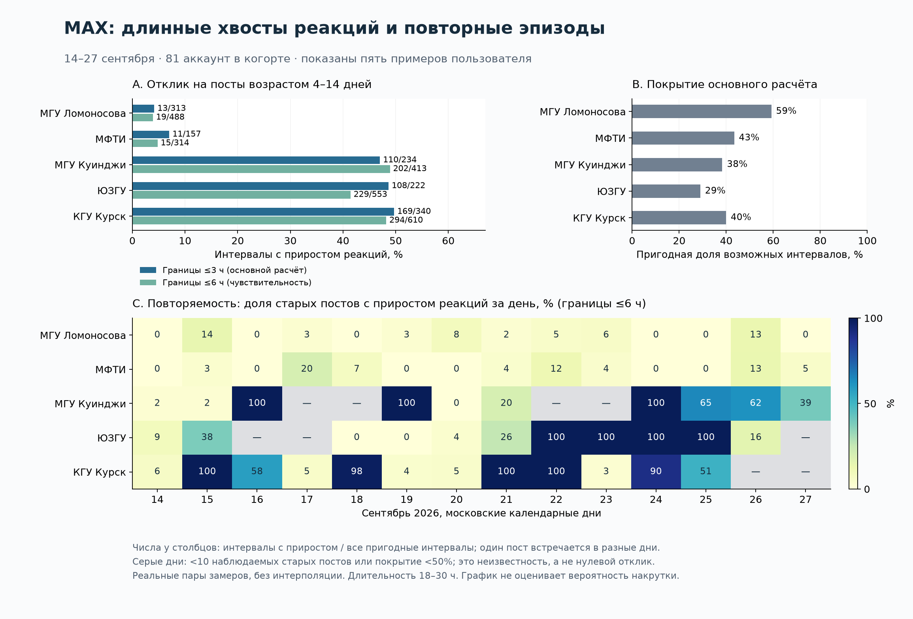

# Повторяющиеся хвосты реакций в MAX

Проверка 28.09.2026, календарные дни 14–27 сентября. **Различие между названными примерами существует в наблюдаемой части данных.** Однако точнее говорить о повторных эпизодах широкого отклика на старые посты, перемежающихся тихими днями, чем о непрерывном ежедневном хвосте. Одна длина хвоста не позволяет установить происхождение активности.

Это продолжение [первого цикла гипотез](EXPERIMENTS.md) и [плана валидации](VALIDATION.md). МГУ Ломоносова, МФТИ, МГУ имени А. И. Куинджи, ЮЗГУ и **Курский государственный университет** — примеры, предложенные пользователем, без меток «органика» / «манипуляция». Платформа во всём новом расчёте — **MAX**. Публичные оценки не обновлялись.



## 1. Что проверено

H18–H21 и правила извлечения записаны до просмотра суточных результатов. Разбиение ретроспективное, это не независимая будущая валидация. H22 добавлена после просмотра результатов и прямо помечена как разведочная.

| Гипотеза | Результат и граница вывода |
|---|---|
| H18: ширина старого хвоста и её повторяемость различаются между примерами | **Подтверждено описательно** на пригодных интервалах. Разница сохраняется при границах ≤3 и ≤6 ч; при ≤1 ч данных мало и ранжирование меняется. Полная независимость от частоты публикаций не установлена. |
| H19: повторный плавно убывающий хвост сам по себе позволяет выявить искусственное происхождение | **Опровергнуто как универсальное правило**: обычный счётный отклик при разных склонностях реагировать даёт такой же эффект. |
| H20: разницу нельзя объяснить только охватом и ранней вовлечённостью | **Частично подтверждено относительно исследованных моделей**: поправка сильно сокращает отличие Куинджи, но существенно меньше — ЮЗГУ и КГУ. Это не исключает иные обычные причины. |
| H21: существующий M0 уже обеспечивает полный тест возраста 4–14 дней | **Опровергнуто для текущего дизайна кода**: возраст по умолчанию ≤7 суток, TTL 7 суток и отбор до 16 самых новых постов. Фактическая история receipts также слишком коротка. |
| H22: распределение реакций между старыми постами содержит информацию сверх общего количества | **Есть разведочные примеры**, особенно при малых суммах у Куинджи и КГУ. Наивная независимая модель не учитывает сессии одного читателя; её ранги нельзя публиковать как вероятность аномалии. |

## 2. Версия кода, срез и знаменатель

Работа продолжается в изолированной ветке **`feat/smart-analizes`**, переименованной по запросу владельца. База — развёрнутый commit `ea8326ebd896bf8db5d4264f2b66c50403881caf`, а не более новый `origin/main`. До исследования сверены исходники API и фактический рабочий каталог сборщиков; 442/442 SHA-256 совпали с базой. При продолжении повторно проверены релиз и файлы работающего MAX-сборщика. Доступы, адреса и транспорт выгрузки в репозиторий не записываются.

Из 83 неудалённых MAX-аккаунтов включены все 81, у которых было ≥15 оригинальных неудалённых публикаций 31.08–27.09 UTC. Отбор использует количество публикаций, а не текущие аномальные статусы. Это активная когорта доступного каталога, не случайная выборка вузов страны. Пять пользовательских примеров не являются независимым набором подтверждения.

В локальный замороженный JSONL извлечены **9978 публикаций**, включая репосты для отдельной проверки, с 31.08 00:00 до 28.09 00:00 МСК. Для каждого поста сохранены только последние реальные снимки суток 13–27.09 и ранняя точка возраста 21–24 ч. Запросы выполнялись последовательно, по одному аккаунту, read-only, с таймаутом 60 с и lock timeout 2 с; вся выгрузка заняла около 506 с. Полный сырой архив продовой БД не копировался. Снимки и коррекции ограничены `created_at < 28.09 00:00 UTC`.

Основной расчёт:

- Оригинальные публикации; запланированный возраст на начало суток от 1 до 13 дней, наблюдаемый возраст начала ≥1 дня, конца ≤14 дней.
- Оба конца — реальные, точные V и R, без `interval_uncertain`; используется последняя коррекция sampling bucket, synthetic исключены.
- Отставание каждого конца от соответствующей московской полуночи ≤3 ч; длина наблюдаемого интервала 18–30 ч. Проверки чувствительности: ≤1 ч, ≤6 ч, включение репостов при ≤3 ч.
- NULL, отсутствующий конец, уменьшение любого счётчика исключаются с отдельной причиной. Настоящий нулевой прирост сохраняется. Ни интерполяции, ни переноса по журналу обходов аккаунта нет.
- Старый хвост: **реальное начало интервала ≥4 дней, реальный конец ≤14 дней**. `n` ниже — число интервалов «пост × день», один пост может встречаться несколько раз.

Из **53 388** возможных интервалов возраста 1–14 дней пригодны **20 097**: 30 838 исключены из-за несвежих концов, 2441 из-за отсутствующего конца, 10 из-за отрицательного изменения, 2 по границе фактического возраста. В выбранных концах не было дополнительных исключений качества. Это не доказывает точность всей истории. Наблюдение могло зависеть от активности; оценка на оставшихся строках не переносится автоматически на пропуски.

Покрытие хвоста считается относительно каталога возможных старых постов на начало суток. Условие реального возраста чуть строже календарного знаменателя у самой границы 4 дней. Оно может консервативно уменьшать долю покрытия.

На скриншоте показан **неполный** день 24.09 примерно до 19:20 МСК. API берёт последние сохранённые значения выбранного и предыдущего календарного дня, обрезает отрицательный прирост до нуля; для нового поста допускает начальный ноль. Поэтому скриншот не обязан численно совпадать с нашим полным днём и фильтром точности. Метка «полная история» не гарантирует наличие каждого успешного чтения.

## 3. Насколько отличаются хвосты

Основной расчёт, границы ≤3 ч:

| MAX-аккаунт | Интервалы с ΔR>0 / n | Доля | ΔR / ΔV за старые интервалы | Реакций на 1000 новых просмотров | Покрытие старых интервалов |
|---|---:|---:|---:|---:|---:|
| МГУ Ломоносова | 13 / 313 | 4,2% | 14 / 5646 | 2,48 | 59,2% |
| МФТИ | 11 / 157 | 7,0% | 11 / 2749 | 4,00 | 43,4% |
| МГУ Куинджи | 110 / 234 | 47,0% | 139 / 2734 | 50,84 | 38,3% |
| ЮЗГУ | 108 / 222 | 48,6% | 414 / 2880 | 143,75 | 29,0% |
| КГУ Курск | 169 / 340 | 49,7% | 733 / 3810 | 192,39 | 39,9% |

Это доли наблюдаемых положительных интервалов, **не доли накрученных постов или реакций**. ΔV не является числом независимых людей, а ΔR/ΔV — вероятностью реакции одного человека. У МГУ и МФТИ старые просмотры продолжают расти, поэтому разницу в реакциях нельзя списать только на отсутствие видимого старого трафика.

Среди 63 аккаунтов с ≥50 пригодными старыми интервалами КГУ, ЮЗГУ и Куинджи занимают соответственно 2–4 места по ширине хвоста; выше есть ещё один аккаунт, не названный пользователем. Это описательное положение в когорте, а не p-value или подтверждение подозрений. Частоту ложных тревог по этим рангам оценить нельзя.

### Повторяемость и чувствительность к покрытию

Для дневного описания требуем ≥10 наблюдаемых старых постов и ≥50% покрытия возможных. Порог «реагирует хотя бы половина» выбран как понятное описание ширины, **не как правило присвоения статуса**. Ненаблюдаемый день разрывает доказанную серию, но не считается тихим.

При строгих границах ≤3 ч пригодны только 9 / 4 / 5 / 1 / 5 дней соответственно пяти строкам таблицы. Поэтому более полная дневная карта на рисунке — **проверка чувствительности ≤6 ч**, а не подмена основного расчёта:

| Аккаунт | ΔR>0 / n, границы ≤6 ч | Доля | Пригодных дней | Из них ≥половины старых постов реагируют |
|---|---:|---:|---:|---:|
| МГУ Ломоносова | 19 / 488 | 3,9% | 14 | 0 |
| МФТИ | 15 / 314 | 4,8% | 14 | 0 |
| МГУ Куинджи | 202 / 413 | 48,9% | 10 | 5 |
| ЮЗГУ | 229 / 553 | 41,4% | 11 | 4 |
| КГУ Курск | 294 / 610 | 48,2% | 12 | 7 |

Например, у ЮЗГУ 22–25.09 положительный прирост есть у всех наблюдаемых старых постов (36/36, 57/57, 48/48, 48/48); 18–19.09 в пригодных интервалах реакций нет. У Куинджи есть широкие эпизоды 16, 19, 24–26.09, но 20.09 — 0/41. У КГУ почти полный отклик 15, 18, 21, 22 и 24.09 перемежается днями с единичными приростами. Следовательно, наблюдение пользователя полезно уточнить до **повторной массовой активации архива**, а не буквального «каждый день одинаковый хвост».

При ≤1 ч остаются лишь 53 / 69 / 57 / 14 / 21 интервалов; доли 1,9 / 13,0 / 21,1 / 14,3 / 57,1%. В частности, ЮЗГУ нельзя устойчиво ранжировать по этому малому срезу. Добавление репостов при ≤3 ч почти не меняет общую разницу. Дни и посты зависимы: нельзя выдать обычный биномиальный доверительный интервал, считая тысячи строк независимыми опытами.

## 4. Что меняют охват, ранний ER и частота публикаций

Ранний признак `q24=(R24+0,5)/(V24+1)` берётся из точного снимка возраста 21–24 ч, не позднее начала оцениваемого интервала. Это сглаженный ковариат, не «органическая норма». При возможном воздействии до первых суток он сам может быть изменён. Медианы q24 среди пригодных старых интервалов: МГУ 1,57%, МФТИ 2,01%, Куинджи 11,12%, ЮЗГУ 9,73%, КГУ 4,35%. Повторение поста в разные дни влияет на эти описательные медианы.

Реализованы NB2-модели `Var(Y|X)=μ+αμ²`, логарифмическая связь, штраф 10 для коэффициентов кроме intercept. Возраст входит как log(age) и его квадрат; offset — log(ΔV+1), с ранним ER дополнительно log(q24). Контекст: log(V24+1), число новых публикаций текущего дня, глубина в ленте на начало суток, выходной и формат. Расширение истории аккаунта добавляет intercept и возрастной коэффициент аккаунта. Отдельная peer-модель обучается без всех пяти названных примеров; остальные аккаунты не объявляются органическими.

Обучение — 14–20.09, **7822 интервала**, контроль — 21–27.09, **9171**. Один пост может пересекать календарное разбиение: это проверка будущих интервалов известных постов, не обобщение на новые посты. Реализованные ΔV и число публикаций дня известны после интервала: это **условная оценка завершившегося отклика**, не предварительный прогноз и не причинный эффект просмотра/публикации. Все модели оптимизационно сошлись, но сходимость не означает адекватность нормы.

| Модель | MAE на контроле ↓ | Средний отрицательный log-likelihood ↓ |
|---|---:|---:|
| Возраст + просмотры | 1,182 | **1,033** |
| + ранний ER | 1,004 | 1,043 |
| + контекст ленты и публикаций | 1,099 | 1,087 |
| + индивидуальная история/возраст аккаунта | 1,160 | 1,377 |
| Ранний ER, обучение без пяти примеров | **0,941** | 1,078 |

Улучшение средней абсолютной ошибки не сопровождается улучшением вероятностного прогноза. Преимущество богатого контекста и пригодность хвостов распределения **не подтверждены**. Отсюда нельзя заявлять «мы полностью учли частоту публикаций» или оценивать шанс случайного возникновения конкретного хвоста.

Для старых интервалов контрольной недели отношение **наблюдаемые реакции / сумма условных ожиданий**:

| Аккаунт | Только возраст/V | + ранний ER | + контекст | + история аккаунта | Peer без пяти примеров |
|---|---:|---:|---:|---:|---:|
| МГУ Ломоносова | 0,22 | 0,41 | 0,41 | 2,02 | 0,55 |
| МФТИ | 0,20 | 0,32 | 0,34 | 0,78 | 0,42 |
| Куинджи | 5,29 | 1,48 | 1,51 | 1,33 | 1,98 |
| ЮЗГУ | 13,08 | 4,35 | 3,87 | 7,86 | 5,75 |
| КГУ Курск | 13,55 | 6,36 | 4,72 | 0,90 | 8,42 |

Для Куинджи ранний ER объясняет большую часть грубого контраста. ЮЗГУ и КГУ сильнее отклоняются от общих условных моделей, но результат зависит от выбранной нормы. **История КГУ поглощает повторяющееся поведение**, сводя отношение к 0,90; это не доказательство нормальности. Так выглядит один из рисков H14: постоянный механизм становится собственным baseline. Это иллюстрация на данных, не контролируемый эксперимент с известным загрязнением обучения. Продолжение H13–H17 в ограниченных контролируемых постановках выполнено в [MASKING.md](MASKING.md); полного переноса на реальные данные пока нет.

## 5. Математические контрпримеры и новый признак

### Длинный гладкий хвост может возникать без вмешательства

Если отклик на старый пост описан `Y ~ Poisson(q·ΔV)`, то `P(Y>0)=1−exp(−q·ΔV)`. При одинаковой форме затухания просмотров более высокая склонность q резко повышает вероятность увидеть положительное число на каждом старом посте. В этой конструкции нет организованной добавки.

В воспроизводимой симуляции 1000 когорт × 30 дней, по 5 постов каждого возраста 4–14 дней, `ΔV~Poisson(100/(1+age/3))`. При q=0,008 медианная ширина хвоста 18,2%, ни одного дня с ≥50% активных старых постов; при q=0,12 — ширина 94,5% и ≥50% каждый день. Среднее число реакций на пост плавно падает с возрастом. Это математический контрпример универсальному критерию, **не подогнанное объяснение конкретных вузов**. Пуассоновская модель здесь задаёт число действий, не договорённость MAX о числе уникальных людей.

### Распределение фиксированной суммы реакций

Разведочный H22: условно на `T=ΣΔR` рассмотреть число активных старых постов `B=Σ1[ΔR>0]`. При независимом распределении T действий с весами `w_i=μ_i/Σμ`:

`E[B|T,w] = Σ_i (1−(1−w_i)^T)`.

Использованы ожидания peer-модели, только контрольная неделя, дни с ≥10 наблюдаемыми старыми постами и T≥10; 10 000 multinomial-симуляций на проверку. Это отдельный механизм-тест на наблюдаемых постах, без требования дневного покрытия ≥50%; он не доказывает ширину отклика всего архива.

| Пример | Постов | Реакций T | Активных B | E[B] при независимом распределении |
|---|---:|---:|---:|---:|
| Куинджи, 25.09 | 16 | 18 | 15 | 9,45 |
| Куинджи, 26.09 | 15 | 12 | 12 | 7,81 |
| КГУ, 21.09 | 15 | 19 | 15 | 8,72 |
| КГУ, 24.09 | 33 | 215 | 31 | 31,41 |
| ЮЗГУ, 22.09 | 20 | 134 | 20 | 18,99 |

У первых трёх примеров верхние симуляционные ранги около 0,0002 / 0,0004 / 0,0001. У КГУ 24.09 — 0,857, у ЮЗГУ 22.09 — 0,316: при большой сумме реакций широкий отклик часто ожидаем уже из-за объёма. **Эти ранги не калиброваны как p-values реальной аномалии**, поиск выполнен после просмотра данных, множественные проверки не скорректированы, условная независимость не доказана.

Контрпример: один новый заинтересованный читатель может поставить по реакции на 40 разных старых постов. Тогда T=B=40, а независимая равномерная модель ожидает всего 25,47 активного поста. Поэтому ровное распределение отличает механизмы взаимодействия, но само не отличает живую сессию просмотра архива от организованного выполнения задания. Внешние признаки кампаний и данные более частых чтений нужны для проверки альтернатив.

Практический кандидат для дальнейшей проверки — **совместный профиль**: избыток условного объёма + необычная ширина при данном объёме + повторение в разных неделях + согласованность остаточных изменений на нескольких постах. У каждого компонента должен быть свой знаменатель, диагностика измерений и проверка обычных общих событий. Нельзя складывать некалиброванные ранги и показывать их как «вероятность накрутки».

## 6. Научные опоры

- [Vassio et al., 2022 — temporal dynamics of followers’ engagement](https://link.springer.com/article/10.1007/s13278-022-00928-2): временные кривые взаимодействий Facebook/Instagram, суточная активность и влияние новых публикаций на распределение внимания. Работа полезна для выбора ковариат и модели старения. Её времена затухания не являются нормативом MAX.
- [Weng et al., 2012 — Competition among memes in a world with limited attention](https://www.nature.com/articles/srep00335): ограниченное внимание и структура сети способны порождать неоднородную длительность распространения. Это дополнительная к первоначальному списку работа. Объект — Twitter-мемы/ретвиты; наличие длинного распределения жизни мемов не равно хвосту реакций конкретного поста MAX. Используется концептуальный механизм, не численные коэффициенты; страница отмечает erratum 2013 года.
- [Rizoiu et al., интервально наблюдаемые процессы, JMLR 2022](https://jmlr.org/papers/v23/21-0917.html): основания работать с интегральными приращениями между наблюдениями. Настоящая проверка не оценивает Hawkes-процесс и не восстанавливает индивидуальные времена реакций из суточных сумм.
- [Barber et al., Conformal prediction beyond exchangeability](https://arxiv.org/abs/2202.13415): ограничения и способы учитывать зависимость/дрейф при калибровке. В текущем коротком срезе такая гарантия не построена.

Общий разбор 12 приложенных PDF, маркетинговых исследований и других дополнительных работ остаётся в [SOURCES.md](SOURCES.md); он здесь не дублируется.

## 7. Исправления анализатора в ветке

Продолжение первого пункта плана P0: устранены воспроизведённые источники ложных уверенных выводов. Изменения **не развёрнуты**.

1. Журнал успешных обходов аккаунта больше не вставляет непроверенные неизменившиеся значения поста. Неопределённый 24-часовой прирост остаётся 24-часовым; пустые часы соседних публикаций не становятся нулевыми.
2. `reactions_catch_up` использует неперекрывающиеся пары реальных чтений длительностью около 6 ч вместо разностей интерполированной сетки. Наблюдаемые отрицательные коррекции/сбросы внутри пары исключают её. Недодисперсия ограничена слабым исследовательским сигналом; пояснение больше не утверждает, что обычный отклик обязан иметь пуассоновский разброс.
3. `reactions_exceed_views` воздерживается на Telegram: суммарные реакции со Stars и возможными несколькими реакциями не имеют универсального ограничения R≤V. Это защитное воздержание; полноценное разделение обычных реакций и Stars ещё не реализовано.

Повтор первого эксперимента на тех же данных и seed:

| Контроль | До | После |
|---|---:|---:|
| Сдвинутые на 3 ч пуассоновские чтения, полный детектор | 118 / 500 срабатываний | 0 / 500 |
| Та же модель, чтения по границам | 0 / 500 | 0 / 500 |
| 24 ч между снимками, account log каждые 30 мин | искусственное сужение до 0,5 ч | исходные 24 ч, вставок нет |
| 200 Stars при 100 просмотрах | сильный R>V сигнал | воздержание |

Ноль из 500 не означает нулевую ошибку: верхняя граница Wilson 95% около 0,76% **только для заданной симуляции**. Контрпример конечной аудитории к самому пуассоновскому критерию остаётся; поэтому введён слабый предел, а не объявлена завершённая калибровка.

Проверки: **220 passed, 7 skipped**, включая тесты производительности, подготовку рядов, детекторы, нормы, worker/store, изоляцию и 9 исследовательских проверок качества интервалов. Семь пропусков — интеграции PostgreSQL без выделенного тестового DSN. Рабочая БД тестами не изменялась.

Остаточные ограничения P0: качество и округление ещё не проведены через всю структуру PostSeries; хранение Stars отдельно не закончено. Перед возможным развёртыванием нужен контролируемый перерасчёт норм и ранее сохранённых оценок: изменение версии подготовки само по себе не гарантирует инвалидирование старого состояния worker, а часть старых признаков может переноситься. В этой задаче перерасчёт и публикация статусов не выполнялись.

## 8. Следующий сбор, который действительно нужен для проверки

**Уточнение владельца после этого отчёта:** расширение хранения исключено, поэтому описанный ниже дизайн отложен и не включался. Использовать существующие receipts и локальные панели, как в [MASKING.md](MASKING.md). Нынешний доступный горизонт ограничивает выводы; расширение не является условием продолжения исследования.


В ограниченном read-only аудите M0: 1366 receipts, 257 публикаций, от 27.09 22:08:06 до 23:31:25 UTC. Это около 83 минут, не доказательство полноты всей когорты и не определение действующей конфигурации каждого сборщика.

В [poll_receipts.py](../../collector_target/poll_receipts.py) по умолчанию возраст 7 дней, TTL 7 дней, максимум 16 публикаций за batch; выборка сортирует самые новые первыми. Даже увеличение возраста до 14 дней **не устраняет вытеснение старых постов новыми**. В runtime передаются account_ids, остальные параметры не становятся автоматически настраиваемыми по окружению.

Конкретный дизайн следующего пилота:

1. Заранее зафиксировать 5 примеров плюс случайную часть сопоставимых MAX-аккаунтов; не использовать подозрение как метку ответа. Для контроля переноса нужны отдельные новые посты и следующие календарные недели.
2. Отбирать посты фиксированно по ID или стратифицированно по возрастам 0–1 / 1–4 / 4–7 / 7–14 дней с известной вероятностью включения. Обход «самые новые 16» не использовать как полную когорту. Если бюджет ограничен, уменьшить фиксированную выборку, а не молча терять старые посты.
3. Сохранять реальные успешные чтения, в том числе неизменившиеся счётчики, качество, исправления, попытки и причины пропусков. Для горизонта 14 дней нужны соответствующий возраст опроса и сохранение производных интервалов до удаления сырья по TTL.
4. Сначала измерить объём и стоимость пилота по [STORAGE_BUDGET.md](../../operations/runbooks/STORAGE_BUDGET.md). Например, 10 аккаунтов × 16 фиксированных постов × 96 чтений/сутки × 14 дней = 215 040 receipts до учёта пропусков; байты нужно измерить, а не угадать. Это расчёт бюджета кандидата, не применённая конфигурация.
5. Заморозить модели и правила до новых результатов. Проверять объём, ширину при данном объёме, сессии, общий инфоповод, загрязнение нормы и плавные стохастические добавки. Калибровать максимум по дням/постам на независимых временных блоках; отслеживать покрытие и воздержания наряду с чувствительностью.

Уже выполненные проверки позволяют отвергнуть несколько слишком простых детекторов и выделить проверяемые особенности. Они не заменяют сбор будущей когорты: ретроспективно восстановить успешные несохранённые чтения невозможно.

## 9. Воспроизведение

Сохранены [анализ](scripts/analyze_max_tail.py), [визуализация](scripts/plot_max_tail.py), [каталог](sql/max_tail_catalog.sql), [SQL концов](sql/max_tail_endpoints.sql), [агрегаты](evidence/max_tail_2026-09-28.json) и [происхождение/контроли](evidence/max_tail_provenance_2026-09-28.json). SQL использует существующую модель аналитики; продуктовый CSV export не возвращается.

Локальные исходные `local_data/max_tail_panel_2026-09-28.jsonl.gz` и `local_data/max_tail_cohort_2026-09-28.json` исключены из Git. Несжатый SHA-256 панели:

`1eadb3143f3ec42e3869ec2bdd315e1e9c176f3353d96feccf61622746c6cf2e`.

Python 3.13.5, NumPy 2.4.6, SciPy 1.17.1, seed 20260928 (allocation seed +22). Из корня ветки:

```sh
rtk proxy /Users/funpin/Documents/ChatGPT/TG-monitoring/.venv/bin/python \
  research/smart-engagement-2026-09/scripts/analyze_max_tail.py \
  --panel research/smart-engagement-2026-09/local_data/max_tail_panel_2026-09-28.jsonl.gz \
  --cohort research/smart-engagement-2026-09/local_data/max_tail_cohort_2026-09-28.json \
  --output /tmp/max-tail-reproduced.json
```

График строится отдельным `plot_max_tail.py --result <json> --output <png>` при установленном matplotlib; его окружение не используется для пересчёта моделей. JSON содержит полные дневные знаменатели и результаты всех пяти моделей по когорте, а не только выбранные строки отчёта. Контроли продуктового кода повторяются командой из EXPERIMENTS с `--repo .`; для исторического результата нужен baseline `ea8326e`.
