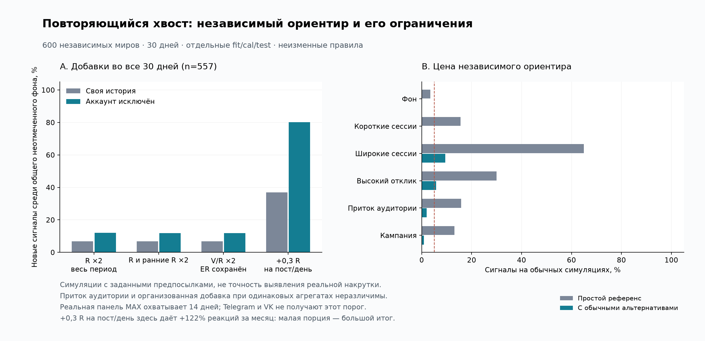

# Повторяющиеся хвосты реакций в MAX

Обновление: H42–H47 выполнены, результаты в [§11](#11-результаты-h42h47-независимый-ориентир-и-цена-чувствительности).
Референс с исключением целого аккаунта защищён от его собственной постоянной
добавки, но проверенный хвостовой кандидат не прошёл допуск к публичному сигналу.
Основной архив не даёт достаточной калибровки; повторные обычные сессии остаются
контрпримером. Первичные H18–H22 ниже сохранены как предыдущий этап.

Проверка 28.09.2026, календарные дни 14–27 сентября. **Различие между названными примерами существует в наблюдаемой части данных.** Однако точнее говорить о повторных эпизодах широкого отклика на старые посты, перемежающихся тихими днями, чем о непрерывном ежедневном хвосте. Одна длина хвоста не позволяет установить происхождение активности.

Это продолжение [первого цикла гипотез](EXPERIMENTS.md) и [плана валидации](VALIDATION.md). МГУ Ломоносова, МФТИ, МГУ имени А. И. Куинджи, ЮЗГУ и **Курский государственный университет** — примеры, предложенные пользователем, без меток «органика» / «манипуляция». Платформа во всём новом расчёте — **MAX**. Публичные оценки не обновлялись.


## 1. Что проверено

H18–H21 и правила извлечения записаны до просмотра суточных результатов. Разбиение ретроспективное, это не независимая будущая валидация. H22 добавлена после просмотра результатов и прямо помечена как разведочная.

| Гипотеза | Результат и граница вывода |
|---|---|
| H18: ширина старого хвоста и её повторяемость различаются между примерами | **Подтверждено описательно** на пригодных интервалах. Разница сохраняется при границах ≤3 и ≤6 ч; при ≤1 ч данных мало и ранжирование меняется. Полная независимость от частоты публикаций не установлена. |
| H19: повторный плавно убывающий хвост сам по себе позволяет выявить искусственное происхождение | **Опровергнуто как универсальное правило**: обычный счётный отклик при разных склонностях реагировать даёт такой же эффект. |
| H20: разницу нельзя объяснить только охватом и ранней вовлечённостью | **Частично подтверждено относительно исследованных моделей**: поправка сильно сокращает отличие Куинджи, но существенно меньше — ЮЗГУ и КГУ. Это не исключает иные обычные причины. |
| H21: существующий M0 уже обеспечивает полный тест возраста 4–14 дней | **Опровергнуто для текущего дизайна кода**: возраст по умолчанию ≤7 суток, TTL 7 суток и отбор до 16 самых новых постов. Фактическая история receipts также слишком коротка. |
| H22: распределение реакций между старыми постами содержит информацию сверх общего количества | **Есть разведочные примеры**, особенно при малых суммах у Куинджи и КГУ. Наивная независимая модель не учитывает сессии одного читателя; её ранги нельзя публиковать как вероятность аномалии. |

## 2. Версия кода, срез и знаменатель

Работа продолжается в изолированной ветке **`feat/smart-analizes`**, переименованной по запросу владельца. База — развёрнутый commit `ea8326ebd896bf8db5d4264f2b66c50403881caf`, а не более новый `origin/main`. До исследования сверены исходники API и фактический рабочий каталог сборщиков; 442/442 SHA-256 совпали с базой. При продолжении повторно проверены релиз и файлы работающего MAX-сборщика. Доступы, адреса и транспорт выгрузки в репозиторий не записываются.

Из 83 неудалённых MAX-аккаунтов включены все 81, у которых было ≥15 оригинальных неудалённых публикаций 31.08–27.09 UTC. Отбор использует количество публикаций, а не текущие аномальные статусы. Это активная когорта доступного каталога, не случайная выборка вузов страны. Пять пользовательских примеров не являются независимым набором подтверждения.

В локальный замороженный JSONL извлечены **9978 публикаций**, включая репосты для отдельной проверки, с 31.08 00:00 до 28.09 00:00 МСК. Для каждого поста сохранены только последние реальные снимки суток 13–27.09 и ранняя точка возраста 21–24 ч. Запросы выполнялись последовательно, по одному аккаунту, read-only, с таймаутом 60 с и lock timeout 2 с; вся выгрузка заняла около 506 с. Полный сырой архив продовой БД не копировался. Снимки и коррекции ограничены `created_at < 28.09 00:00 UTC`.

Основной расчёт:

- Оригинальные публикации; запланированный возраст на начало суток от 1 до 13 дней, наблюдаемый возраст начала ≥1 дня, конца ≤14 дней.
- Оба конца — реальные, точные V и R, без `interval_uncertain`; используется последняя коррекция sampling bucket, synthetic исключены.
- Отставание каждого конца от соответствующей московской полуночи ≤3 ч; длина наблюдаемого интервала 18–30 ч. Проверки чувствительности: ≤1 ч, ≤6 ч, включение репостов при ≤3 ч.
- NULL, отсутствующий конец, уменьшение любого счётчика исключаются с отдельной причиной. Настоящий нулевой прирост сохраняется. Ни интерполяции, ни переноса по журналу обходов аккаунта нет.
- Старый хвост: **реальное начало интервала ≥4 дней, реальный конец ≤14 дней**. `n` ниже — число интервалов «пост × день», один пост может встречаться несколько раз.

Из **53 388** возможных интервалов возраста 1–14 дней пригодны **20 097**: 30 838 исключены из-за несвежих концов, 2441 из-за отсутствующего конца, 10 из-за отрицательного изменения, 2 по границе фактического возраста. В выбранных концах не было дополнительных исключений качества. Это не доказывает точность всей истории. Наблюдение могло зависеть от активности; оценка на оставшихся строках не переносится автоматически на пропуски.

Покрытие хвоста считается относительно каталога возможных старых постов на начало суток. Условие реального возраста чуть строже календарного знаменателя у самой границы 4 дней. Оно может консервативно уменьшать долю покрытия.

На скриншоте показан **неполный** день 24.09 примерно до 19:20 МСК. API берёт последние сохранённые значения выбранного и предыдущего календарного дня, обрезает отрицательный прирост до нуля; для нового поста допускает начальный ноль. Поэтому скриншот не обязан численно совпадать с нашим полным днём и фильтром точности. Метка «полная история» не гарантирует наличие каждого успешного чтения.

## 3. Насколько отличаются хвосты

Основной расчёт, границы ≤3 ч:

| MAX-аккаунт | Интервалы с ΔR>0 / n | Доля | ΔR / ΔV за старые интервалы | Реакций на 1000 новых просмотров | Покрытие старых интервалов |
|---|---:|---:|---:|---:|---:|
| МГУ Ломоносова | 13 / 313 | 4,2% | 14 / 5646 | 2,48 | 59,2% |
| МФТИ | 11 / 157 | 7,0% | 11 / 2749 | 4,00 | 43,4% |
| МГУ Куинджи | 110 / 234 | 47,0% | 139 / 2734 | 50,84 | 38,3% |
| ЮЗГУ | 108 / 222 | 48,6% | 414 / 2880 | 143,75 | 29,0% |
| КГУ Курск | 169 / 340 | 49,7% | 733 / 3810 | 192,39 | 39,9% |

Это доли наблюдаемых положительных интервалов, **не доли накрученных постов или реакций**. ΔV не является числом независимых людей, а ΔR/ΔV — вероятностью реакции одного человека. У МГУ и МФТИ старые просмотры продолжают расти, поэтому разницу в реакциях нельзя списать только на отсутствие видимого старого трафика.

Среди 63 аккаунтов с ≥50 пригодными старыми интервалами КГУ, ЮЗГУ и Куинджи занимают соответственно 2–4 места по ширине хвоста; выше есть ещё один аккаунт, не названный пользователем. Это описательное положение в когорте, а не p-value или подтверждение подозрений. Частоту ложных тревог по этим рангам оценить нельзя.

### Повторяемость и чувствительность к покрытию

Для дневного описания требуем ≥10 наблюдаемых старых постов и ≥50% покрытия возможных. Порог «реагирует хотя бы половина» выбран как понятное описание ширины, **не как правило присвоения статуса**. Ненаблюдаемый день разрывает доказанную серию, но не считается тихим.

При строгих границах ≤3 ч пригодны только 9 / 4 / 5 / 1 / 5 дней соответственно пяти строкам таблицы. Поэтому более полная дневная карта на рисунке — **проверка чувствительности ≤6 ч**, а не подмена основного расчёта:

| Аккаунт | ΔR>0 / n, границы ≤6 ч | Доля | Пригодных дней | Из них ≥половины старых постов реагируют |
|---|---:|---:|---:|---:|
| МГУ Ломоносова | 19 / 488 | 3,9% | 14 | 0 |
| МФТИ | 15 / 314 | 4,8% | 14 | 0 |
| МГУ Куинджи | 202 / 413 | 48,9% | 10 | 5 |
| ЮЗГУ | 229 / 553 | 41,4% | 11 | 4 |
| КГУ Курск | 294 / 610 | 48,2% | 12 | 7 |

Например, у ЮЗГУ 22–25.09 положительный прирост есть у всех наблюдаемых старых постов (36/36, 57/57, 48/48, 48/48); 18–19.09 в пригодных интервалах реакций нет. У Куинджи есть широкие эпизоды 16, 19, 24–26.09, но 20.09 — 0/41. У КГУ почти полный отклик 15, 18, 21, 22 и 24.09 перемежается днями с единичными приростами. Следовательно, наблюдение пользователя полезно уточнить до **повторной массовой активации архива**, а не буквального «каждый день одинаковый хвост».

При ≤1 ч остаются лишь 53 / 69 / 57 / 14 / 21 интервалов; доли 1,9 / 13,0 / 21,1 / 14,3 / 57,1%. В частности, ЮЗГУ нельзя устойчиво ранжировать по этому малому срезу. Добавление репостов при ≤3 ч почти не меняет общую разницу. Дни и посты зависимы: нельзя выдать обычный биномиальный доверительный интервал, считая тысячи строк независимыми опытами.

## 4. Что меняют охват, ранний ER и частота публикаций

Ранний признак `q24=(R24+0,5)/(V24+1)` берётся из точного снимка возраста 21–24 ч, не позднее начала оцениваемого интервала. Это сглаженный ковариат, не «органическая норма». При возможном воздействии до первых суток он сам может быть изменён. Медианы q24 среди пригодных старых интервалов: МГУ 1,57%, МФТИ 2,01%, Куинджи 11,12%, ЮЗГУ 9,73%, КГУ 4,35%. Повторение поста в разные дни влияет на эти описательные медианы.

Реализованы NB2-модели `Var(Y|X)=μ+αμ²`, логарифмическая связь, штраф 10 для коэффициентов кроме intercept. Возраст входит как log(age) и его квадрат; offset — log(ΔV+1), с ранним ER дополнительно log(q24). Контекст: log(V24+1), число новых публикаций текущего дня, глубина в ленте на начало суток, выходной и формат. Расширение истории аккаунта добавляет intercept и возрастной коэффициент аккаунта. Отдельная peer-модель обучается без всех пяти названных примеров; остальные аккаунты не объявляются органическими.

Обучение — 14–20.09, **7822 интервала**, контроль — 21–27.09, **9171**. Один пост может пересекать календарное разбиение: это проверка будущих интервалов известных постов, не обобщение на новые посты. Реализованные ΔV и число публикаций дня известны после интервала: это **условная оценка завершившегося отклика**, не предварительный прогноз и не причинный эффект просмотра/публикации. Все модели оптимизационно сошлись, но сходимость не означает адекватность нормы.

| Модель | MAE на контроле ↓ | Средний отрицательный log-likelihood ↓ |
|---|---:|---:|
| Возраст + просмотры | 1,182 | **1,033** |
| + ранний ER | 1,004 | 1,043 |
| + контекст ленты и публикаций | 1,099 | 1,087 |
| + индивидуальная история/возраст аккаунта | 1,160 | 1,377 |
| Ранний ER, обучение без пяти примеров | **0,941** | 1,078 |

Улучшение средней абсолютной ошибки не сопровождается улучшением вероятностного прогноза. Преимущество богатого контекста и пригодность хвостов распределения **не подтверждены**. Отсюда нельзя заявлять «мы полностью учли частоту публикаций» или оценивать шанс случайного возникновения конкретного хвоста.

Для старых интервалов контрольной недели отношение **наблюдаемые реакции / сумма условных ожиданий**:

| Аккаунт | Только возраст/V | + ранний ER | + контекст | + история аккаунта | Peer без пяти примеров |
|---|---:|---:|---:|---:|---:|
| МГУ Ломоносова | 0,22 | 0,41 | 0,41 | 2,02 | 0,55 |
| МФТИ | 0,20 | 0,32 | 0,34 | 0,78 | 0,42 |
| Куинджи | 5,29 | 1,48 | 1,51 | 1,33 | 1,98 |
| ЮЗГУ | 13,08 | 4,35 | 3,87 | 7,86 | 5,75 |
| КГУ Курск | 13,55 | 6,36 | 4,72 | 0,90 | 8,42 |

Для Куинджи ранний ER объясняет большую часть грубого контраста. ЮЗГУ и КГУ сильнее отклоняются от общих условных моделей, но результат зависит от выбранной нормы. **История КГУ поглощает повторяющееся поведение**, сводя отношение к 0,90; это не доказательство нормальности. Так выглядит один из рисков H14: постоянный механизм становится собственным baseline. Это иллюстрация на данных, не контролируемый эксперимент с известным загрязнением обучения. Продолжение H13–H17 в ограниченных контролируемых постановках выполнено в [MASKING.md](MASKING.md); полного переноса на реальные данные пока нет.

## 5. Математические контрпримеры и новый признак

### Длинный гладкий хвост может возникать без вмешательства

Если отклик на старый пост описан `Y ~ Poisson(q·ΔV)`, то `P(Y>0)=1−exp(−q·ΔV)`. При одинаковой форме затухания просмотров более высокая склонность q резко повышает вероятность увидеть положительное число на каждом старом посте. В этой конструкции нет организованной добавки.

В воспроизводимой симуляции 1000 когорт × 30 дней, по 5 постов каждого возраста 4–14 дней, `ΔV~Poisson(100/(1+age/3))`. При q=0,008 медианная ширина хвоста 18,2%, ни одного дня с ≥50% активных старых постов; при q=0,12 — ширина 94,5% и ≥50% каждый день. Среднее число реакций на пост плавно падает с возрастом. Это математический контрпример универсальному критерию, **не подогнанное объяснение конкретных вузов**. Пуассоновская модель здесь задаёт число действий, не договорённость MAX о числе уникальных людей.

### Распределение фиксированной суммы реакций

Разведочный H22: условно на `T=ΣΔR` рассмотреть число активных старых постов `B=Σ1[ΔR>0]`. При независимом распределении T действий с весами `w_i=μ_i/Σμ`:

`E[B|T,w] = Σ_i (1−(1−w_i)^T)`.

Использованы ожидания peer-модели, только контрольная неделя, дни с ≥10 наблюдаемыми старыми постами и T≥10; 10 000 multinomial-симуляций на проверку. Это отдельный механизм-тест на наблюдаемых постах, без требования дневного покрытия ≥50%; он не доказывает ширину отклика всего архива.

| Пример | Постов | Реакций T | Активных B | E[B] при независимом распределении |
|---|---:|---:|---:|---:|
| Куинджи, 25.09 | 16 | 18 | 15 | 9,45 |
| Куинджи, 26.09 | 15 | 12 | 12 | 7,81 |
| КГУ, 21.09 | 15 | 19 | 15 | 8,72 |
| КГУ, 24.09 | 33 | 215 | 31 | 31,41 |
| ЮЗГУ, 22.09 | 20 | 134 | 20 | 18,99 |

У первых трёх примеров верхние симуляционные ранги около 0,0002 / 0,0004 / 0,0001. У КГУ 24.09 — 0,857, у ЮЗГУ 22.09 — 0,316: при большой сумме реакций широкий отклик часто ожидаем уже из-за объёма. **Эти ранги не калиброваны как p-values реальной аномалии**, поиск выполнен после просмотра данных, множественные проверки не скорректированы, условная независимость не доказана.

Контрпример: один новый заинтересованный читатель может поставить по реакции на 40 разных старых постов. Тогда T=B=40, а независимая равномерная модель ожидает всего 25,47 активного поста. Поэтому ровное распределение отличает механизмы взаимодействия, но само не отличает живую сессию просмотра архива от организованного выполнения задания. Внешние признаки кампаний и данные более частых чтений нужны для проверки альтернатив.

Практический кандидат для дальнейшей проверки — **совместный профиль**: избыток условного объёма + необычная ширина при данном объёме + повторение в разных неделях + согласованность остаточных изменений на нескольких постах. У каждого компонента должен быть свой знаменатель, диагностика измерений и проверка обычных общих событий. Нельзя складывать некалиброванные ранги и показывать их как «вероятность накрутки».

## 6. Научные опоры

- [Vassio et al., 2022 — temporal dynamics of followers’ engagement](https://link.springer.com/article/10.1007/s13278-022-00928-2): временные кривые взаимодействий Facebook/Instagram, суточная активность и влияние новых публикаций на распределение внимания. Работа полезна для выбора ковариат и модели старения. Её времена затухания не являются нормативом MAX.
- [Weng et al., 2012 — Competition among memes in a world with limited attention](https://www.nature.com/articles/srep00335): ограниченное внимание и структура сети способны порождать неоднородную длительность распространения. Это дополнительная к первоначальному списку работа. Объект — Twitter-мемы/ретвиты; наличие длинного распределения жизни мемов не равно хвосту реакций конкретного поста MAX. Используется концептуальный механизм, не численные коэффициенты; страница отмечает erratum 2013 года.
- [Rizoiu et al., интервально наблюдаемые процессы, JMLR 2022](https://jmlr.org/papers/v23/21-0917.html): основания работать с интегральными приращениями между наблюдениями. Настоящая проверка не оценивает Hawkes-процесс и не восстанавливает индивидуальные времена реакций из суточных сумм.
- [Barber et al., Conformal prediction beyond exchangeability](https://arxiv.org/abs/2202.13415): ограничения и способы учитывать зависимость/дрейф при калибровке. В текущем коротком срезе такая гарантия не построена.

Общий разбор 12 приложенных PDF, маркетинговых исследований и других дополнительных работ остаётся в [SOURCES.md](SOURCES.md); он здесь не дублируется.

## 7. Исправления анализатора в ветке

Продолжение первого пункта плана P0: устранены воспроизведённые источники ложных уверенных выводов. Изменения **не развёрнуты**.

1. Журнал успешных обходов аккаунта больше не вставляет непроверенные неизменившиеся значения поста. Неопределённый 24-часовой прирост остаётся 24-часовым; пустые часы соседних публикаций не становятся нулевыми.
2. `reactions_catch_up` использует неперекрывающиеся пары реальных чтений длительностью около 6 ч вместо разностей интерполированной сетки. Наблюдаемые отрицательные коррекции/сбросы внутри пары исключают её. Недодисперсия ограничена слабым исследовательским сигналом; пояснение больше не утверждает, что обычный отклик обязан иметь пуассоновский разброс.
3. `reactions_exceed_views` воздерживается на Telegram: суммарные реакции со Stars и возможными несколькими реакциями не имеют универсального ограничения R≤V. Это защитное воздержание; полноценное разделение обычных реакций и Stars ещё не реализовано.

Повтор первого эксперимента на тех же данных и seed:

| Контроль | До | После |
|---|---:|---:|
| Сдвинутые на 3 ч пуассоновские чтения, полный детектор | 118 / 500 срабатываний | 0 / 500 |
| Та же модель, чтения по границам | 0 / 500 | 0 / 500 |
| 24 ч между снимками, account log каждые 30 мин | искусственное сужение до 0,5 ч | исходные 24 ч, вставок нет |
| 200 Stars при 100 просмотрах | сильный R>V сигнал | воздержание |

Ноль из 500 не означает нулевую ошибку: верхняя граница Wilson 95% около 0,76% **только для заданной симуляции**. Контрпример конечной аудитории к самому пуассоновскому критерию остаётся; поэтому введён слабый предел, а не объявлена завершённая калибровка.

Проверки: **220 passed, 7 skipped**, включая тесты производительности, подготовку рядов, детекторы, нормы, worker/store, изоляцию и 9 исследовательских проверок качества интервалов. Семь пропусков — интеграции PostgreSQL без выделенного тестового DSN. Рабочая БД тестами не изменялась.

Остаточные ограничения P0: качество и округление ещё не проведены через всю структуру PostSeries; хранение Stars отдельно не закончено. Перед возможным развёртыванием нужен контролируемый перерасчёт норм и ранее сохранённых оценок: изменение версии подготовки само по себе не гарантирует инвалидирование старого состояния worker, а часть старых признаков может переноситься. В этой задаче перерасчёт и публикация статусов не выполнялись.

## 8. Следующий сбор, который действительно нужен для проверки

**Уточнение владельца после этого отчёта:** расширение хранения исключено, поэтому описанный ниже дизайн отложен и не включался. Использовать существующие receipts и локальные панели, как в [MASKING.md](MASKING.md). Нынешний доступный горизонт ограничивает выводы; расширение не является условием продолжения исследования.


В ограниченном read-only аудите M0: 1366 receipts, 257 публикаций, от 27.09 22:08:06 до 23:31:25 UTC. Это около 83 минут, не доказательство полноты всей когорты и не определение действующей конфигурации каждого сборщика.

В [poll_receipts.py](../../collector_target/poll_receipts.py) по умолчанию возраст 7 дней, TTL 7 дней, максимум 16 публикаций за batch; выборка сортирует самые новые первыми. Даже увеличение возраста до 14 дней **не устраняет вытеснение старых постов новыми**. В runtime передаются account_ids, остальные параметры не становятся автоматически настраиваемыми по окружению.

Конкретный дизайн следующего пилота:

1. Заранее зафиксировать 5 примеров плюс случайную часть сопоставимых MAX-аккаунтов; не использовать подозрение как метку ответа. Для контроля переноса нужны отдельные новые посты и следующие календарные недели.
2. Отбирать посты фиксированно по ID или стратифицированно по возрастам 0–1 / 1–4 / 4–7 / 7–14 дней с известной вероятностью включения. Обход «самые новые 16» не использовать как полную когорту. Если бюджет ограничен, уменьшить фиксированную выборку, а не молча терять старые посты.
3. Сохранять реальные успешные чтения, в том числе неизменившиеся счётчики, качество, исправления, попытки и причины пропусков. Для горизонта 14 дней нужны соответствующий возраст опроса и сохранение производных интервалов до удаления сырья по TTL.
4. Сначала измерить объём и стоимость пилота по [STORAGE_BUDGET.md](../../operations/runbooks/STORAGE_BUDGET.md). Например, 10 аккаунтов × 16 фиксированных постов × 96 чтений/сутки × 14 дней = 215 040 receipts до учёта пропусков; байты нужно измерить, а не угадать. Это расчёт бюджета кандидата, не применённая конфигурация.
5. Заморозить модели и правила до новых результатов. Проверять объём, ширину при данном объёме, сессии, общий инфоповод, загрязнение нормы и плавные стохастические добавки. Калибровать максимум по дням/постам на независимых временных блоках; отслеживать покрытие и воздержания наряду с чувствительностью.

Уже выполненные проверки позволяют отвергнуть несколько слишком простых детекторов и выделить проверяемые особенности. Они не заменяют сбор будущей когорты: ретроспективно восстановить успешные несохранённые чтения невозможно.

## 9. Воспроизведение

Сохранены [анализ](scripts/analyze_max_tail.py), [визуализация](scripts/plot_max_tail.py), [каталог](sql/max_tail_catalog.sql), [SQL концов](sql/max_tail_endpoints.sql), [агрегаты](evidence/max_tail_2026-09-28.json) и [происхождение/контроли](evidence/max_tail_provenance_2026-09-28.json). SQL использует существующую модель аналитики; продуктовый CSV export не возвращается.

Локальные исходные `local_data/max_tail_panel_2026-09-28.jsonl.gz` и `local_data/max_tail_cohort_2026-09-28.json` исключены из Git. Несжатый SHA-256 панели:

`1eadb3143f3ec42e3869ec2bdd315e1e9c176f3353d96feccf61622746c6cf2e`.

Python 3.13.5, NumPy 2.4.6, SciPy 1.17.1, seed 20260928 (allocation seed +22). Из корня ветки:

```sh
rtk proxy /Users/funpin/Documents/ChatGPT/TG-monitoring/.venv/bin/python \
  research/smart-engagement-2026-09/scripts/analyze_max_tail.py \
  --panel research/smart-engagement-2026-09/local_data/max_tail_panel_2026-09-28.jsonl.gz \
  --cohort research/smart-engagement-2026-09/local_data/max_tail_cohort_2026-09-28.json \
  --output /tmp/max-tail-reproduced.json
```

График строится отдельным `plot_max_tail.py --result <json> --output <png>` при установленном matplotlib; его окружение не используется для пересчёта моделей. JSON содержит полные дневные знаменатели и результаты всех пяти моделей по когорте, а не только выбранные строки отчёта. Контроли продуктового кода повторяются командой из EXPERIMENTS с `--repo .`; для исторического результата нужен baseline `ea8326e`.

## 10. Продолжение: протокол H42–H45 до новых исходов

28.09.2026. Это продолжение использует тот же архив 14–27 сентября;
вторая неделя — временное разделение уже изученных данных, не новый слепой
контроль. Никакой вуз не получает метку происхождения активности. Хранение,
опрос, TTL и production не меняются. Рабочая ветка `feat/smart-analizes`
чиста на старте (`fa83f41`); полученный `origin/main` — `8de0462`, локальный
`main` — `73ca332`. Повторное чтение действующего build identity подтвердило
`e9dfc83c1158b859e12247bb66a343a7ea57781c`; HTTP readiness ответил 200.

**H42 — исключение всей собственной истории.** Разбить 81 аккаунт по
SHA256(id), чётные/нечётные позиции: fit / calibration. Для каждого целевого
аккаунта исключить его из обеих частей. Обучить на 14–20.09 две NB2-модели,
ridge=10, по старым точным интервалам с известным ранним откликом: (A) возраст,
длительность, публикационная активность, глубина, формат, выходной, без
счётчиков целевого аккаунта; (B) тот же контекст плюс V24, offset
`log(ΔV + duration/24) + log(q24)`. A не имеет независимого измерителя размера
аудитории: её ошибка на неоднородных вузах — обязательный результат.
У A offset `log(duration/24)`. Список типов и стандартизация только по fit.

Дневной допуск: >=5 пригодных постов, >=50% каталога старых постов; оконный:
>=3 пригодных дней из семи. Основные границы <=3 ч; <=6 ч — заранее отдельная
чувствительность, она не заменяет основной результат. Измерение, отрицательные
изменения и знаменатели наследуются из §2. Раннее качество дополнительно
сужает числитель покрытия; пропуски остаются пропусками.

Для дня: L=log((T+0.5)/(sum(mu)+0.5)); B=(число активных постов − ожидаемая
занятость при T независимых распределениях с весами mu/sum(mu)) / n;
C — среднее произведение положительных Pearson-подобных остатков разных
постов, остатки ограничены 5, знаменатель sqrt(mu+alpha*mu²+1).
Ожидание занятости — описательный контраст, не доказанная модель читателей.
Для окна: V=mean(L)/log(2), P=третье по величине L/log(2), W=mean(B)/0.1,
K=mean(C). Основной score каждой модели `min(V,P,max(W,K))`; общий score —
максимум двух моделей. Повторяемость и структура должны поддержать объём.
Абляции: только условный score; только объём/повторяемость `min(V,P)`.
Единицы масштаба фиксированы до расчёта, по исходам не оптимизируются.

Калибровать **один общий score окна**, по одному окну 14–20.09 каждого
cal-аккаунта. Ранг `(1+#cal>=test)/(1+ncal)`, уровень 0.05; при ncal<19 —
воздержание. Проверка 21–27.09 исключённого аккаунта. Публиковать все размеры,
отказы, MAE/NLL, оба ожидания, профиль и ранги, не вероятность накрутки/FPR.
Для одновременного просмотра 81 аккаунта дополнительно показать разрешимость
Bonferroni 0.05/81; он не исправляет невалидные исходные ранги. Объединение
абляций и допусков в единый сигнал запрещено. Будущий независимый период
обязателен для внедрения; в этом архиве он отсутствует.

**H43 — постоянная добавка и загрязнение peer-референса.** 600 независимых
30-дневных синтетических миров, seed 20267228. В каждом 61 аккаунт: один
целевой, 30 fit-peers и 30 cal-peers. По два новых поста в сутки; в каждый
день 20 постов возрастом 4–13 суток. Fit/cal/test — первые/вторые/третьи
10 дней. Публикация переносит свой ранний отклик и привлекательность через
дни; общий AR(1)-множитель охвата создаёт зависимость постов/дней. Счётчики
целые; пуассоновские V, биномиальные R, неоднородность размера/вовлечённости.
Заданные параметры генератора фиксируются в скрипте; это не органическая
норма MAX. Полная наблюдаемость здесь благоприятна и явно отделена от архива.

Ориентиры симуляции **обучаются**, истинные скрытые параметры не передаются
детектору. Структурный: средние реакции по возрасту у fit-peers; условный:
`(ΔV+1)*q24*exp(-0.08*(age-1))` с множителем, оценённым по fit-peers.
Сравнение — аналогичные нормы по первым 10 дням каждого самого аккаунта;
калибровочные peers также нормируются своими fit-историями. Истинная модель
имеет отличающуюся возрастную кривую и случайные общие эффекты.
Профиль/совместный score как H42, dispersion фиксирована 0.4. По 30 целым
cal-окнам, один test-блок целевого аккаунта на мир; независимы миры, не дни.

Сценарии: увеличение R на 10/30/100%; уже раннее увеличение R24 и R;
пропорциональное увеличение ранних/поздних V/R на 10/30/100%; небольшие
ежедневные Bernoulli-добавки R с p=0.1/0.3/1 на пост; отдельный случай
изменения только test. Пропорциональная добавка использует случайную фазу
накопительного пути, чтобы не уничтожать малые дозы округлением; при x2
ER сохраняется точно. Воздействия постоянных сценариев охватывают **все**
30 дней, включая fit/cal. Отдельно загрязнить 0/10/30% peer-аккаунтов на
всём периоде, заранее равномерно распределив их по fit/cal. Записать фактическую
дозу, все сигналы и новые сигналы среди общих исходно неотмеченных случаев.
Главный критерий H43: исключение target сохраняет неизменность fit/cal
референса при любых изменениях только target; это не обещает чувствительность,
если воздействие объясняется изменёнными входными счётчиками.

**H44 — ложные сигналы обычных альтернатив.** На тех же независимых мирах:
неглубокие и повторные широкие сессии читателей архива, высокая вовлечённость,
обычный приток заинтересованной аудитории, общий инфоповод/кампания и волны
поздних рекомендаций VK. Частоты/глубины — предпосылки генератора, а не
измеренная распространённость. Сравнить референс базового фона с равной
смесью обычных семейств, не отбрасывать неудобные cal-score. VK — отдельный
контрпример переносу MAX, без общего порога для платформ. Считать доли
ложных сигналов только на заданных обычных симуляциях, интервалы Wilson по
мирам. Идентичные агрегаты «приток аудитории» и «организованная добавка»
обязаны давать идентичный результат. Ошибка >5% в обычном семействе отвергает
универсальную специфичность кандидата; результат не скрывается смесью.

**H45 — границы допуска и воспроизводимость.** Технически проверить исключение
target из обеих стадий, отсутствие будущего в fit, неизменность ранга при
изменении отсутствующего чтения, сохранение известных нулей, качество MAX,
воздержание Telegram при неизвестном шаге/Stars и запрет переноса порогов VK.
Малое число cal-аккаунтов и разрешение множественной проверки дают явный
отказ. Измерить локальное время/RSS; повтор численного отчёта должен совпасть.
Если реальные наблюдения/контрпримеры не допускают автоматический публичный
детектор, сохранить исследовательский профиль и конкретные причины отказа,
а не внедрять признак для отметки пяти выбранных вузов.

### Дополнительная диагностика H46 после первичных H42–H45

Первичный расчёт завершён: при <=3 ч только 6–7 cal-аккаунтов, при <=6 ч
21–22; это не основание заменить основной допуск. До вычисления H46
фиксируем проверку устойчивости: сохранить fit-модели и исходные пороги H42,
отдельно описать профили целевого аккаунта в обеих семидневках. Референс
по-прежнему не видит его историю. Совпадение недельных превышений не получает
произведения рангов или отдельного p-value повторяемости.

Для каждого из семи дней контрольной недели убрать этот день и соответствующий
день недели в cal (сдвиг ровно 7 суток); заново получить **один** оконный score
и его калибровку по оставшимся дням. Fit не переобучать; допуски >=3 дней,
>=5 постов, >=50% покрытия, >=19 cal-аккаунтов сохранить. Рассмотреть все семь
удалений для всех 81 аккаунтов, не выбирать выгодное. Публиковать число
пригодных повторов, диапазон рангов и превышения, отдельно для <=3 и <=6 ч.
Это блочная чувствительность к календарю, не независимые семь испытаний,
не bootstrap-интервал риска и не новый подбор детектора. Короткая панель
не позволяет получить отдельный двухнедельный cal-блок перед test-блоком.

### Дополнительная проверка H47: собственная история также в калибровке

После H43 уточняем границу сравнения: его `self_joint` использует первые
10 дней target для обучения, но cal-окна принадлежат другим аккаунтам,
нормированным их собственной историей. Чтобы отдельно проверить буквальное
присутствие постоянной добавки и в обучении, и в калибровке target, добавить
один заранее определённый компаратор: первые 29 cal-peers и одно окно target
дней 10–19, всего прежние 30 окон. Fit и cal target изменяются вместе с
его полным 30-дневным путём; независимый ориентир H43 остаётся прежним.

Те же 600 миров, семейства, дозы и доли загрязнения, без новых порогов.
Это парная дополнительная диагностика, не независимая новая симуляция.
Общий неотмеченный знаменатель для неё — пересечение baseline независимого
правила и нового компаратора; первичные знаменатели/результаты H43 сохраняются.
Показывать все сигналы и новые на этом пересечении. Единственный cal-блок
target не называется самостоятельной достаточной калибровкой; связь этого
блока с его test — ещё одна причина не приписывать рангу гарантию 5%.

## 11. Результаты H42–H47: независимый ориентир и цена чувствительности

**Исключение всей истории проверяемого аккаунта защищает референс от её
поглощения. Проверенный совместный детектор к публичному применению не готов:**
основная реальная панель слишком редко наблюдается, а обычные повторные
читательские сессии остаются контрпримером. Эти два вывода совместимы:
устранить самонормировку необходимо, но этого недостаточно для атрибуции.

Воспроизводимые [агрегаты](evidence/persistent_tail_2026-09-28.json),
[скрипт](scripts/persistent_tail_validation.py),
[технические проверки](../../tests/test_persistent_tail_research.py).
Протокол H42–H45 выше записан до первичных исходов; H46 и H47 — явно
последующие диагностики с сохранением исходных результатов. Хеши всех трёх
частей, источника, входов и тестов находятся внутри JSON.



### H42. Реальные окна, целиком исключённые аккаунты

Каждый целевой аккаунт исключён из fit **и** cal, включая всю первую неделю.
Разбиение peer-аккаунтов фиксируется по хешу до его удаления и не меняется
при изменении его счётчиков. Половины fit/cal не пересекаются. Это отличается
от H20: проверены все 81 аккаунт, калибруется целое семидневное окно, а не
только отношение реакций к ожиданию у пяти заранее известных примеров.
Калибровочные аккаунты не названы органическими.

| Допуск концов | Пригодные test-окна / 81 | Cal-аккаунтов после исключения target | Окон с разрешимым рангом 5% | Превышения совместного score |
|---|---:|---:|---:|---:|
| **Основной, <=3 ч** | 15 | 6–7 | **0** | Воздержание |
| Чувствительность, <=6 ч | 48 | 21–22 | 48 | 2/48 |

Требование >=3 дней применяется ко всему окну, а каждый день требует >=5
старых постов и >=50% покрытия каталога, включая отсутствие точного раннего
замера как потерю пригодности. Это иной знаменатель, чем исходные описательные
таблицы H18: совпадение чисел не ожидается. При основном допуске минимальный
ранг 12.5–14.3%, поэтому даже произвольно большой score не даёт решения 5%.
Шесть часов не выбраны вместо трёх после просмотра отметок.

В пригодной части **второй** недели при <=6 ч:

| Пример MAX | Дней / интервалов | Наблюдаемое / структурное ожидание | Наблюдаемое / условное ожидание | Совместный ранг |
|---|---:|---:|---:|---:|
| МГУ Ломоносова | 7 / 241 | 0.22 | 0.32 | 0.261 |
| МФТИ | 7 / 133 | 0.15 | 0.26 | 0.273 |
| МГУ Куинджи | 5 / 145 | 3.72 | 1.80 | 0.091 |
| ЮЗГУ | 6 / 252 | 14.21 | 7.07 | 0.0435 |
| КГУ Курск | 5 / 176 | 10.10 | 6.37 | 0.0455 |

Ожидания в таблице суммируются только по допущенным дням. Ранг вычислен по
совместному score объёма, повторения и структуры, **не** по самому отношению
сумм. Для Куинджи ранний отклик снова существенно меняет объяснение, но отсутствие
превышения не подтверждает нормальность. Большие отношения ЮЗГУ/КГУ не называют
свою причину. Оба остаются диагностическими случаями расширенного допуска.

На одинаковых доступных test-интервалах с ранним замером условная модель
имеет MAE 0.805 против 0.823 структурной (4233 интервала, <=3 ч), однако NLL
хуже: 0.829 против 0.791. При <=6 ч — MAE 0.590 против 0.619, NLL 0.637
против 0.736 на 9382 интервалах. Эти ошибки включают дни, не прошедшие
оконный допуск; знаменатели различены в JSON. Богатый контекст и отсутствие
аккаунтного intercept не превращают прогноз в истинную органическую норму.

Для одновременного просмотра 81 аккаунта ни один реальный ранг не разрешает
даже формальный уровень 0.05/81. Bonferroni здесь — диагностика множественности:
она не исправляет неизвестную обменность, общие инфоповоды или зависимый от
изменений счётчиков отбор замеров. Доля 2/48 не является измеренным FPR.

### H46. Повторяемость между неделями и удаление календарного блока

На основном допуске <=3 ч двухнедельное заключение не получено. При <=6 ч
у КГУ пригодны 6 дней первой недели и 5 второй; диагностическое превышение
есть в обеих. У ЮЗГУ и Куинджи в первой неделе пригодны только по 3 дня,
и превышения совместного правила нет. Это подтверждает необходимость
различать постоянство гипотезы и фактическую наблюдаемость эпизодов.

При каждом удалении дня test одновременно удаляется соответствующий день
недели cal, а правило и fit остаются прежними. Для пяти примеров из семи
удалений только **четыре** сохраняют >=19 cal-аккаунтов. ЮЗГУ/КГУ сохраняют
превышение во всех четырёх; МГУ/МФТИ — ни в одном. Куинджи получает его в
двух из четырёх, хотя исходное окно не превышало границу. Ещё один неназванный
аккаунт получает два превышения после удаления; это не новый опубликованный
список аномалий. В JSON есть все семь удалений для всех аккаунтов.

Таким образом, два основных диагностических случая не объясняются только
одним удачно выбранным днём, но калибровка хрупка, а часть повторов воздерживается.
Четыре удаления не являются четырьмя независимыми подтверждениями.
Два семидневных профиля не дают отдельно откалиброванной вероятности
повторяемости: предшествующего двухнедельного cal-блока в архиве нет.

### H43. Постоянное воздействие и ранние объясняющие счётчики

**600 независимых симулированных миров по 30 дней**, а не месяц реальных
наблюдений. Внутри мира зависимы дни, публикации и повторные чтения одного
поста. Различаются размеры и вовлечённость аккаунтов; общая дневная компонента
охвата имеет AR(1). Обученный детектор получает только синтетические V/R,
ранние V/R и возраст, без скрытой истинной интенсивности. Упрощённая симуляционная
модель не тождественна NB-модели реальной панели; коэффициенты между ними
не переносятся. Полная наблюдаемость — благоприятное допущение этого эксперимента.

Первый компаратор `self_joint` обучает уровень по первым 10 дням каждого
самого аккаунта, а калибрует его по 30 другим аккаунтам с их собственной
нормировкой. Независимый вариант использует только отдельные fit/cal-peers.
Оба оценивают последнее десятидневное окно; постоянные воздействия присутствуют
во всех 30 днях. Компаратор с target также в cal отдельно добавлен в H47 ниже.

Новые сигналы на **одних и тех же 557 мирах**, исходно не отмеченных всеми
четырьмя первичными правилами при базовом референсе без загрязнения:

| Заданный сценарий | Своя история | Только условный независимый | Совместный независимый |
|---|---:|---:|---:|
| R ×2 только в test | 129/557 | 163/557 | 67/557 |
| R ×2 во всём периоде | **38/557** | 163/557 | 67/557 |
| Ранние R и весь поздний R ×2 | 38/557 | **18/557** | 66/557 |
| Ранние/поздние V и R ×2, ER сохранён | 38/557 | 24/557 | 66/557 |
| +0.1 R на пост/день в среднем | 67/557 | 298/557 | 90/557 |
| +0.3 R на пост/день в среднем | 206/557 | 556/557 | 447/557 |

Здесь видны **два разных поглощения**. Своя история уменьшает новые сигналы
удвоения с 23.2% до 6.8%, когда оно присутствует с начала периода. Ранний
ER уменьшает чувствительность условного независимого правила с 29.3% до
3.2%, когда увеличены и ранние реакции. Исключение target из fit/cal
не защищает от его изменённых условных входов. Структурный второй ориентир
возвращает часть чувствительности, но расширяет калибровочный хвост:
он проигрывает чисто условному правилу на позднем увеличении только R.
Преимущество объединения не универсально.

При изменении всей истории target коэффициенты **и** peer-calibration
сохранились точно во всех 600 мирах; отдельный тест меняет все его входные
поля на большую величину. Это проверенное защитное свойство архитектуры.
Оно не означает 100%-е обнаружение: независимый совместный вариант пропускает
большинство пропорциональных удвоений на неоднородном фоне.

Малые порции имеют существенный накопленный размер: p=0.1 даёт фактически
**+40.7% R**, p=0.3 — **+122.4% R**, p=1 — **+406.1% R** на этой редкой
поздней активности. Поэтому 447/557 нельзя называть чувствительностью к
«+30% накрутки». Настоящие +10% и +30% пропорционального R дали лишь
5/557 и 15/557 новых совместных сигналов; при изменении также ранних R —
5/557 и 13/557. Округление накопительного пути не уничтожает малые дозы.

При загрязнении **и fit, и cal** заранее выбранных 0/10/30% peers ранним
и поздним удвоением R количество всех совместных сигналов постоянного R×2
снижается **96 → 76 → 53 из 600**; раннего R×2 — **95 → 75 → 53**.
Здесь общий знаменатель 600, а не меняющееся пересечение исходно неотмеченных.
Target исключён, но чужое загрязнение остаётся: защитить одну границу
недостаточно. Верхние peer-score не удалялись.

### H44. Обычные читатели и высокая вовлечённость отвергают универсальный сигнал

Частоты ниже — ложные сигналы **в заявленных обычных симуляциях**, не на
реальных вузах. В обогащённом референсе шесть заданных семейств представлены
поровну в fit/cal; это контролируемая смесь, не оценённая доля реальных
сессий и кампаний. Проверяется тот же совместный независимый score.

| Обычная альтернатива | Базовый референс, из 600 | Референс с обычными альтернативами, из 600 |
|---|---:|---:|
| Исходный неоднородный фон | 21 (3.5%) | 1 (0.17%) |
| Короткие сессии архива | 93 (15.5%) | 1 (0.17%) |
| Повторные широкие сессии | **390 (65.0%)** | **57 (9.5%)** |
| Высокая вовлечённость | 180 (30.0%) | 35 (5.83%) |
| Обычный приток аудитории ×2 | 95 (15.83%) | 12 (2.0%) |
| Общая кампания | 79 (13.17%) | 5 (0.83%) |
| Поздние волны VK, контроль ошибочного переноса | 71 (11.83%) | 3 (0.5%) |

Для широких сессий после обогащения Wilson 95% — **7.40–12.11%** по 600
независимым мирам. Этот контрпример не укладывается в исследовательские 5%.
В то же время новые сигналы постоянного R×2 падают до **9/595 (1.51%)**,
а p=0.3 ежедневных добавок — до **69/595 (11.60%)**. Здесь 595 — другое
общее исходно неотмеченное пересечение внутри обогащённого референса.
Сравнения при равном достигнутом FPR не проводились; пороги по test не подбирались.

Ширина/согласованность действительно чувствительны к механизму: на p=0.3
базовое совместное правило даёт 447/557 против 210/557 у абляции только
объёма/повторяемости. Но оно же повышает сигналы обычных широких сессий
с 85/600 у объёмной абляции до 390/600. Следовательно, это полезный профиль
распределения отклика, а не подтверждённое специфичное свидетельство накрутки.

«Обычный приток аудитории ×2» и «организованное сохранение ER при ×2» имеют
**тождественные входы и решения** во всех мирах. Нельзя обещать разделить
эти механизмы с помощью других порогов тех же агрегатов. При этом разные
генераторы сессий/волн дают разные распределения признаков — диагностика
механизма всё ещё полезна, пока её не выдают за происхождение реакций.

VK здесь моделируется отдельным обычным режимом поздних волн. Числа не
оценивают реальную частоту рекомендаций и не обосновывают перенос MAX-порога.
Telegram не участвует в точном расчёте: в существующем архиве нет подходящих
exact V/R, шага округления и отделения Stars. Его воздержание сохраняется.

### H47. Полная собственная история в fit и cal

Новый компаратор содержит 29 прежних cal-peers и один блок самого target
дней 10–19. Число cal-окон остаётся 30; уровень и score не меняются.
Собственные fit/cal теперь действительно получают постоянную добавку.
Независимый вариант H43 по-прежнему исключает всю историю target.

На общем исходно неотмеченном наборе **570 миров** без загрязнения peers:

| Сценарий | Свои fit и cal: новые сигналы | Независимый ориентир: новые сигналы |
|---|---:|---:|
| R ×2 только в test | 138/570 (24.21%) | 70/570 (12.28%) |
| R ×2 во всём fit/cal/test | **36/570 (6.32%)** | **70/570 (12.28%)** |
| Ранние R и поздние R ×2 во всём периоде | 36/570 | 69/570 |
| Ранние/поздние V/R ×2, ER сохранён | 36/570 | 69/570 |
| +0.3 R на пост/день весь период | 154/570 | 456/570 |

Таким образом, и при буквальном включении собственной калибровочной истории
постоянство подавляет сигнал самонормировки. Независимое сравнение сохраняет
одинаковый результат позднего R×2 независимо от его присутствия в прошлом
target. Но оно не превосходит собственную модель в каждом сценарии: отдельное
новое удвоение self-компаратор находит чаще. Истинная ошибка на вузах и
гарантия 5% из этих чисел не следуют. Новые 570 не подменяют первичные 557;
таблицы H43 сохранены без изменения. Полная сетка H47 также включена в JSON.

### H45. Проверки, ограничения и решение о внедрении

**69 технических тестов прошли**, включая исключение target,
отсутствие будущих исходов в fit, необучение преобразований на test-типах,
сохранение пропусков/наблюдаемых нулей, ранговую дискретность и совпадения,
проверку накопительной дозы, точного ER при удвоении и календарного удаления.
Проверки прежних MAX_TAIL/MASKING/PLATFORMS/калибровки включены; продуктовый
frontend/API не менялся, полный продуктовый CI в этом цикле не заявляется.

Численный повтор итогового скрипта совпал побайтово. H46/H47 не изменили
первичные результаты H42–H45. Локальный полный прогон: 92.0 с, пиковая RSS 264.4 MiB;
это стоимость исследовательского переобучения и 600 миров, не бенчмарк worker.
Рисунок строится по сохранённому JSON в отдельном имеющемся окружении,
модели при этом не переобучаются. Исходное окружение Python 3.13.5,
NumPy 2.4.6, SciPy 1.17.1 сохранено.

| Что установлено | Решение |
|---|---|
| Исключение всей истории target сохраняет fit/cal-референс при постоянном воздействии | Сохранить как обязательное свойство следующего кандидата |
| Ранние V/R и peer-калибровка могут поглотить добавку | Проверять отдельно; исключение target не объявлять полной защитой |
| КГУ повторяется в обеих неделях расширенного допуска; основной допуск не даёт решения | Сохранить диагностику и покрытие, не повышать публичный статус |
| Широкие обычные сессии дают 9.5% сигналов даже после обогащения референса | Кандидат не прошёл проверку специфичности заданных альтернатив |
| Нет нового независимого реального периода, строгой калибровки и контроля множественности | Интеграция этого хвостового score в worker/API/UI пока не допускается |

**Продуктовые признаки 11/12 и автоматический worker этим исследованием не
изменены.** Для текущего хвостового кандидата не создавались миграции, сервисы,
новые таблицы, опросы или расписания. Новых выгрузок данных production нет;
проверялась только идентичность действующего приложения и readiness.
TTL, квоты, хранение рабочих узлов и удалённый CSV export не менялись.

При последующем допуске нужна замороженная версия референса и автоматический
расчёт целого аккаунтного окна с причиной воздержания; успех ручного скрипта
не будет подтверждением работы worker. Существующее покрытие 8–14 дней
остаётся ограничением. Следующий протокол начинается с **H48**, сохраняет
этот референс/пороги при проверке действительно новых доступных исходов и
отдельно исследует сопоставимость аккаунтов и обычных альтернатив. Повторный
перебор этих же недель не становится будущей валидацией.

Из корня исследовательской рабочей копии:

```sh
rtk proxy /Users/funpin/Documents/ChatGPT/TG-monitoring/.venv/bin/python \
  research/smart-engagement-2026-09/scripts/persistent_tail_validation.py \
  --panel research/smart-engagement-2026-09/local_data/max_tail_panel_2026-09-28.jsonl.gz \
  --cohort research/smart-engagement-2026-09/local_data/max_tail_cohort_2026-09-28.json \
  --output /tmp/persistent_tail.json
```

Все параметры симуляции, реальных окон, знаменатели, абляции, причины отказа,
семь календарных удалений и интервалы находятся в одном машинном отчёте.
Исходная панель осталась прежней; её несжатый SHA-256 проверяется скриптом.

## 12. Продолжение H48–H53

Сопоставимость peers, независимые проверки формы и пропусков, реальные
возрастные кривые по уточнению пользователя и отрицательные контрпримеры
вынесены в [GENERALIZATION.md](GENERALIZATION.md). H42–H47 выше сохранены
без переопределения протоколов/исходов. Новый кандидат также не допущен
к production; следующий цикл H54+ указан в [NEXT_TOPIC.md](NEXT_TOPIC.md).
